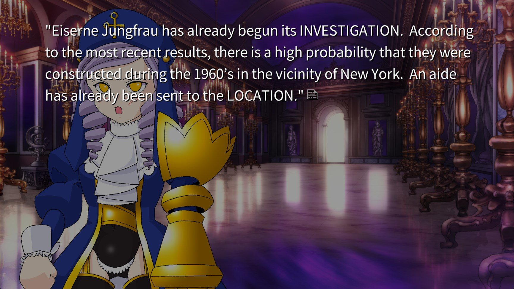
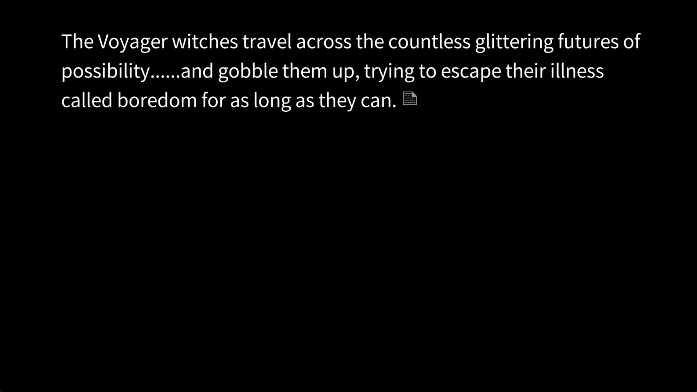
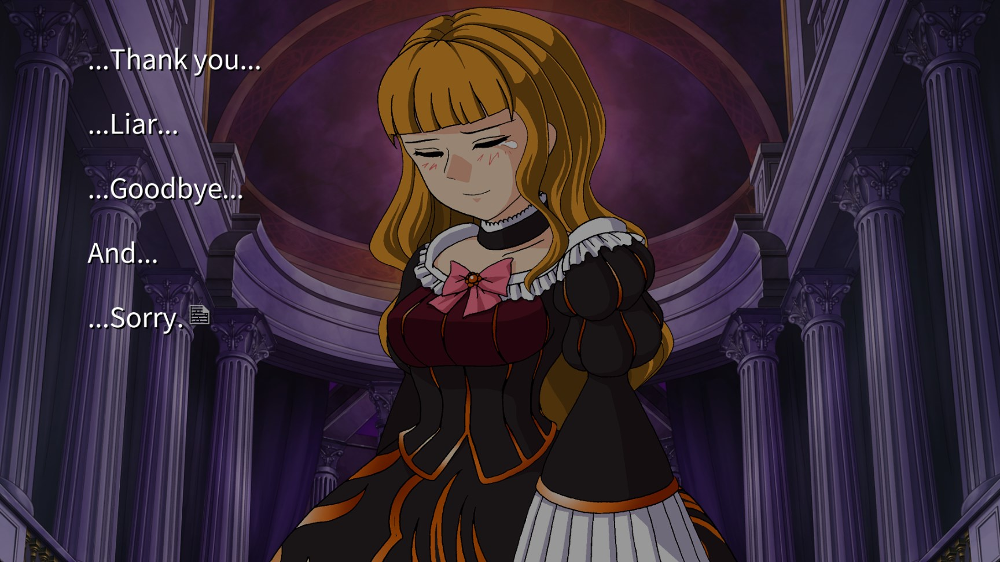
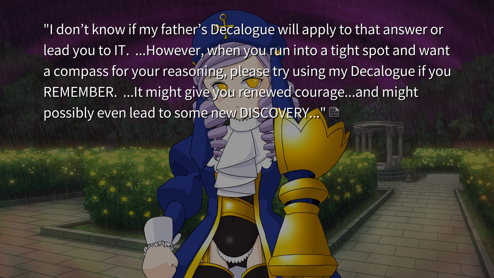
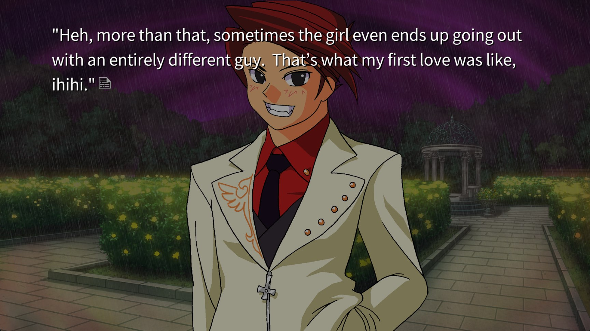
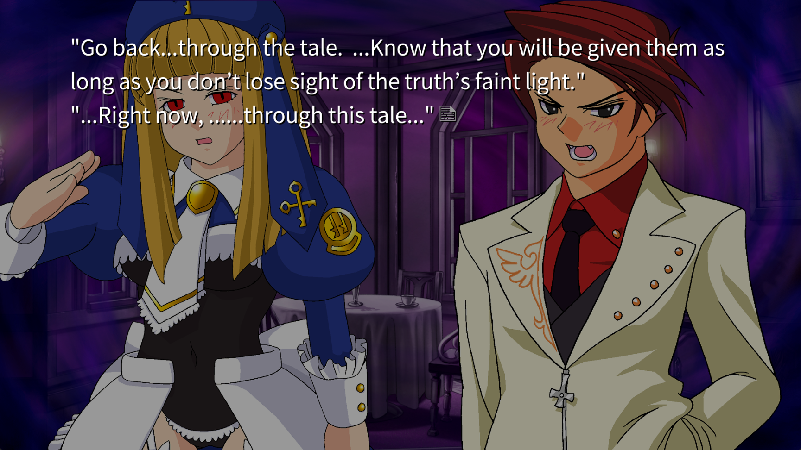
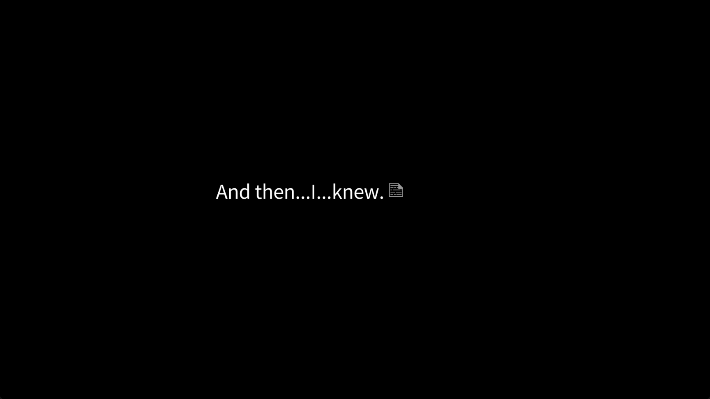
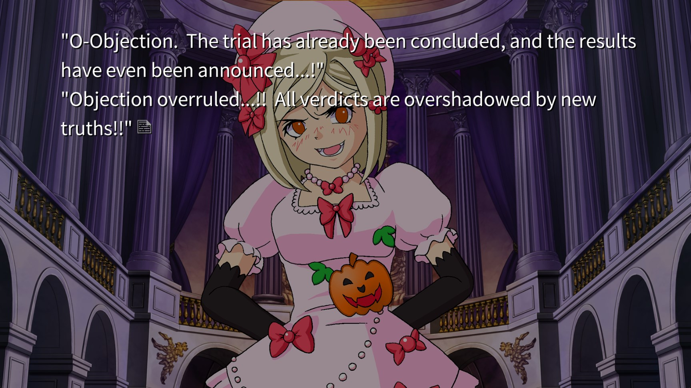
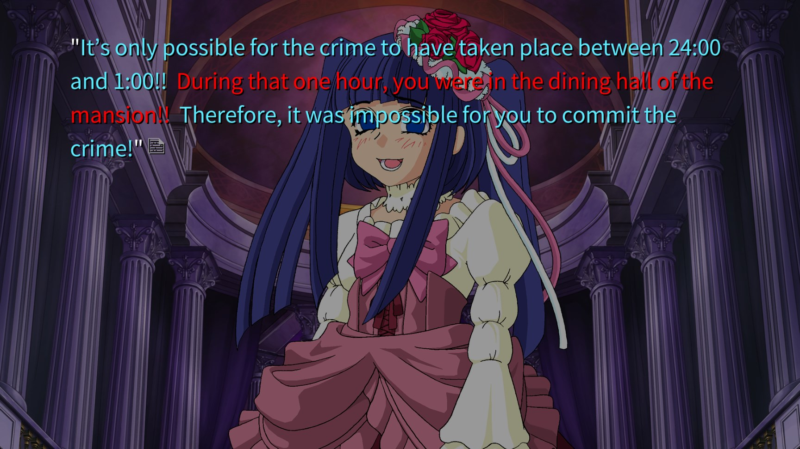
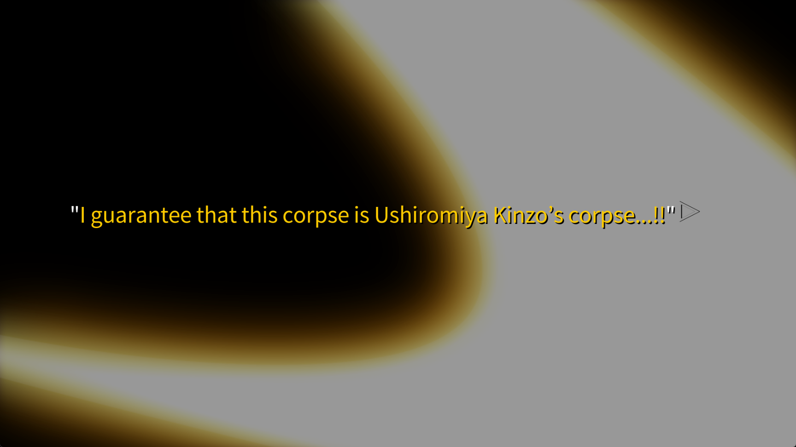

# ...it begins

-   Bern asks Erika and Dlanor to explain the first 4 games as well
-   Not a single fragment of the witch can be left behind.
-   What are the stakes?

    

-   Kinzo was scammed
-   The stakes are worth less than 30 US dollars

    > This is really funny albeit kinda sad

    > I really wish there was toothbrush art of Bern and Erika. It works so well

-   Erika is elevated to witch rank
-   Erika, the Witch of Truth
-   The sea of fragments is tiny to a pair who love each other...

    > Aw.

    

    > Not aw.

# ???

-   Battler is questioning the Decalogue, namely Knox's 3rd, because it seems unreasonable to just discard something's existence like that
-   But if it didn't exist, reading those types of mysteries would suck. They'd **cease to exist**
-   We need encouragement to believe that **reasoning is possible**
    > Oh that's cool. We're almost proving that belief is just as important as reasoning.
-   Strange, right? Beatrice was giving Battler red truths to make him solve the mystery

    > She wanted to die and be denied, as was established before.

    > The solvability of the puzzles means Beatrice is basically just denying herself... why?

# [12-12-22]

-   The decalogue should be used like a crutch. It gives the reader the courage to use reasoning, and the willpower to reread the tale to find clues
    > The question here is whether or not Beatrice's game actually follows the Decalogue at all.
-   Virgilia says that there is no guarantee that this mystery follows the Decalogue
-   That being said, this game is a contest between Battler and Beatrice. So Battler can win. Reasoning is possible.

    > Something solvable to Beato might not be solvable to Battler though.

    > Maybe the stupid epitaph riddle is a good example of this concept

# Beato wanted you to solve it, so she made this game, ...the riddles of this tale, ...solvable.

-   Unless the other party assures you that reasoning is possible, you won't do it. It's almost like love between shy, young people isn't it?
-   This is basically the relationship between the detective novel writer and reader

    > But like, why does that matter? If you can acknowledge your own efforts, who cares? I feel like this proposition becomes unnecessary if both parties are enjoying themselves regardless

    > In other words, the guarantee isn't really needed if they're smiley

    

-   Battler lays down some big truths:

    `sudden confessions -> break-ups`

    `pairs who never confess but realize they've been together for a long time -> stay together for a long time`

-   Basically, there has to be a lot of mutual trust.
-   A good example of this is Battler not doubting that Beatrice is fighting with everything she has

    > Somehow I doubt this. She has been giving Battler tons of freebies with the red

-   Someone only dies here when they stop thinking. Battler was given reason to continue thinking, and a crutch to guide his own thinking. That means...

    > he's back!

-   Knox's 1st. The culprit has to be one of the people mentioned in the early part of the story.
    > The culprit appeared in the first game
-   Battler decides to use the Decalogue for a while
-   The culprit in all of these repeating games... is one of the 18
-   Knox's 2nd. It is forbidden for supernatural agencies to be employed as a detective technique.
    > Magic shouldn't appear. If it does, question why it was shown in the first place. **Suspect the witnesses and observers**
-   Remember that the tales of the first and second games were passed on to people in the future by the message bottles

    > Who wrote those? A human, obviously.

    > So there's no reason to believe they're totally impartial.

-   The narrator/observer is unreliable (duh)

    > Is it even possible to solve something like that?

    > Not really. It's more about coming up with an interpretation that satisfies you, right?

    > Well, actually, in this case... it's explicitly solvable.

    

-   Basically, this is a fair fight.

-   Knox's 8th. It is forbidden for the case to be resolved with clues that are not presented.
-   Knox's 6th. It is forbidden for accident or intuition to be employed as a detective technique.
-   Clues for the "who, how, and why" are present in the tale.

    > But solvable to Beatrice $\neq$ solvable to Battler

    > Cool math markdown right? Check this out:

    > $$\sum_{n=1}^{\infty} n = -\frac{1}{12}$$

-   It's time to go back through the tale

    

    > hehe... without love it can't be 'seen'

    > OH HE ACTUALLY SAID IT

    > is he crossing through the sea of fragments?

    

    > What does he know? If Beatrice was waiting for him the whole time... what does that mean?

    > ok i couldn't really take notes for a bit because this sequence was so sick but here we go

    

-   Battler is acknowledged as the new Endless Sorceror
-   _Bern_: Erika, you handle this! The red truth you've created with me is perfect! The construction of the truth that makes Natsuhi the culprit is perfect! Battler certainly won't be able to break it!

    > How exactly... can the red be broken?

-   _45_: An access code is required to target the territory lord!
    > Territory lord? Like, the gun's owner? No, that's stupid. I'm not sure what this means.
-   Territory lord = The one who controls the fragment
-   Battler has made his way to the innermost depths of all truths!

    > An irrefutable fact? But that's what the red is...

    > Well, wait. It's been established that truth is overridden by newer truths. But that doesn't really apply here, right? No, it's exactly what happened to Ange on the boat. He's realized that his personal truth cannot be overridden **at all** unless he wants it to. Furthermore, he's learned to acknowledge everyone else's? I don't really know. Ange is my blueprint here

-   Battler is the new game master
-   Bern is going to play again

# I can construct a theory with someone other than Aunt Natsuhi as the culprit

-   Erika's theory is impossible to **disprove**. **That doesn't mean it's true**.

    > In other words... trying to fight it is useless. Another truth needs to be constructed and shown **to be true**

    > Hers is a devil's proof!

    > "You cannot prove Natsuhi **isn't** the culprit. So she is. This is wrong!

    > However, it was shown that nobody else **could** be the culprit. I think this leaves a single possibility: Sayo.

    > I mean, there was that whole arc about Shannon's real name is Sayo. That's all I have though.

# It's possible to show a different truth by using a different interpretation

-   When multiple truths exist in parallel, the authenticity of both is questioned!
-   It's possible that **Battler** was the culprit

# The red truth from the 4th game that I'm not the son of my mother Asumu. The feeling that Dad was hiding something in both the first game and this game. In particular, in this game, it was made clear that there were some special circumstances having to do with my birth.

# During that one hour, you were in the dining hall of the mansion!

> Everything else is blue! These aren't truths!

# It has not been specified that the time of death was between 24:00 and 1:00

# From 1:00 AM until the discovery of the crime, it was impossible for any criminal action to occur in the cousin room!!

> How can this be broken?

-   Battler could have killed them **after** screaming?
-   Erika claims that he cannot deny that their deaths were proclaimed at the time of discovery

    > That doesn't make it true though.

    > Okay this is sick. It's flipping the entire first half of the game on its head. The Devil's Proof is being used to show that unfalsifiable **human** action does not necessarily imply that action is what happened

# When this court was opened, Lambda made a proclamation. She said this was a 24:00 answer session!

# Kinzo is dead at the starting time for all games!

-   Right... we had a fade to black when Battler screamed. We don't actually know if the cousins were dead at that point!
-   Futhermore, Erika's theory fails because it assumed Kinzo carried away the corpses.

# After George, Jessica, Maria, Rosa, Krauss, and Genji's deaths, their corpses were never moved!

> **WHAT?!!????**

> Then... that means... the people who discovered the corpses were either accomplices or misidentified non-corpses as corpses???

# Therefore, the corpses couldn't have vanished after being discovered! Your theory about Kinzo carrying the corpses away fails!

-   Knox's 2nd invoked: prove that Kinzo was dead with something other than witch red

# Presentation of evidence. In this closed off Rokkenjima, there is no objective way to show that this corpse is Grandfather's.

-   How can he prove this without the red?

    > Without red... or blue...?

    

-   The gold truth can only be used by the game master
    > What... is this? Isn't this functionally equivalent to red?

# Kinzo's absence has been verified, and the dishonorable relationship between Natsuhi and Kinzo has been removed from consideration!

# Natsuhi is pure and faithful! I won't permit this vulgar tale you're all so fond of!

# Furthermore, because we've raised doubts about the time of death for all who have died so far, the alibis for everyone besides Aunt Natsuhi go back to square one!!!

> I can't believe I never thought to question the time of death...

# If you try to argue that the crime was impossible for everyone except Natsuhi, it won't work!!

# However, in the cousin room, you witnessed corpses that were impossible to misidentigy! Are you trying to say that was a lie? Knox's 7th, it is forbidden for the detective to be the culprit!

# Furudo Erika is the detective, and the 'me' isn't this game isn't one! And by Knox's 9th, it is permitted for observers to let their own conclusions and explanations be heard!

-   Knox's 8th cannot be invoked properly here. It was was established that Battler was no longer the detective with the red.

# Furthermore, Battler saw Kinzo when figuring out the device tonnected to the riddle. So his viewpoint is not objective.

# It is impossible to mistake someone or something for Ushiromiya Kinzo by sight.

-   In other words, Battler deliberately claimed to see Kinzo. It was not a misidentification.
-   _Dlanor_: Because men like you exist in this world, you will surely protect the fragile truth from any kind of pride. You will surely protect the real truth from the tyranny of any plausible truth... that might claim to exist as the sole truth and try to exterminate all fragile truths!

-   Erika has no options, her theory needs to be revised.
-   Bern forces her to do so

    > We're in a weird situation now. Both possibilities are valid. Neither are unique.

-   The illusion of the witch still exists, because the real truth hasn't been discovered yet.

-   Lambda acknowledges both theories as valid, and resets the game. Battler is the new game master

    > He's the new Beatrice?

    > In other words, as has been established, "Beatrice" is just whoever the culprit of the episode is.

-   Bern gives Erika another chance to play, but she'll be thrown into oblivion if she fails

-   The 6th game can now begin

# END OF EPISODE 5
