# [12-14-22]

# IT BEGINS

-   Cathedral is now a wedding chapel

    > What the fuck is happening

    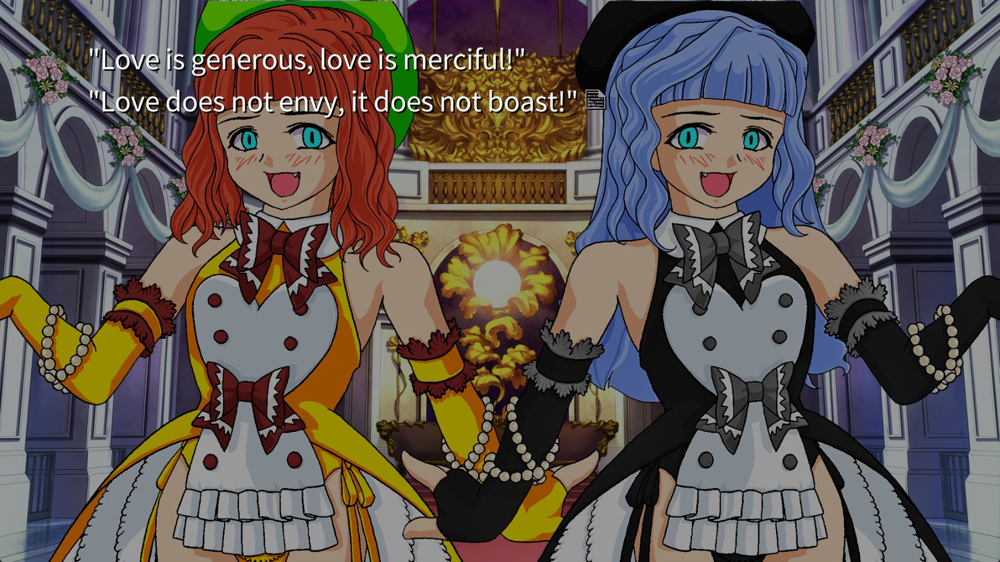

-   Erika's wedding dress has the one-winged eagle on it???
-   Bern speaks to the groom in plural

    > Is she marrying Battler to establish a "loving" relationship, and thus a fair fight? Like Dlanor and Virgilia mentioned?

-   Nope. It's to defile Battler. She's trying to make him submit to her

    > Deja vu

    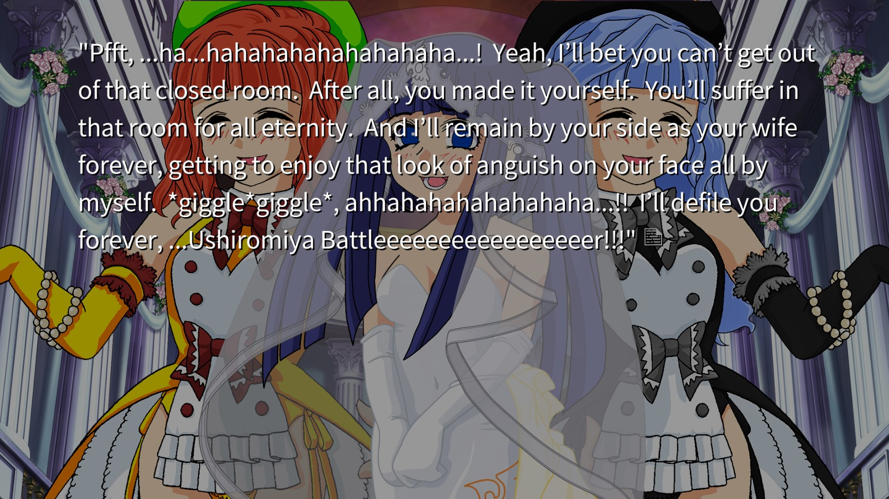

    > I wonder what closed room she's referring to here. Challenging Erika's theory and not really knowing the **definitive** truth behind everything?

-   Battler(?) wakes up in an unfamiliar room (looks like a guest room) and wants to leave quickly
-   Chain to the room is set

    > Is this the closed room she was referring to?

    > Is this the perspective of someone about to be murdered?

-   But it's staked to the door. It cannot be opened

    > metaphor for an abusive situation?

    > you cannot scream, just silently cry for help

    > This is a little terrifying. The witch could be in the room...

    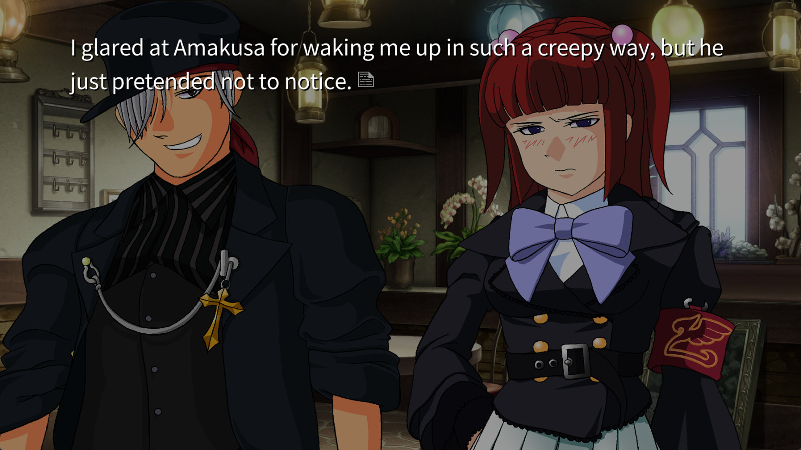

    > Oh, so that was Ange's nightmare. Maybe that sequence could be interpreted as happiness (the corridor) being totally locked off, and believing in the witch becoming your only option?

    > (looking at the character profiles) How does BATTLER succeed at being the game master?

-   Ange is questioning her own memory of what happened in episode 4
-   Hachijo Tohya appears

    > Who? Ange can't even remember meeting her before arriving on Nijima

    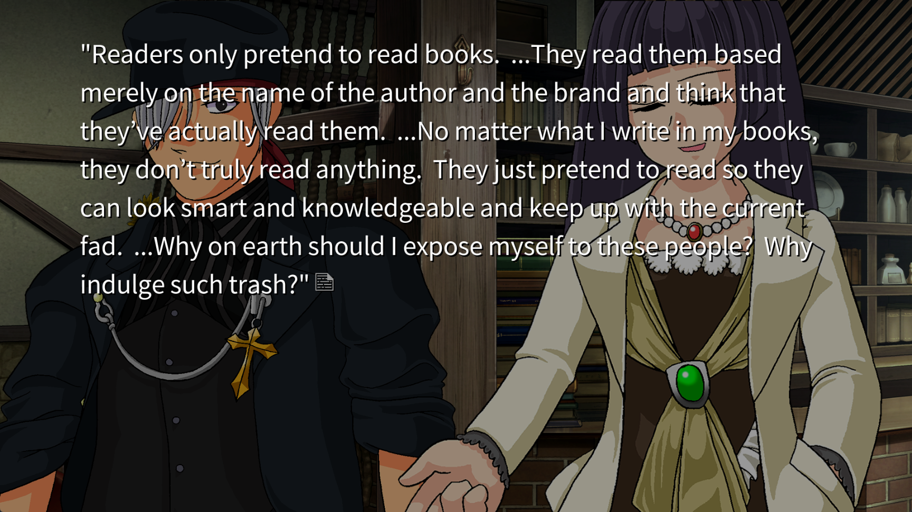

    > Alright then

-   _Ange_: \<End of the Golden Witch\>. I've read that one. That's one hell of a hobby you've got there, killing off other people's families however you like.

    > She wrote episodes 3, 4, and 5?

-   She claims that her works are truth

    > How can she claim that...?

    > I suppose it's truth in the fake sense. Whatever everyone finds most reasonable.

-   _Ange_: The truth doesn't change based on what humans believe.

    > The truth is the truth, regardless of whether or not is is proven or believed.

-   Ange's memories from when she'd leave to Niijima onwards are all fucked
-   What she remembers: She got an appointment with Ootsuki, but the publishing company never got back to her about Itouikukuro, so she was stuck doing nothing that day.
-   She split from Amakusa when he left to get a black bag (of weapons?)

    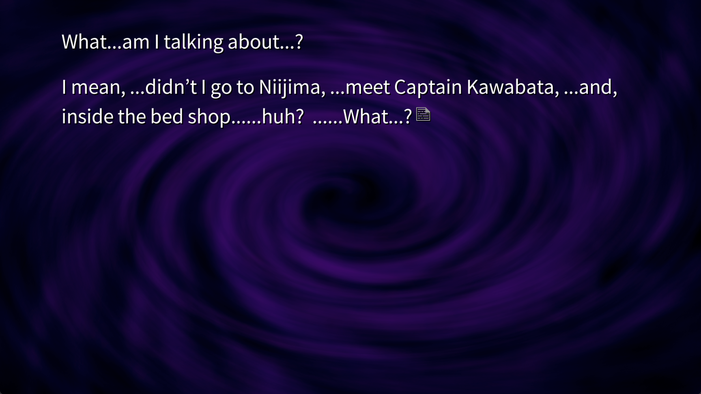

    > Oh she saw Sakutaro in the bed shop, didn't she?

-   Hachijo is also the author of 'Dawn' huh.
-   She's also claiming to not be human. A witch, in fact.
-   _Ange_: Who are you? I don't remember ever meeting you like this.
-   Hachijo transforms, and Ange then questions how she's alive after what happened in episode 4
-   Featherine now asks Ange to be an observer of the fragments Beatrice has woven

    > Battler is no longer a suitable observer since he became the game master

    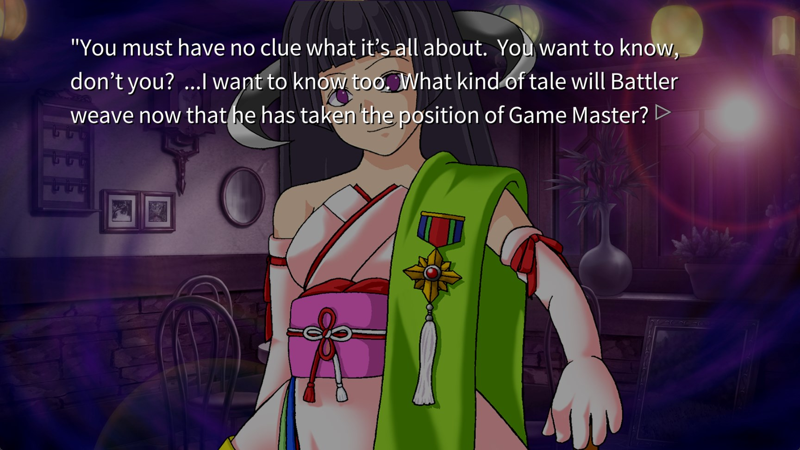

-   Ange wants to know the truth as well, so...
-   She becomes Featherine's reader

---

-   Answering my earlier question...
-   Lambda confirmed that Battler understood everything about Beato's game.
-   To prove it, Battler would have to run this game by himself and carry it to completion
    > What exactly... does that mean? Prevent Erika from finding the truth? Prevent the epitaph from being solved?
-   Beatrice (the piece) appears and refers to Battler(?) as father?
-   She's also way too pleasant.

    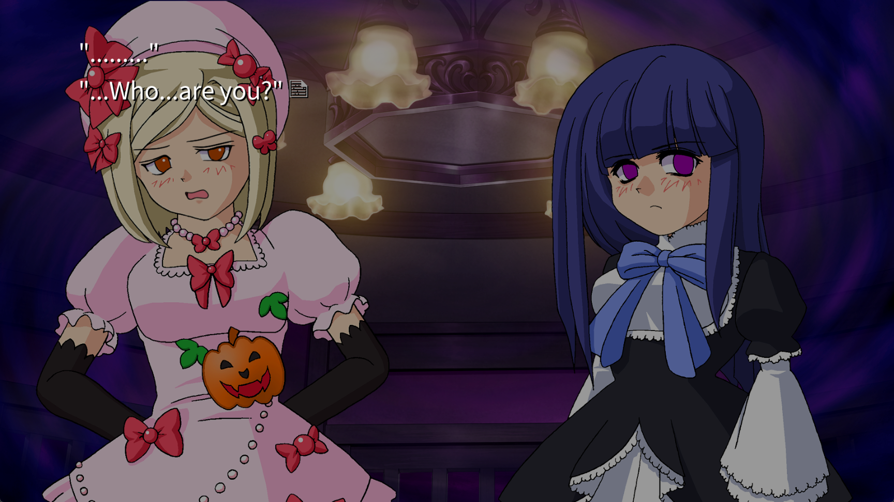

-   _Battler_: Go To Your Room 👉

    > LOL

-   Sakutaro was Maria's piece
    > An imaginary friend. He needed a vessel
-   The pieces on the Rokkenjima board do not need vessels
-   Deaths of players do not necessarily mean their physical deaths. Rather, the death of their belief?

# [12-15-22]

-   More like loss of interest or concern. No longer caring.
-   When Maria outgrows stuffed animals, 'Maria the game player' will die
    > If you 'quit the game' for a long enough time, you would effectively die in some sense and never be able to become the person you once were
-   Beatrice had absolutely no chance of winning, but she kept playing anyway.
    > The way I see it... oh. I hate that my brain immediately went to OMORI. Maybe the truth is ugly, and Beatrice wants Battler to believe in her to avoid having him confront it.

# That Beatrice will never revive again.

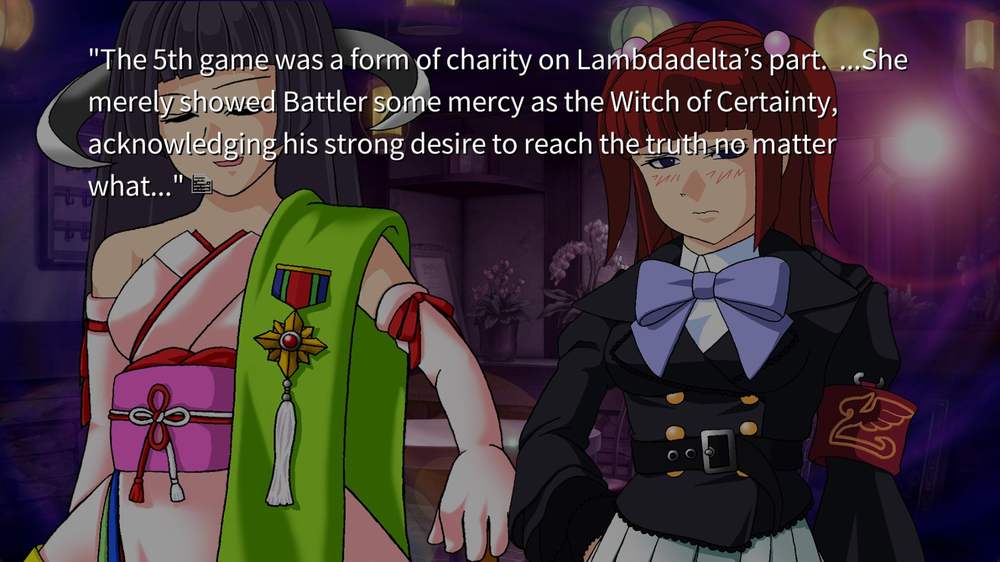

-   That Beato will never revive. However that doesn't mean that it is impossible for 'Beato' to be born again
-   Bern said (at the end of episode 1) that Beato exists as the incarnation of a rule
-   The resurrection ceremony accumulated information based on that rule(?)
-   The weird Beatrice is a "baby" version of the one we know

    > Let's think for a second.

    > Pure and lovable $\rightarrow$ insane bpd pussy bitch

    > sorry

# [12-16-22]

-   "Featherine probably finds it more interesting when she's spoken to rudely. What a coincidence. That's exactly how I used to be."
    > Who's the narrator here?
-   Let's read Beato's tale as well.
-   Battler constructed the 6th game
-   _Genji_: You must write up multiple tales and make the inner and outer side of the story match
    > The truth must match what the story actually allows?
-   The game doesn't allow for logic errors. When that happens, the board will immediately collapse and be destroyed
    > Foreshadowing?
-   _Genji_: Beatrice "woke up" three days ago.
-   Battler is excited to show her his game
-   His attitude towards her is completely different after reaching the truth
    > This is why she's so different now, right? Beatrice isn't "real", she's determined by rules and human perception...
-   We should be able to conclude that there's some kind of connection between Battler and Beatrice right? But the red from game 4 denies that:

# Six years ago, no person called Beatrice existed for Battler

> How do we reason around this?

> My first guess is that **Beatrice** isn't the person from six years ago that we actually care about. It's whoever she's "representing". Shannon, most likely.

> Though, that still doesn't quite explain the antagonism. Just a simple possibility that gets past that red.

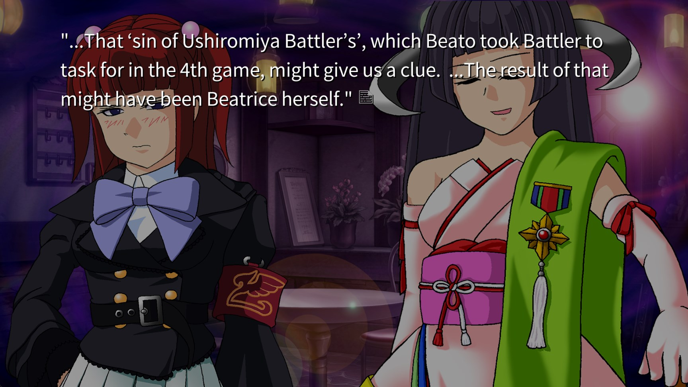

> yeah, exactly.

-   Could Beatrice be Battler's piece?

    > This would line up with what I mentioned earlier. It, unfortunately, makes me think about OMORI even more as well. If Beatrice is Battler's piece, then that means that Battler "created" her in order to protect himself from the truth.

    > Fundamentally, that's what she's for, right? Why did Maria believe so strongly in witches and magic? To cope with her suffering. Ange did the same for a short time, lost that skill, then learned to empathize and accept those who did.

-   Featherine's line of thinking:  
    `Battler sinned -> Everyone dies`  
    `Beatrice commits the murders`  
    `Therefore, Battler created Beatrice`

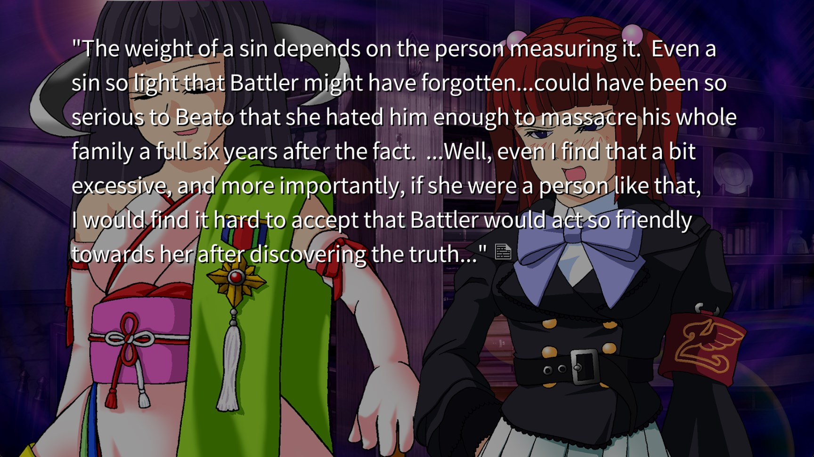

> THAT'S WHAT I'M SAYING

-   Why is Battler being so nice to her after all the bullshit she's done?
-   Why does he feel the need to apologize
-   Featherine knows why but won't tell Ange
    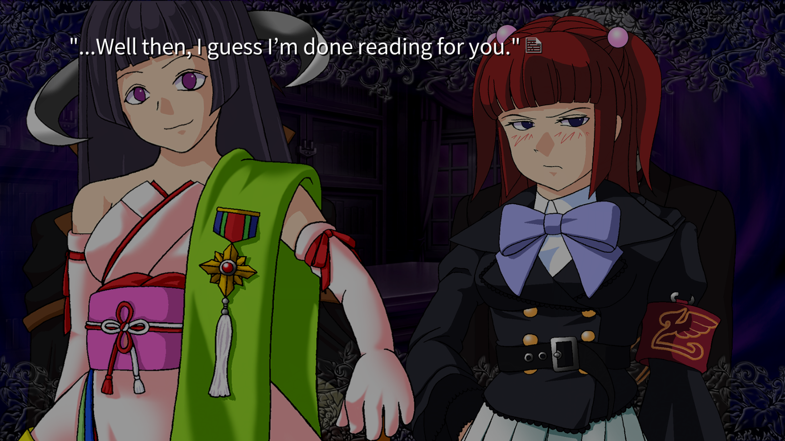
-   Beato is a personification of the rules
-   Battler feels a compulsive need to apologize to the lobotomized Beatrice

    > WHAT DID HE DO

    > HE'S DOING THE KINZO THING AGAIN

    > HE'S KINZO

    > HE WANTS OLD BEATRICE BUT SHE'S GONE SHE CAN'T COME BACK HE KNOWS TOO MUCH

-   This isn't the same Beatrice
-   Someone isn't decided by their birth

-   Featherine says that people are differentiated by their personalities
-   _Amakusa_: SOOOOOOOOOOOOOOO true. Ange would be more cute if she didn't have a fucked life

    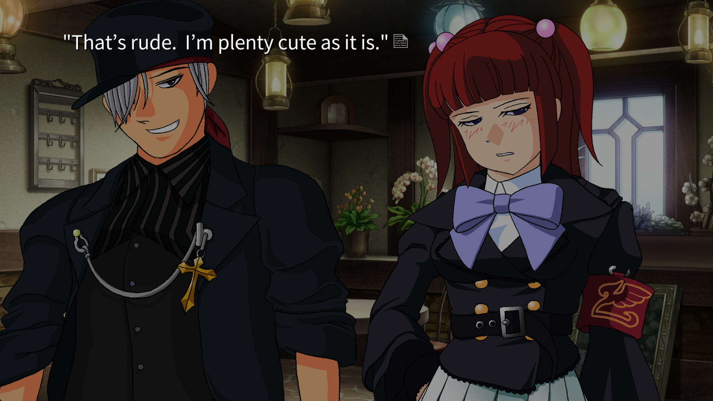

-   Someone can have two personalities. That basically makes two people

    > Like Shannon having another name? (And Kanon?)

-   Because of this, there's no guarantee that this Beato will become the Beatrice that Battler wants
    > Is the Beatrice we know the one that Kinzo wanted?
-   Hachijo's writing and the message bottles have the same 'scent'
-   Beato is Battler's piece, so she can't do anything he doesn't want
-   This **is** Beatrice. But it's how she was "1000 years ago"

-   _Shannon_: So why did you turn down Milady when she asked you to got with her to welcome the relatives?
-   Kanon actually has nothing to do
-   They once again assert that neither of them are human
-   George thinks Shannon is human

    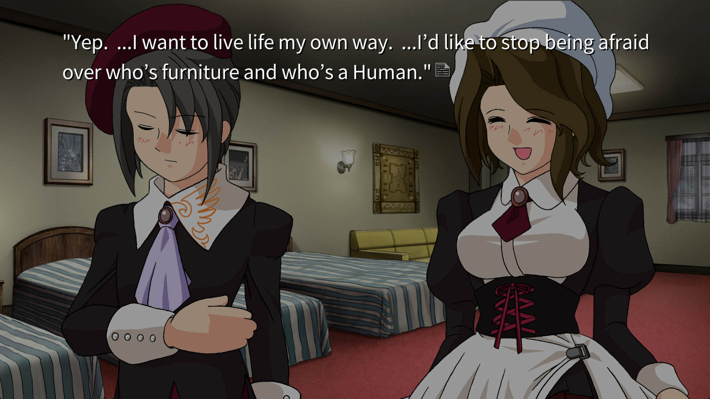

-   Kanon admits to loving Jessica

    > No shit

    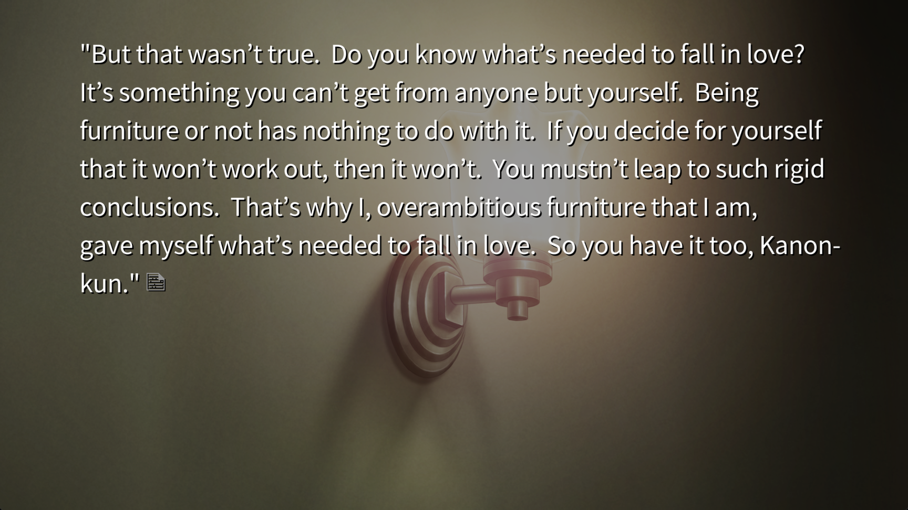

    > Shannon gave HERSELF what she needed to fall in love. The brooch? Just believing that things can work out? This is a really good line

-   Shannon wants to leave and never come back
-   _Shannon_: If your feelings for Jessica are at least as strong as my feelings for George, then we'll have to settle whose feelings are really stronger.
    > WHAT DID SHE MEAN BY THIS
-   _Shannon_: Whether my love bears fruit, or yours does, we'll both support the victor.

    > WHY CAN'T THEY BOTH WORK OUT?!?!?!??! WHAT IS GOING ON

    > They just made a whole big deal about different personalities = different people, they can't be the same person could they?

-   Kanon decided to stop working here if Shannon ever quit
-   _Kanon_: I plan to stop being furniture
-   Kanon's real name is Yoshiya
-   The witch knew that she was an illusion created in the image of who she once was
-   And she also knew that it would only hurt Battler if she were to try and pretend to be that person

    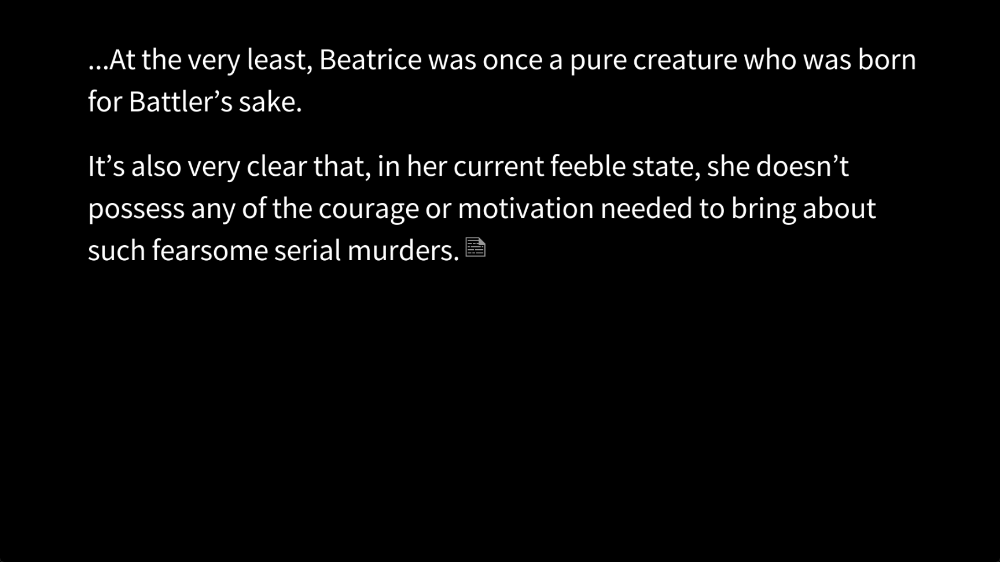

-   Ange doesn't think she's actually lived for a thousand years, just a while
-   See: 6 years
    > What happened in that 6 year period?

# I was born for Father's sake

-   So I want to become the Golden Witch that Father desires

    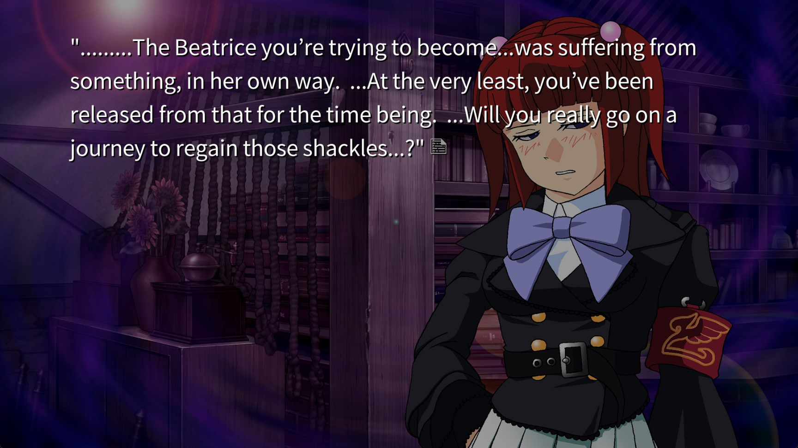

-   6th game go

    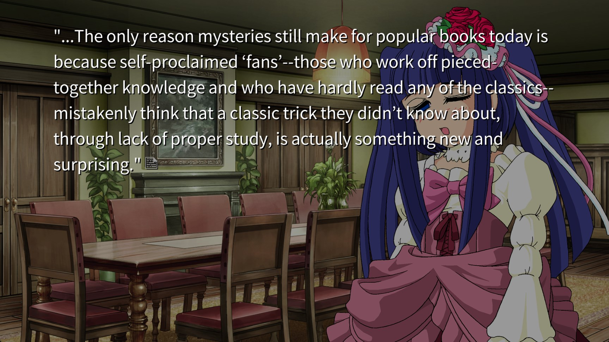

    > Please kill yourself

-   Cheese puzzle

    > It's 4 cuts isn't it? I don't think that's right though

    > 2 cuts?

    > 1 cut?????

-   1 cut.

    > oh it could be a fucked up shape

-   Puzzles without specified rules (i.e. no red truth) are left to the observer's interpretation
-   Erika goes feral over chopsticks and coins

---

-   Back in the fucked up chained room

    > This is from Ange's perspective, right?

    > Using the shackle analogy again

-   Makes it look like she's an inch away from freedom, though that door will never actually open. A shackle trapping me here for all eternity.
-   Window is clamped shut
    > So there's absolutely no way out of this closed room.
-   "What if I try attacking it from a different angle instead of just smashing it head on?"
    > THIS IS HORRIFYING
-   Hand brushes against another rain-soaked hand
-   Closes tightly around her(?) left hand
-   bye fingie

    > Is this actually happening in the game right now?

    > Who could be the one in the room?

---

-   _Battler_: When I was a brat six years ago, I remember spending a lot of nights all scared that the witch was walking around the mansion.
-   They actually gesture at the room near the end of the hall
    > It's the same room Natsuhi was in, right?
-   The cousins start moving to the guesthouse and pass through the entrance hall
-   Shannon is with them
-   Battler was terrified of the witch 6 years ago
-   Beato is an incarnation of a butterfly

# [12-18-22]

> Note: I have a migraine so these notes might suck

-   Why did Beatrice bully Battler so much despite being born for his sake?
    > God I wish that were me
-   The new Beatrice has no issue with spiderwebs or scorpion charms
-   Mario 64 time

    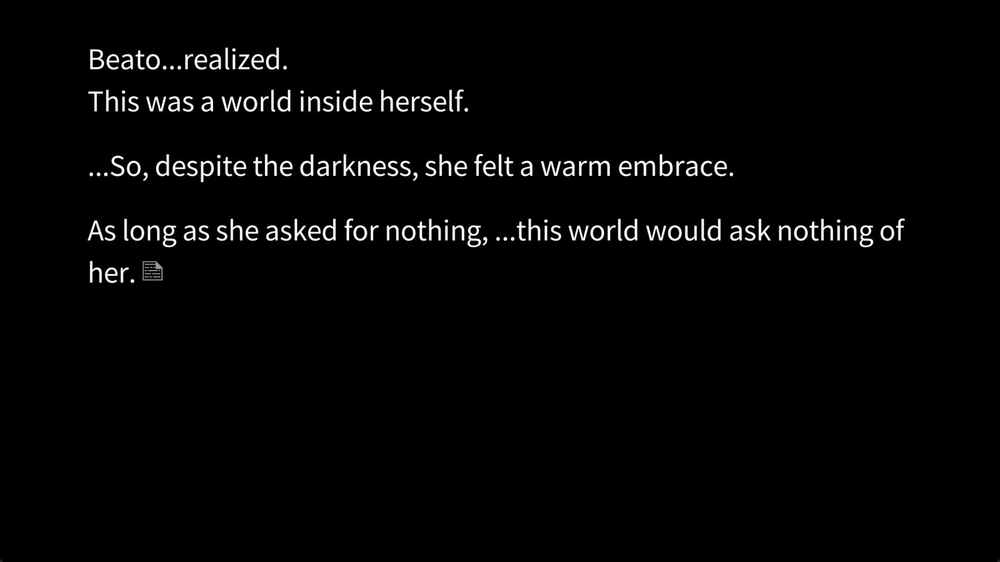

    > Sounds like the golden land to me. As long as she asks for nothing, this world will ask nothing of her.

    > It's a comfortable darkness, but Beato doesn't want to stay inside it forever.

-   Beatrice is "born". Another one. But they're different somehow.

    > Her profile says she's a "mysterious witch who existed even before the rules" and that she is the "final version of the witch sealed away by Kinzo".

    > It also says that she's the one who gave Shannon the butterfly brooch. Why is that mentioned?

-   The new Beatrice was born later. Does that mean the mission to live for Battler's sake was born later?

    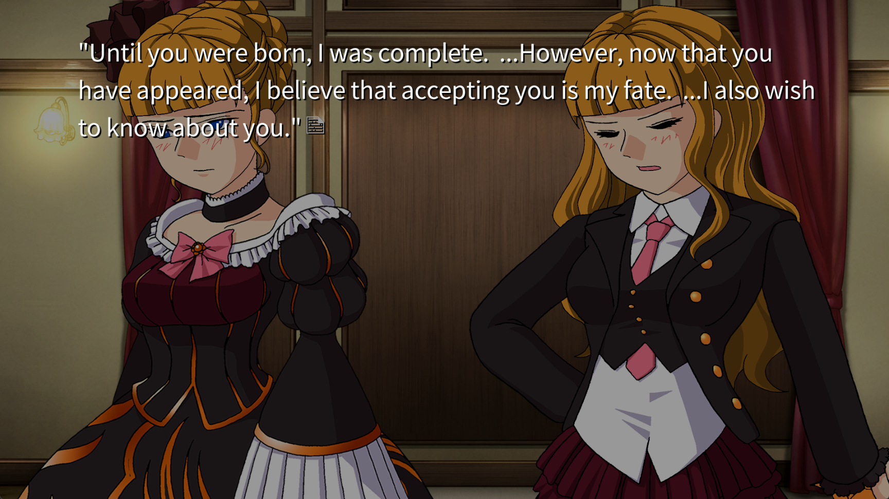

    > This older Beatrice was complete until this newer one was born. What exactly... does that mean?

    > It's hard to answer that until we have a clear understanding of _who_ or _what_ Beatrice is. Seems like she was "revived" by Battler in a sense, but what is meant by Kinzo sealing her away?

-   This Beatrice is more similar to the one we know. She's interested in reviving and teaching Kinzo a lesson.
-   They also seem to be a few years in the past. Before the portrait was put up.
    > WHAT ARE YOUUUUUUU

---

-   Shannon is a klutz
    > This isn't even an important note
-   _Shannon_: I didn't see her directly, but some very strange things did happen.
    > Ah, confirming that the events in episode 2 were not quite as they seemed.
-   Anti magic toxin isn't as dangerous to those whose existences are already weak
    > Those who still believe will probably still continue believing regardless?
-   Witches don't need to use magic
-   Witches cannot enter a human's field of vision
-   Why is she not hurt when Battler sees her?
-   If their existences are acknowledged, this isn't an issue.
    > See: Ange and Battler
-   The older Beatrice wanders around at night, striving to regain her power and reduce the anti magic power of humans.

    > There's probably **some** parallel between what she's doing and Shannon making her usual night rounds.

    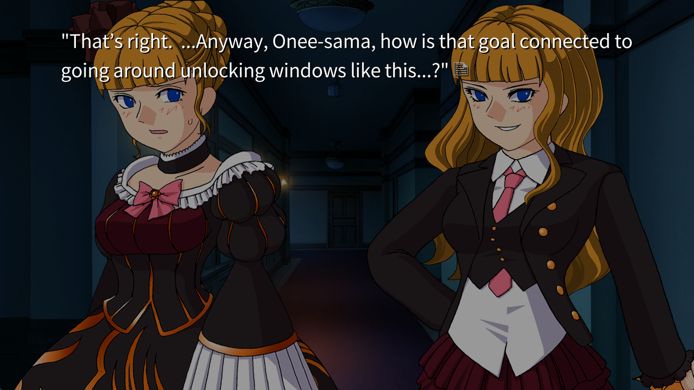

    > Wait hang on. There's a Kanon/Shannon parallel here. The game literally just said that Shannon was a klutz who would leave things unlocked.

    > It also introduced the idea that people are differentiated by their personalities. You're not the same person you were (six) years ago for example.

    > Don't tell me that Kanon and Shannon are actually the same person...

-   _Beatrice (older)_: Right now, there is no one in this corridor. And yet, the lock has been undone, and the window has opened.

    > The window was already open before?

    > Dumb and incorrect idea: Battler was already dead at the end of episode 4

-   Servants are starting to believe in Beatrice, bit by bit.
-   Ange and Featherine mention how the witch's existence is a product of the environment. This could just be resolved by saying that someone forgot to lock up or that it was a prank, but the rumors of the witch took form instead

    > Considering what Shannon said earlier, I think that is literally what happened

    > However, because we don't know precisely what happened, the existence of the witch cannot be denied.

    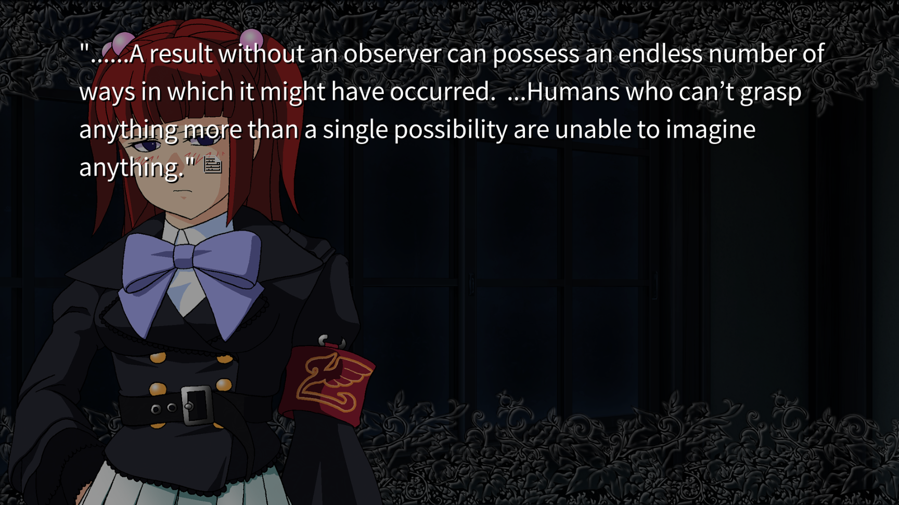

-   The witch's prank becomes fact by those who believe in it
-   Belief causes magic to become truth. Sakutaro is the quintessential example.
    > Mass produced stuff animal. Rosa Ushiromiya kill yourself challenge (FAILED)
-   _Ange_: Beatrice is just a general term for any inexplicable occurrences that take place in the mansion after dark. Beatrice isn't the name of a person, it's a phenomenon.

    > What about the Beatrice from 30 years ago then?

-   The eerie magic circles were being drawn before as well
    > These weren't actually observed
-   _Erika_: There's probably some person by that name, or else multiple persons of a fixed or unfixed number who do things and attribute it to that name.

-   Why is she arguing with a literal 9 year old

    > I love Erika so much

    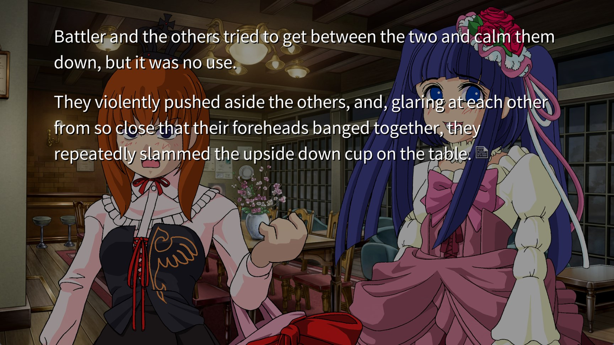

    > Autism vs ADHD

-   where am i
-   They're transported to the Golden Land (which, I think, is just a witch's headspace) and Erika asks MARIA to demonstrate Beatrice's magic
-   Also I forgot but Maria is the founder of Mariage Sorciere

    > Do I actually have to take notes on this fucking "fight"

    > Fine

# This is a story of something that really happened!

# There were no tricks. It was just an ordinary table and an ordinary cup.

-   She closed her eyes yeah yeah yeah...

    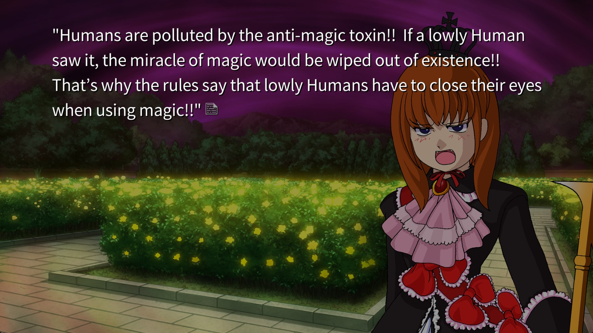

# Your so-called candy magic is nothing more than a sleight of hand! Just a sleight of hand that the fake witch calling her Beatrice or whoever claimed was magic!
