# [12-14-22]

# IT BEGINS

-   Cathedral is now a wedding chapel

    > What the fuck is happening

    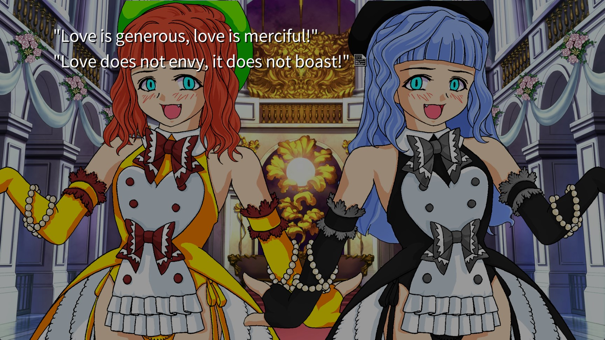

-   Erika's wedding dress has the one-winged eagle on it???
-   Bern speaks to the groom in plural

    > Is she marrying Battler to establish a "loving" relationship, and thus a fair fight? Like Dlanor and Virgilia mentioned?

-   Nope. It's to defile Battler. She's trying to make him submit to her

    > Deja vu

    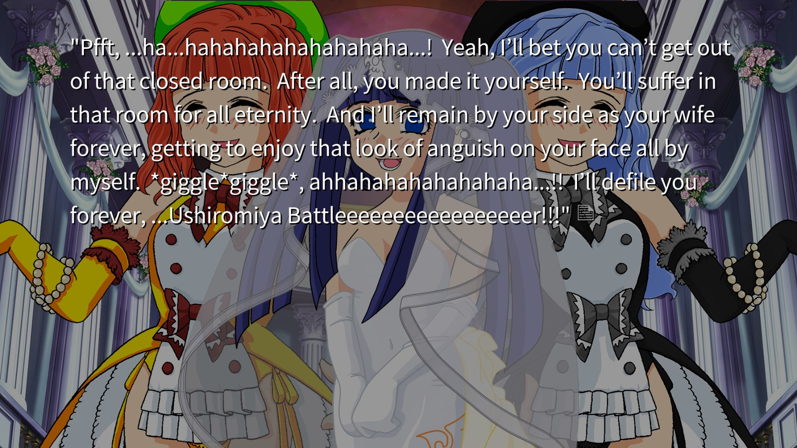

    > I wonder what closed room she's referring to here. Challenging Erika's theory and not really knowing the **definitive** truth behind everything?

-   Battler(?) wakes up in an unfamiliar room (looks like a guest room) and wants to leave quickly
-   Chain to the room is set

    > Is this the closed room she was referring to?

    > Is this the perspective of someone about to be murdered?

-   But it's staked to the door. It cannot be opened

    > metaphor for an abusive situation?

    > you cannot scream, just silently cry for help

    > This is a little terrifying. The witch could be in the room...

    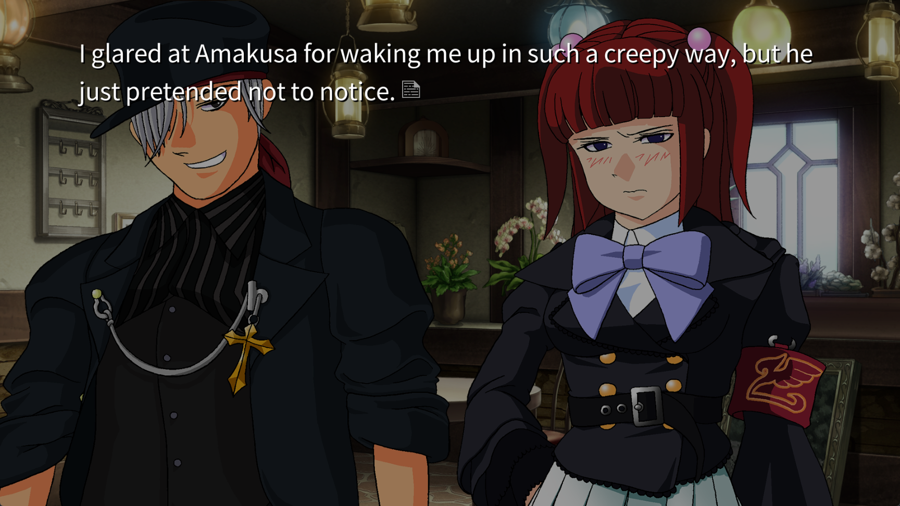

    > Oh, so that was Ange's nightmare. Maybe that sequence could be interpreted as happiness (the corridor) being totally locked off, and believing in the witch becoming your only option?

    > (looking at the character profiles) How does BATTLER succeed at being the game master?

-   Ange is questioning her own memory of what happened in episode 4
-   Hachijo Tohya appears

    > Who? Ange can't even remember meeting her before arriving on Nijima

    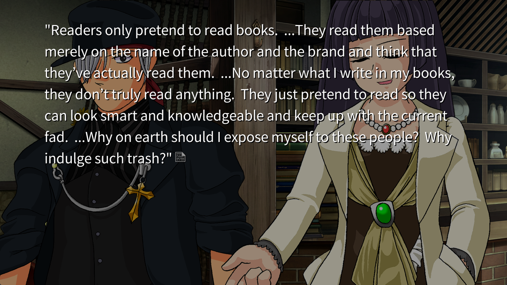

    > Alright then

-   _Ange_: \<End of the Golden Witch\>. I've read that one. That's one hell of a hobby you've got there, killing off other people's families however you like.

    > She wrote episodes 3, 4, and 5?

-   She claims that her works are truth

    > How can she claim that...?

    > I suppose it's truth in the fake sense. Whatever everyone finds most reasonable.

-   _Ange_: The truth doesn't change based on what humans believe.

    > The truth is the truth, regardless of whether or not is is proven or believed.

-   Ange's memories from when she'd leave to Niijima onwards are all fucked
-   What she remembers: She got an appointment with Ootsuki, but the publishing company never got back to her about Itouikukuro, so she was stuck doing nothing that day.
-   She split from Amakusa when he left to get a black bag (of weapons?)

    

    > Oh she saw Sakutaro in the bed shop, didn't she?

-   Hachijo is also the author of 'Dawn' huh.
-   She's also claiming to not be human. A witch, in fact.
-   _Ange_: Who are you? I don't remember ever meeting you like this.
-   Hachijo transforms, and Ange then questions how she's alive after what happened in episode 4
-   Featherine now asks Ange to be an observer of the fragments Beatrice has woven

    > Battler is no longer a suitable observer since he became the game master

    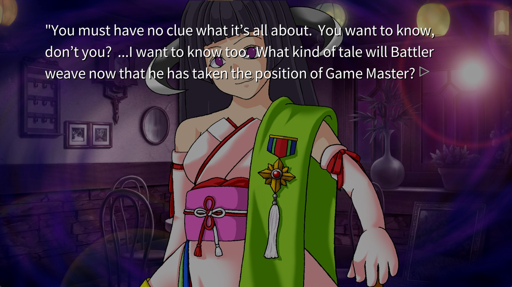

-   Ange wants to know the truth as well, so...
-   She becomes Featherine's reader

---

-   Answering my earlier question...
-   Lambda confirmed that Battler understood everything about Beato's game.
-   To prove it, Battler would have to run this game by himself and carry it to completion
    > What exactly... does that mean? Prevent Erika from finding the truth? Prevent the epitaph from being solved?
-   Beatrice (the piece) appears and refers to Battler(?) as father?
-   She's also way too pleasant.

    

-   _Battler_: Go To Your Room 👉

    > LOL

-   Sakutaro was Maria's piece
    > An imaginary friend. He needed a vessel
-   The pieces on the Rokkenjima board do not need vessels
-   Deaths of players do not necessarily mean their physical deaths. Rather, the death of their belief?

# [12-15-22]

-   More like loss of interest or concern. No longer caring.
-   When Maria outgrows stuffed animals, 'Maria the game player' will die
    > If you 'quit the game' for a long enough time, you would effectively die in some sense and never be able to become the person you once were
-   Beatrice had absolutely no chance of winning, but she kept playing anyway.
    > The way I see it... oh. I hate that my brain immediately went to OMORI. Maybe the truth is ugly, and Beatrice wants Battler to believe in her to avoid having him confront it.

# That Beatrice will never revive again.

-   That Beato will never revive. However that doesn't mean that it is impossible for 'Beato' to be born again
-   Bern said (at the end of episode 1) that Beato exists as the incarnation of a rule
-   The resurrection ceremony accumulated information based on that rule(?)
-   The weird Beatrice is a "baby" version of the one we know

    > Let's think for a second.

    > Pure and lovable $\rightarrow$ insane bpd pussy bitch

    > sorry

# [12-16-22]

-   "Featherine probably finds it more interesting when she's spoken to rudely. What a coincidence. That's exactly how I used to be."
    > Who's the narrator here?
-   Let's read Beato's tale as well.
-   Battler constructed the 6th game
-   _Genji_: You must write up multiple tales and make the inner and outer side of the story match
    > The truth must match what the story actually allows?
-   The game doesn't allow for logic errors. When that happens, the board will immediately collapse and be destroyed
    > Foreshadowing?
-   _Genji_: Beatrice "woke up" three days ago.
-   Battler is excited to show her his game
-   His attitude towards her is completely different after reaching the truth
    > This is why she's so different now, right? Beatrice isn't "real", she's determined by rules and human perception...
-   We should be able to conclude that there's some kind of connection between Battler and Beatrice right? But the red from game 4 denies that:

# Six years ago, no person called Beatrice existed for Battler

> How do we reason around this?

> My first guess is that **Beatrice** isn't the person from six years ago that we actually care about. It's whoever she's "representing". Shannon, most likely.

> Though, that still doesn't quite explain the antagonism. Just a simple possibility that gets past that red.

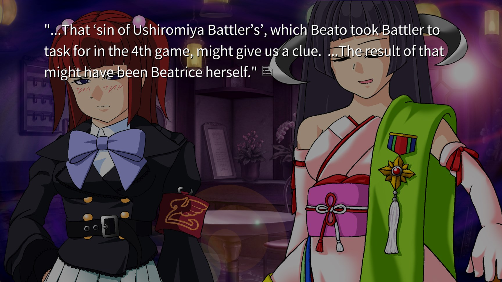

> yeah, exactly.

-   Could Beatrice be Battler's piece?

    > This would line up with what I mentioned earlier. It, unfortunately, makes me think about OMORI even more as well. If Beatrice is Battler's piece, then that means that Battler "created" her in order to protect himself from the truth.

    > Fundamentally, that's what she's for, right? Why did Maria believe so strongly in witches and magic? To cope with her suffering. Ange did the same for a short time, lost that skill, then learned to empathize and accept those who did.

-   Featherine's line of thinking:  
    `Battler sinned -> Everyone dies`  
    `Beatrice commits the murders`  
    `Therefore, Battler created Beatrice`

> THAT'S WHAT I'M SAYING

-   Why is Battler being so nice to her after all the bullshit she's done?
-   Why does he feel the need to apologize
-   Featherine knows why but won't tell Ange
    
-   Beato is a personification of the rules
-   Battler feels a compulsive need to apologize to the lobotomized Beatrice

    > WHAT DID HE DO

    > HE'S DOING THE KINZO THING AGAIN

    > HE'S KINZO

    > HE WANTS OLD BEATRICE BUT SHE'S GONE SHE CAN'T COME BACK HE KNOWS TOO MUCH

-   This isn't the same Beatrice
-   Someone isn't decided by their birth

-   Featherine says that people are differentiated by their personalities
-   _Amakusa_: SOOOOOOOOOOOOOOO true. Ange would be more cute if she didn't have a fucked life

    

-   Someone can have two personalities. That basically makes two people

    > Like Shannon having another name? (And Kanon?)

-   Because of this, there's no guarantee that this Beato will become the Beatrice that Battler wants
    > Is the Beatrice we know the one that Kinzo wanted?
-   Hachijo's writing and the message bottles have the same 'scent'
-   Beato is Battler's piece, so she can't do anything he doesn't want
-   This **is** Beatrice. But it's how she was "1000 years ago"

-   _Shannon_: So why did you turn down Milady when she asked you to got with her to welcome the relatives?
-   Kanon actually has nothing to do
-   They once again assert that neither of them are human
-   George thinks Shannon is human

    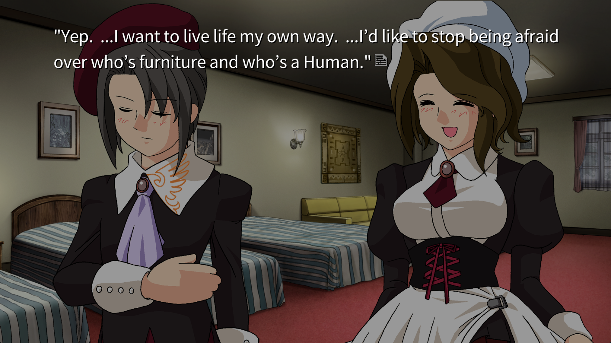

-   Kanon admits to loving Jessica

    > No shit

    

    > Shannon gave HERSELF what she needed to fall in love. The brooch? Just believing that things can work out? This is a really good line

-   Shannon wants to leave and never come back
-   _Shannon_: If your feelings for Jessica are at least as strong as my feelings for George, then we'll have to settle whose feelings are really stronger.
    > WHAT DID SHE MEAN BY THIS
-   _Shannon_: Whether my love bears fruit, or yours does, we'll both support the victor.

    > WHY CAN'T THEY BOTH WORK OUT?!?!?!??! WHAT IS GOING ON

    > They just made a whole big deal about different personalities = different people, they can't be the same person could they?

-   Kanon decided to stop working here if Shannon ever quit
-   _Kanon_: I plan to stop being furniture
-   Kanon's real name is Yoshiya
-   The witch knew that she was an illusion created in the image of who she once was
-   And she also knew that it would only hurt Battler if she were to try and pretend to be that person

    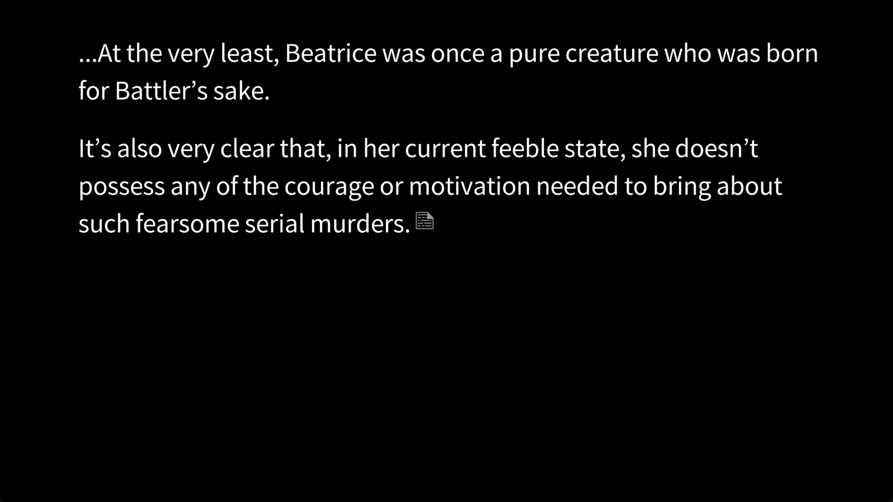

-   Ange doesn't think she's actually lived for a thousand years, just a while
-   See: 6 years
    > What happened in that 6 year period?

# I was born for Father's sake

-   So I want to become the Golden Witch that Father desires

    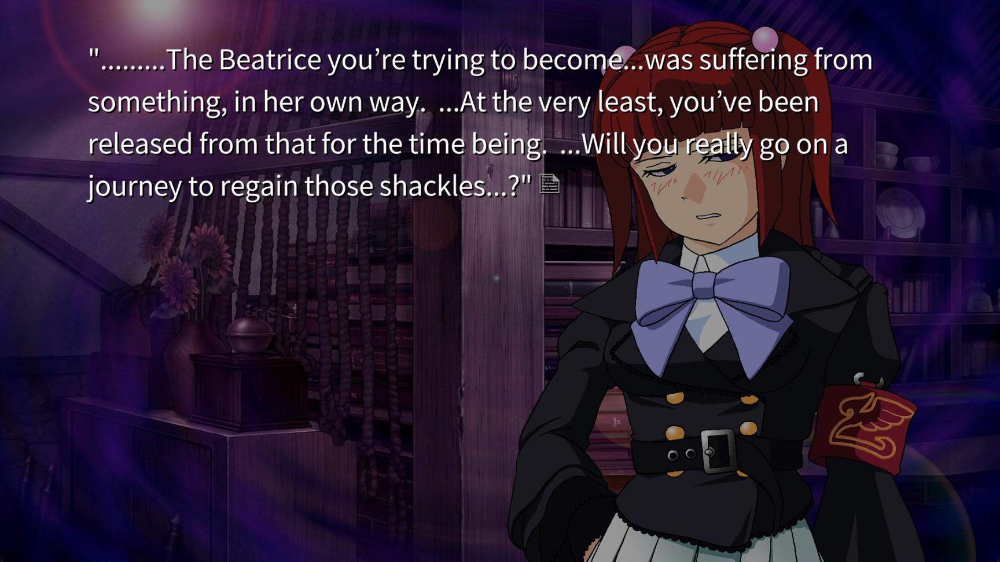

-   6th game go

    

    > Please kill yourself

-   Cheese puzzle

    > It's 4 cuts isn't it? I don't think that's right though

    > 2 cuts?

    > 1 cut?????

-   1 cut.

    > oh it could be a fucked up shape

-   Puzzles without specified rules (i.e. no red truth) are left to the observer's interpretation
-   Erika goes feral over chopsticks and coins

---

-   Back in the fucked up chained room

    > This is from Ange's perspective, right?

    > Using the shackle analogy again

-   Makes it look like she's an inch away from freedom, though that door will never actually open. A shackle trapping me here for all eternity.
-   Window is clamped shut
    > So there's absolutely no way out of this closed room.
-   "What if I try attacking it from a different angle instead of just smashing it head on?"
    > THIS IS HORRIFYING
-   Hand brushes against another rain-soaked hand
-   Closes tightly around her(?) left hand
-   bye fingie

    > Is this actually happening in the game right now?

    > Who could be the one in the room?

---

-   _Battler_: When I was a brat six years ago, I remember spending a lot of nights all scared that the witch was walking around the mansion.
-   They actually gesture at the room near the end of the hall
    > It's the same room Natsuhi was in, right?
-   The cousins start moving to the guesthouse and pass through the entrance hall
-   Shannon is with them
-   Battler was terrified of the witch 6 years ago
-   Beato is an incarnation of a butterfly

# [12-18-22]

> Note: I have a migraine so these notes might suck

-   Why did Beatrice bully Battler so much despite being born for his sake?
    > God I wish that were me
-   The new Beatrice has no issue with spiderwebs or scorpion charms
-   Mario 64 time

    

    > Sounds like the golden land to me. As long as she asks for nothing, this world will ask nothing of her.

    > It's a comfortable darkness, but Beato doesn't want to stay inside it forever.

-   Beatrice is "born". Another one. But they're different somehow.

    > Her profile says she's a "mysterious witch who existed even before the rules" and that she is the "final version of the witch sealed away by Kinzo".

    > It also says that she's the one who gave Shannon the butterfly brooch. Why is that mentioned?

-   The new Beatrice was born later. Does that mean the mission to live for Battler's sake was born later?

    

    > This older Beatrice was complete until this newer one was born. What exactly... does that mean?

    > It's hard to answer that until we have a clear understanding of _who_ or _what_ Beatrice is. Seems like she was "revived" by Battler in a sense, but what is meant by Kinzo sealing her away?

-   This Beatrice is more similar to the one we know. She's interested in reviving and teaching Kinzo a lesson.
-   They also seem to be a few years in the past. Before the portrait was put up.
    > WHAT ARE YOUUUUUUU

---

-   Shannon is a klutz
    > This isn't even an important note
-   _Shannon_: I didn't see her directly, but some very strange things did happen.
    > Ah, confirming that the events in episode 2 were not quite as they seemed.
-   Anti magic toxin isn't as dangerous to those whose existences are already weak
    > Those who still believe will probably still continue believing regardless?
-   Witches don't need to use magic
-   Witches cannot enter a human's field of vision
-   Why is she not hurt when Battler sees her?
-   If their existences are acknowledged, this isn't an issue.
    > See: Ange and Battler
-   The older Beatrice wanders around at night, striving to regain her power and reduce the anti magic power of humans.

    > There's probably **some** parallel between what she's doing and Shannon making her usual night rounds.

    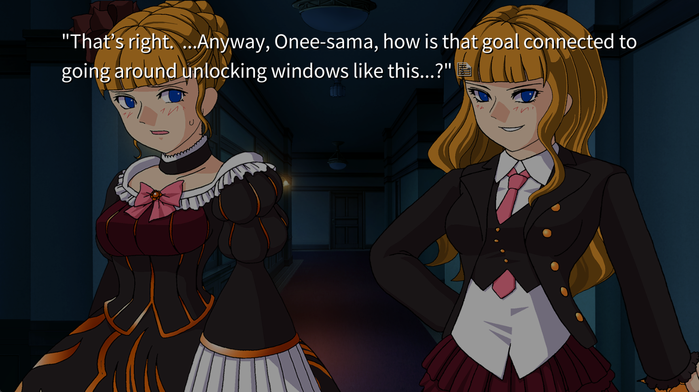

    > Wait hang on. There's a Kanon/Shannon parallel here. The game literally just said that Shannon was a klutz who would leave things unlocked.

    > It also introduced the idea that people are differentiated by their personalities. You're not the same person you were (six) years ago for example.

    > Don't tell me that Kanon and Shannon are actually the same person...

-   _Beatrice (older)_: Right now, there is no one in this corridor. And yet, the lock has been undone, and the window has opened.

    > The window was already open before?

    > Dumb and incorrect idea: Battler was already dead at the end of episode 4

-   Servants are starting to believe in Beatrice, bit by bit.
-   Ange and Featherine mention how the witch's existence is a product of the environment. This could just be resolved by saying that someone forgot to lock up or that it was a prank, but the rumors of the witch took form instead

    > Considering what Shannon said earlier, I think that is literally what happened

    > However, because we don't know precisely what happened, the existence of the witch cannot be denied.

    

-   The witch's prank becomes fact by those who believe in it
-   Belief causes magic to become truth. Sakutaro is the quintessential example.
    > Mass produced stuff animal. Rosa Ushiromiya kill yourself challenge (FAILED)
-   _Ange_: Beatrice is just a general term for any inexplicable occurrences that take place in the mansion after dark. Beatrice isn't the name of a person, it's a phenomenon.

    > What about the Beatrice from 30 years ago then?

-   The eerie magic circles were being drawn before as well
    > These weren't actually observed
-   _Erika_: There's probably some person by that name, or else multiple persons of a fixed or unfixed number who do things and attribute it to that name.

-   Why is she arguing with a literal 9 year old

    > I love Erika so much

    

    > Autism vs ADHD

-   where am i
-   They're transported to the Golden Land (which, I think, is just a witch's headspace) and Erika asks MARIA to demonstrate Beatrice's magic
-   Also I forgot but Maria is the founder of Mariage Sorciere

    > Do I actually have to take notes on this fucking "fight"

    > Fine

# This is a story of something that really happened!

# There were no tricks. It was just an ordinary table and an ordinary cup.

-   She closed her eyes yeah yeah yeah...

    

# Your so-called candy magic is nothing more than a sleight of hand! Just a sleight of hand that the fake witch calling her Beatrice or whoever claimed was magic!

> SHE IS LITERALLY BULLYING AN AUTISTIC TODDLER

-   An 'Illusion of the Witch' occurs when someone tries to force the acknowledgement of magic by claiming that a thing would be impossible without it. If someone can show that it would be possible without magic, the illusion is defeated and the witch must retreat.

    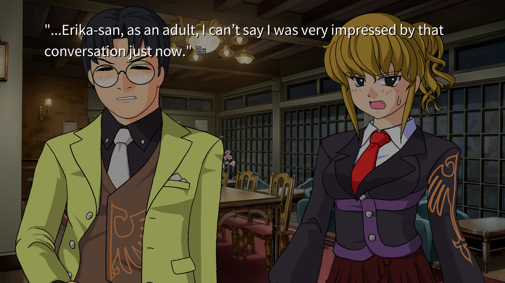

-   Shannon asks Battler not to push any further "for her sake"
-   Maria says Erika doesn't believe in witches, magic, miracles, or happiness
-   Erika called Kumasawa to the lounge?

# [12-22-22]

> whats up everybody its AA im playing umineko episode 6 i was busy fucking with arch linux for 2 days lets do this shit

> I wonder if there's a particular reason Erika and Dlanor are presented as children

-   _George_: Well, my parents brought me up to treat women with care

    > why does this sound so awful

    > HE USED TO BE AN INCEL?

    > ok in his defense he was a literal middle schooler

    > WAIT NO HE WAS 18 GEORGE **NOOOOOO**

    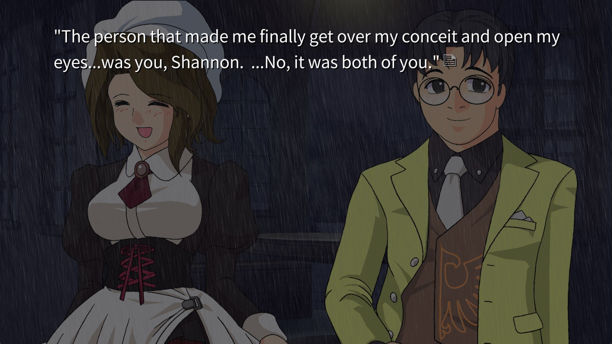

    > Both of you. Both of you...

    > I know this is referring to both Shannon and Battler, but I'm choosing to believe it doubles as a subtle nod to Shannon having two names.

    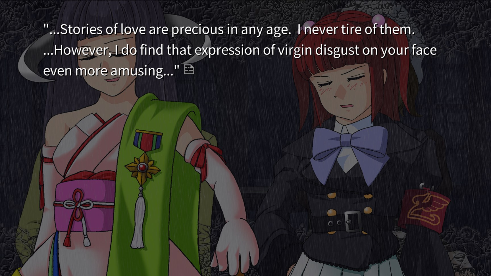

    > **SHE'S JUST LIKE ME!!!!!!!!!!!!!!!**

-   George didn't want to admit that pedestalizing girls was Incorrect and continued to believe that Battler and Jessica were inferior
    > Come on man...
-   _Ange_: No idiot would want to be friends with an unmoving, unspeaking telephone pole. However, unmoving and unspeaking is exactly what you'd want from a telephone pole.
    > Don't try too hard
-   George was envious of Battler because he and Shannon got along well
-   It's worth noting what Shannon said about Rudolf always keeping up with Battler as well
-   George is going to announce their marriage tomorrow
-   He's willing to disinherit himself
-   _Erika_: Are there any mystery novels that accept love as proof? No, there aren't.

    > Yeah yeah, if their engagement is impeded, it can be a motive

    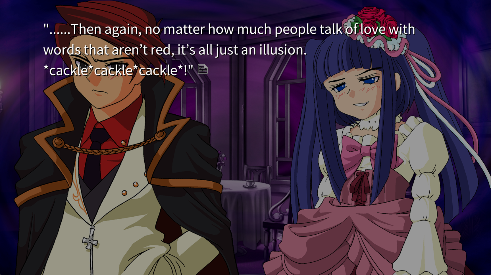

-   Erika once again wonders what truth Battler reached to change his mind about Beato
-   Shannon returns to the servant room and meets Genji and Kanon
-   _Kanon_: That was a pretty long break.

    > Envy? Are you even real? Do you EXIST?

    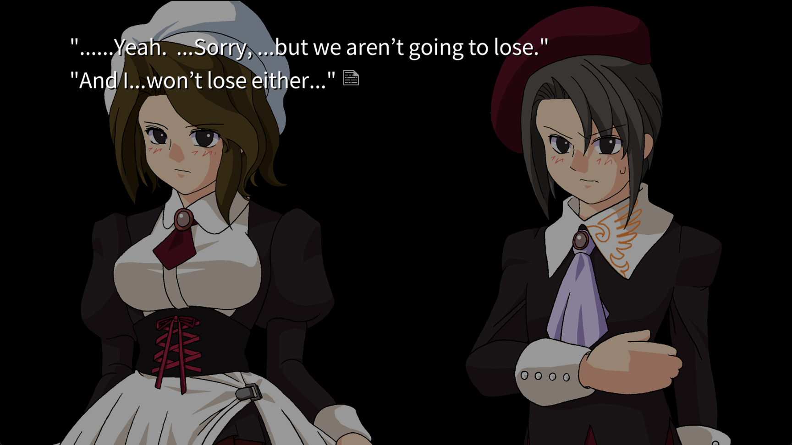

    > This weird competition thing again. I wonder what this implies. Like why can only one relationship work out?

-   Shannon and Kanon pull out the left and right wings of a gold butterfly
    > Okay they have to be one person right?
-   In order to become human (Detroit) and receive the miracle that allows us to love, we must rely on a miracle of magic once again

    > The brooch? They split it in half?

    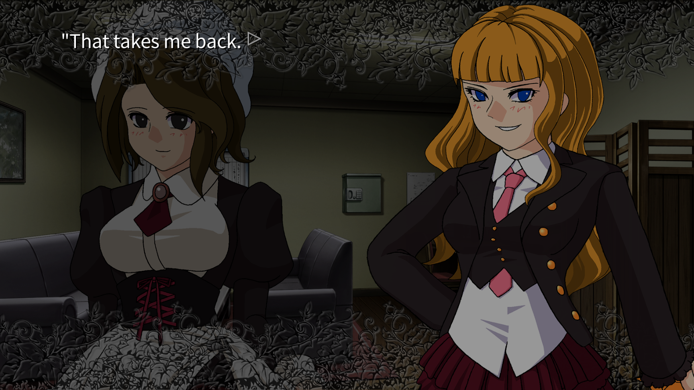

-   The brooch was the first time that Beatrice interacted with a human and gave them her power
    > This contradicts episode 2 doesn't it?
-   She was able to materialize in front of Shannon in particular
-   Kumasawa says the breaking of the mirror on the shrine was a prelude to Beatrice's resurrection
    > Shannon moment
-   Erika notes that it's strange how the mirror works on both evil spirits from the East and witches from the West
-   Why can't Beatrice stand spiderwebs?

    > That's a good question. I mean, there's the whole butterfly thing...

    > Also scorpions. Where did that come from?

-   Erika points out that the stories treat Beatrice and the evil spirits of Akujikishima the same
-   Scorpions represent a charm against evil in western sorcery
-   Erika claims that the two legends mixed together after Kinzo had the portrait made
-   She further claims that the legend of the witch is just the legend of Akujikishima rebranded
    > Seems to be the case
-   Beato is unaffected by spiderwebs
-   **Beatrice** is burned by them.

    > Beatrice's properties are determined by the person who creates her

    > Huh, Battler learned the truth, then when he made a Beatrice, she ended up being a normal human.

-   Witch who can use magic, but has no body vs. witch with a body but cannot use magic

    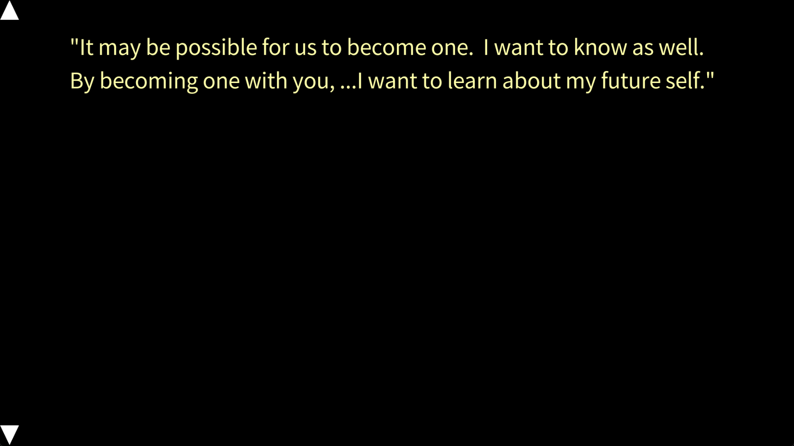

    > This is a little real and homosexual

-   They attempt to fuse, but nothing happens.

    > oooooooh it's not their time yet

    > gay ass game

---

> Back in the fucking horrifying room

-   The finger is now attached, but the teeth marks are still there
-   ...This individual is now collared.
-   The chain keeping the door shut was now keeping them in place

    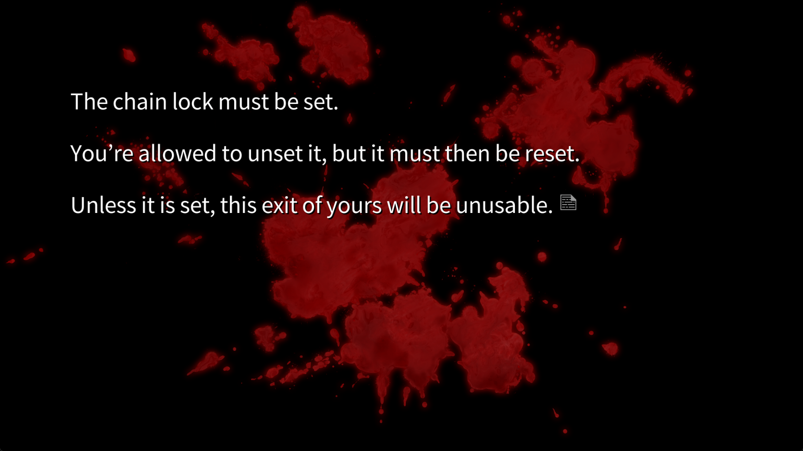

    > So they can't exit unless the chain is set. This is truly a perfect closed room

    > One interpretation: this is another instance of why someone would believe in the witch, because a witch could just escape

# [12-23-22]

-   _Jessica_: I love fighting all-out like this!
    > Call back to the Ronove fight in episode 4?
-   Because Kanon rigidly believed that he was furniture, he thought his dreams were pointless
-   The ability to grow is a privilege only given to humans
-   Kanon asks a very sad question...

    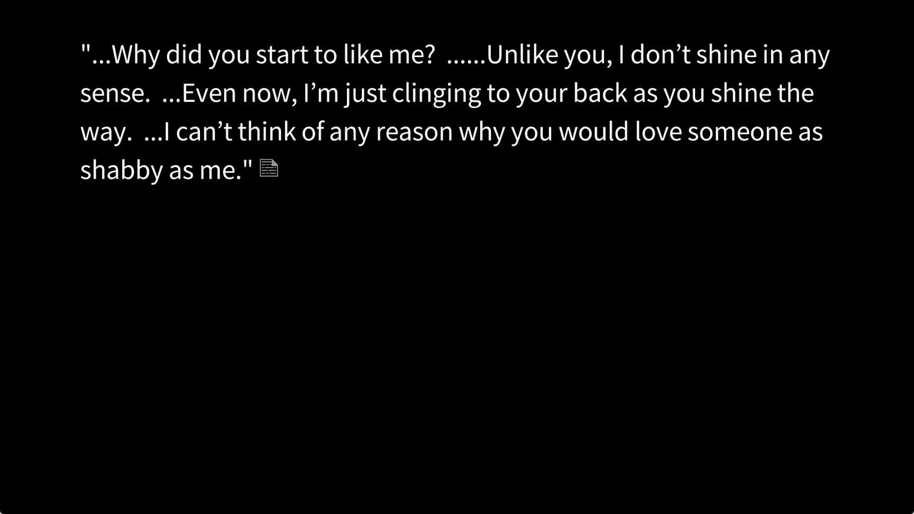

    > First of all, meowch. Pain. Agony. Suffering

    > Second, I like how this juxtaposes both Ange and Erika's perceptions of love. Ange demonstrates the redemptive and healing nature of love, Erika outright denies the concept of loving (in relation to herself) because it's not red, and Kanon fails to understand how he can be loved.

    > This is cool. That there are no prerequisites to being loved/deserving love is a very powerful message

-   Frustrated that he can do nothing but simply receive the affection
-   As expected, Jessica doesn't really have a reason. In fact, her supposed reason could be misconstrued to imply that any nearby boy would have been fine

    > First of all, I'm choosing to believe a girl would have been fine too. Second, why does it matter? Like, seriously. Just have fun with it...

    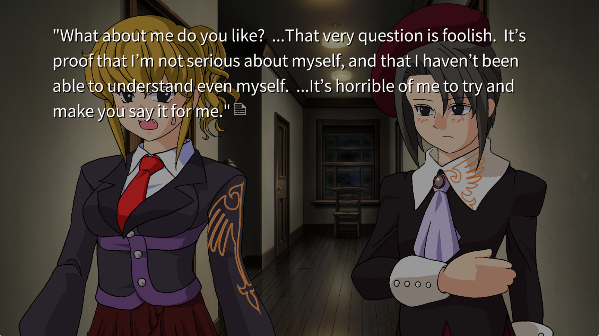

    > You don't need someone else to acknowledge why you're lovable, you just are.

    > Really interesting commentary on the transformative power of love here. Epic

-   Kanon repeats that furniture (who aren't of this world) need a miracle to love
-   Ange is failing to understand why magic is necessary for them to love
    > Well, I can't help but think back to the Discworld thing again. Magic is all about belief, right? Embellishment, believing in something that isn't necessarily "true" or "real". Humans need to do that in order to **be** human. And love is probably the best example. You have to believe that you can love and deserve to be loved. There's nothing... _factual_ there. It's just believing in something so it can become.
-   Furthermore, this is all the result of the brooch
-   According to the furniture, Shannon won't even have the right to marry without another miracle
    > But... why? Their marriage is guaranteed at this point
-   There's some kind of barrier that can't be overcome without magic
    > What barrier though?
-   Same goes for Kanon. What miracle is needed at this point?

    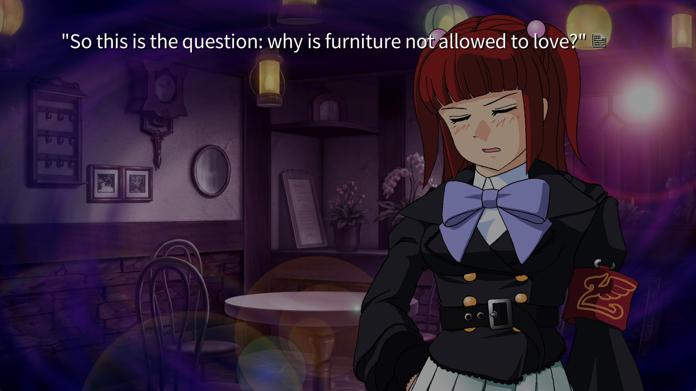

-   Just what exactly is the brooch?

---

-   Big sister Beatrice says it's a "crystallization of magic"
-   It only works for those who already believe in magic, like Shannon
-   _Beatrice (baby)_: It's ironic. No matter what kind of magic we give out, everything depends on whether the human we give it to can accept it.

    > You don't say? It's almost as if you have to believe in things for them to become real.

    

    > Very true, and a conclusion I've reached as well. Parappa was right

-   "Those who make others believe are witches"

    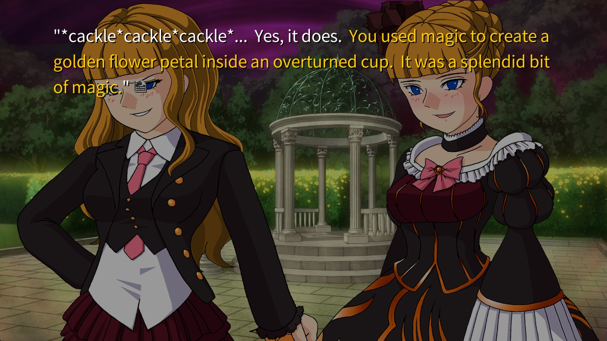

    > So this seems to reinforce my interpretation of the golden truth. It's a personal truth. Something you choose to believe. It can be overridden by a red... but only if such a red exists.

-   Ange once again questions what the brooch is
    > I feel like it's very simple. The brooch is just a little bit of encouragement. "Hey, this is possible". Just like Beatrice's game.
-   She also questions whether something as "insignicant" as belief and encouragement would be enough to change fate
    > It is! You really don't need much to completely change trajectories
-   The vague, ritualistic power of the brooch is much more different now. It's stronger, like a **whole different interpretation of magic**.
    > You only need a tiny bit of magic to get some momentum. Then, things just become "real".
-   _Kanon_: You are human, so you do not believe in witches or magic.
-   He also says that he was created by magic, so his existence is proof of it.

    > Odd. But it kind of reasserts the idea that Kanon isn't "real".

    > In other words... he and Shannon might be one person?

-   A single brooch can only grant one person's wish. Only one of us furniture can be joined by this single brooch.

    > So just make another one. It's possible, you just have to believe.

    > Unless you're the same person...

---

> this is so sad

-   Do we remember any notable cookie incidents?

    > Well, there was that one part where Shannon ate some on the beach with "Beatrice". And when the cousins ate some on the beach as well in episode... 1? 2? Something like that

    > It's like Sakutaro isn't it? Battler truly believes that Beatrice is dead, so he can't bring her back.

-   Battler's reasons for defeating Beato isn't to destroy an enemy out of hatred, it's more like he wants to give a sincere answer to her questions
-   A piece is like a tool. When used skillfully, they can be quite useful. But if you use them incorrectly, they can hurt you as well
    > Like telling a story with characters, right? Something like that...
-   Battler merely set a piece onto the board. Beatrice is the one who actually created the piece.

    > In that case, why is she devoted to Battler?

    > Well, clearly the answer has something to do with love.

    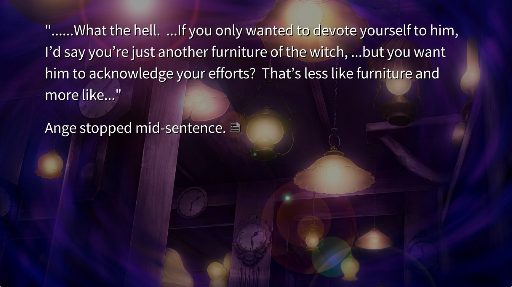

    > She's more of a human. Specifically a girl who loves Battler.

    

-   Ange is confused as to why a piece was made for this. If you love someone, shouldn't you just act on your own behalf? Even if the piece was successful, that piece would be loved. Not you.

    > Hm... is that what Shannon and Kanon are?

    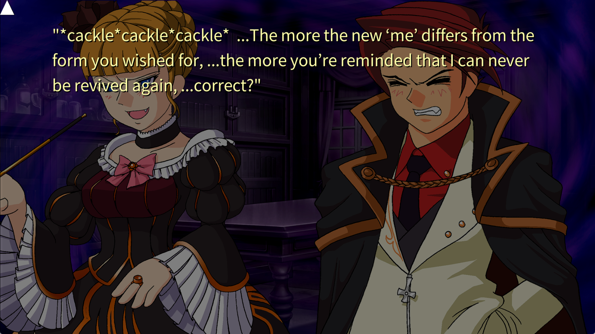

    > i am going to sob

    > THIS MUSIC.......

    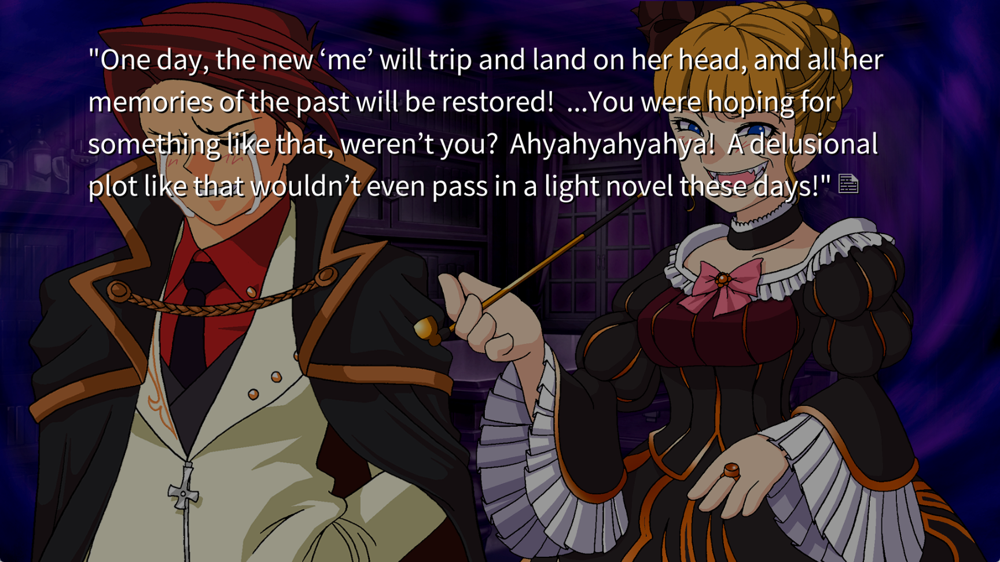

    > curls up on the floor and starts sobbing uncontrollably and vomiting a little from how hard im sobbing

-   Beatrice was waiting for Battler to remember before. Now... it's the exact opposite.
-   _Beatrice_: Why not consider her my daughter? One that closely resembles me.

    > Hm... wait... this isn't unlike the Beatrice that existed on the island 19 years ago...

    > Or rather. It's more like she's implying that other Beatrice **is** the daughter of the one that Kinzo was desperate to revive.

-   "You can torture her if you want. Or maybe even guide her down a better path."
    > The Kinzo parallels are so fucking painful

---

-   George, Jessica, Kanon, and Shannon are transported to... what looks like a room in Kuwadorian?
-   _Shannon_: Something strange is about to happen. That strange thing will probably test us.
-   Furfur and Zepar appear
    > the bitches from the wedding...
-   So these are the manifestations of the brooch. Not unlike Sakutaro and his vessel
-   _Furfur_: If you don't gain the miracle of magic, disaster will most certainly befall you!
    > Okay, but like, I don't think your blessing is needed for things to work out
-   "Kanon will leave the island for eternity"

    > If Shannon wins, Kanon disappears. Odd.

    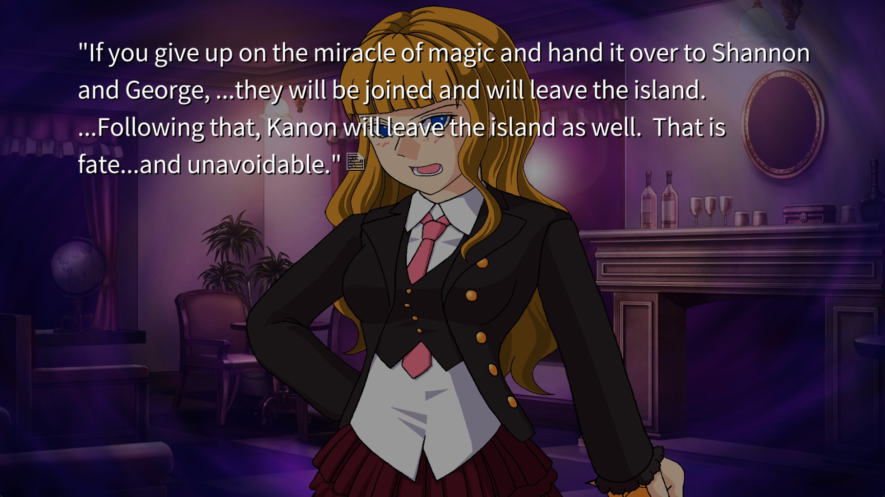

    > Why is this **unavoidable**?

    > And what happens if they win? What happens to Shannon?

-   This trial also applies to Beato. Her wish that her affection for Battler will be acknowleged can be granted
    > I don't feel like taking notes for this

---

-   Erika's room is once again, on the second floor of the guesthouse
-   Notably, it's no longer adjacent to the cousin's room. She can't hear anything.
-   Erika is preparing more tape seals
-   But the tape isn't sticky enough...
-   Erika and Dlanor have nothing to do now
-   _Dlanor_: Why do you hate magic?
-   Dlanor claims that Erika doesn't derive any pleasure from destroying illusions
    > I feel like that's obvious. Erika seems to just tear down magic because she herself is somehow incapable of believing
-   Erika just starts spouting non-sequitors, confusing Dlanor

    > ???

    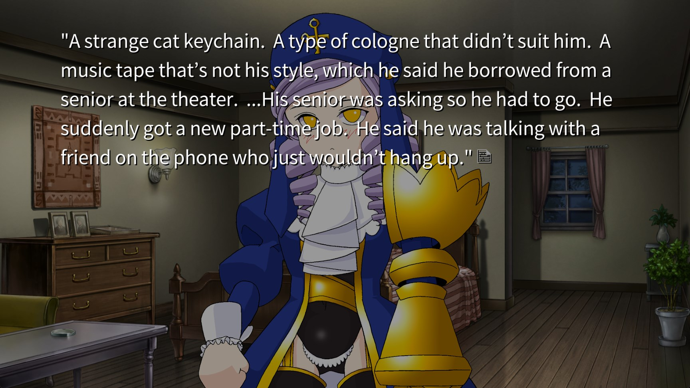

-   _Erika_: Because of love, you end up 'seeing' things that don't even exist
-   As I am now, I no longer need to worry about being tormented by non-red words.

    > I think the fact I relate to this on a very personal level is... bad.

    > It's a sad position to be in. She's not even wrong. With love, you really do see things that aren't there. It's agonizing, like you're constantly fighting reality and your better judgment, and to be completely honest, adopting this mindset where you **deny** love because of the excruciating, unfathomable, reality-defying, torturous pain it causes? It makes sense. I'm not coping. I'm not coping. I'm not coping. I'm not coping. I'm not coping. I'm not coping. I'm not coping

    > Who is Erika's ex? What is her damage???

    > I know her damage. I see you. I need to kill mysel

-   When blue truths collide, the decision is almost always based on which side has more evidence. This is particularly true for humans.
-   _Dlanor_: Then I frankly declare that, despite a lack of proof, I still love Lady Erika even NOW.
-   _Erika_: That's not a red. Even if it was, that's a stalemate.
-   Erika proceeds to checkmate Dlanor effortlessly

    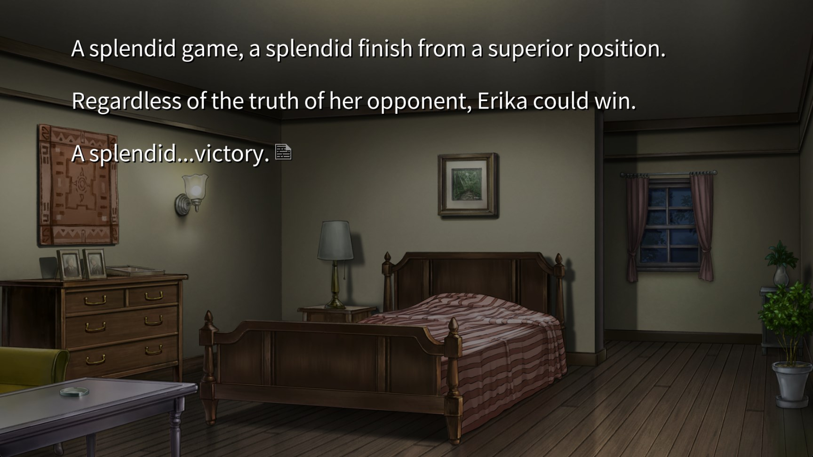

-   Dlanor points out that humans cannot use the red

    > In other words... they have to believe. How was her opponent supposed to show his truth?

    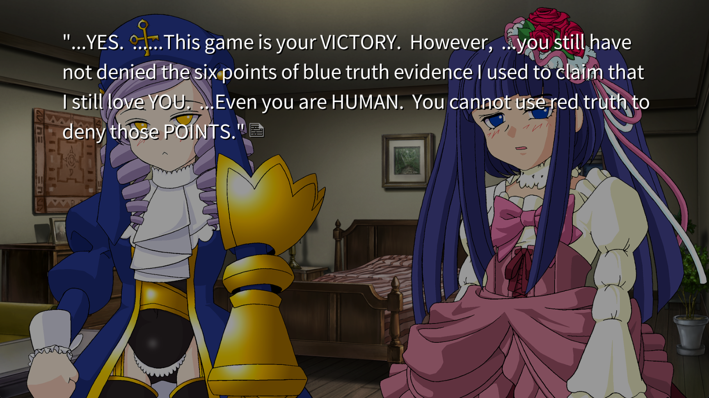

-   It's almost 24:00

---

-   Eva is flipping out about George's engagement
-   Ayumi is another girl picked out by Eva and Hideyoshi
-   George claims that Eva is just doing things for her own personal gain

    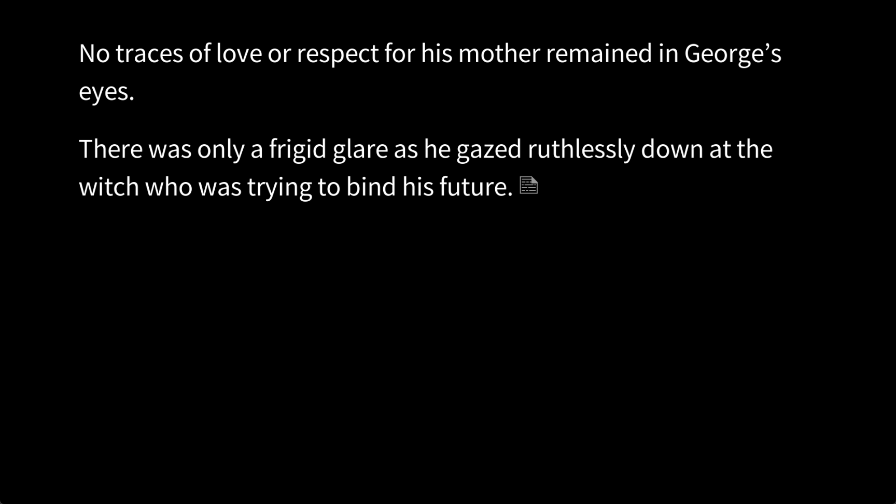

    > ok i cant do this anymore

# [12-24-22]

> Time to kill myself again

-   George had piano lessons on Tuesdays, cram school on Wednesdays, supplemental lessons on Thursdays...

    > guy wasn't allowed to have a childhood

    > So what's Eva(trice) trying to do here? Prove that George can't do anything on his own? That he's not strong enough to go through with a decision like this? That he's dependent on her?

    > Not only that, but she compares their suffering. Eva didn't have it easy, but she uses her own experiences to trivialize George's desires

    > I <3 Generational Trauma

    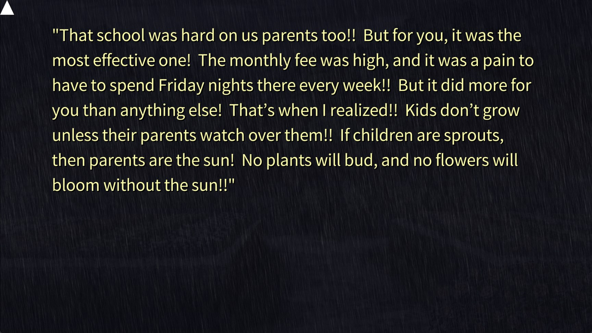

-   _Evatrice_: A first step? Don't make me laugh. You still haven't even been born yet!

    > Rejecting your kid's autonomy has to be one of the most vile things a parent can do

    > I suppose this is what the trials represented. Obviously. Are we going to see Jessica talk to her parents now?

-   _George_: Everything I owe you for what you've done, I've paid back now with pain.
-   _Fight Sequence_

    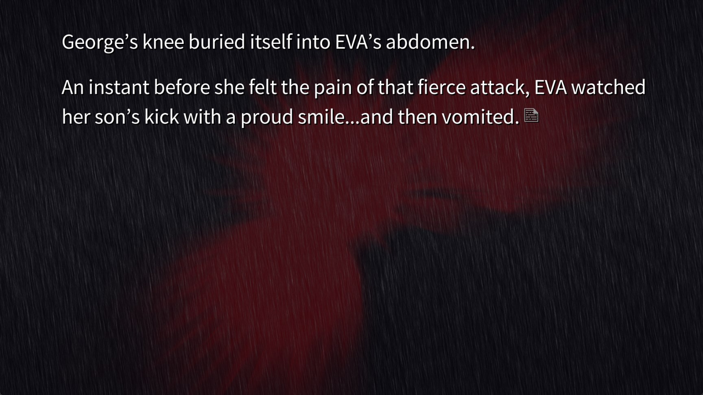

    > No way? No way? No way? No way? No way? No way? No way? No way? No way? No way? No way? No way? No way? No way? No way? No way? No way? No way? No way? No way? No way? No way? No way? No way? No way? No way? No way? No way? No way? No way? No way? No way? No way? No way?

-   _Gaap_: Impressive. Even considering that it was before her ascension, I can't believe you managed to defeat Evatrice.
    > This implies that she was going to solve the epitaph.
-   _Gaap_: But of course. I wasn't here. You summoned me just now.
    > Wait... did he actually kill her?
-   George asks Gaap to put her body in the vip room on the second floor
    > Ok no, he didn't actually kill her. It's all within the demons' love game
-   'So that the love of the pair will stand true, offer up the life of one person by your own hands'
    > Who will Beato need to kill? I can't think of anyone...

---

-   ~00:05 AM
-   The family conference is ongoing. Everyone is taking a short break, and Kyrie moves to the second floor corridor
-   Suddenly, Jessica is there

    > Wait, why is she going to fight Kyrie of all people...?

    > Oh, it's just a roulette.

-   Would it really be okay to sell her soul to demons for the sake of love?
-   _Jessica_: There's the two of us and another pair of lovers, ...and we have to fight each other

    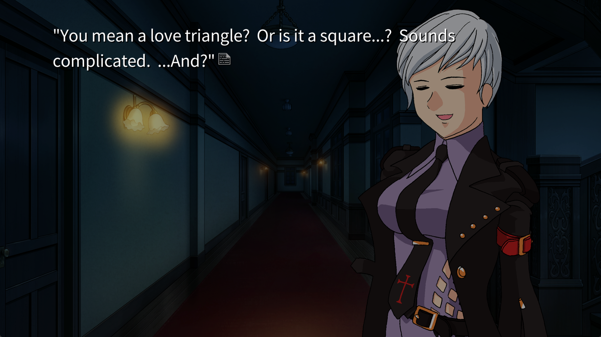

    > A love **triangle**. Y'know. Almost as if there are only three (four, including Beato) people in this game. Almost as if Kanon and Shannon are the same pers

    > Now that I think about it, Kyrie is probably the most thematically fitting person for Jessica to fight. After all, Kyrie is a victim of a situation just like this (the situation with Asumu)

    > Of course, that situation... was a love triangle. It would probably make sense for this to be a triangle as well, right? Parallels? Parallels?

-   _Kyrie_ (referring to giving up on your lover): I can tell you one thing for certain. Doing that will be even more painful. You'll be forced to crawl through hell. For the rest of your life.
    > ...This is probably talking about Kinzo as well, isn't it?
-   Ange found Kyrie's "book of thoughts" and read it after her death
-   _Ange_: It was practically a book of curses.
    > She wasn't a fan of Asumu.
-   Rudolf was a manipulative piece of shit
-   Kyrie stood out as a shrewd business partner

    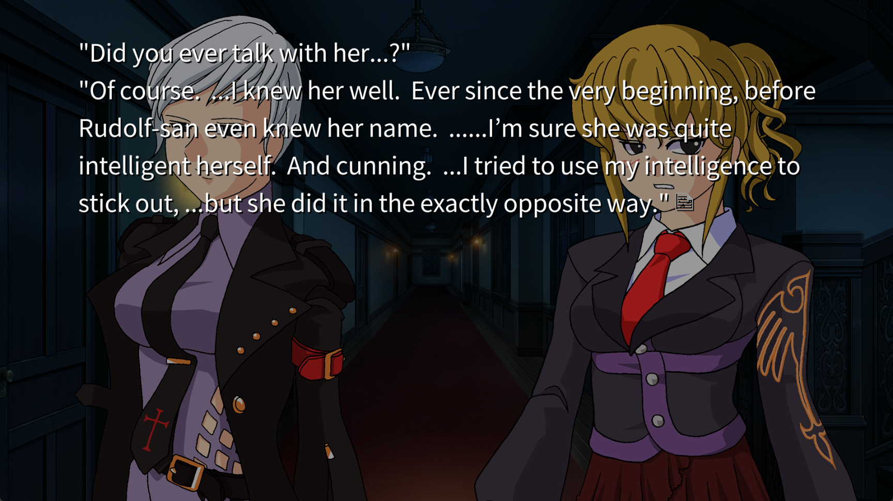

    > So... she used her intelligence to blend into the crowd? How does that help her at all?

    > Oh, no. She means Asumu pretended to be extremely stupid.

-   Bit by bit, Rudolf started to need a woman who could stay quiet and soothe him
    > booooooooo
-   Asumu would pretend to know nothing, because she knew that's what Rudolf wanted most (someone to balance out Kyrie)
-   And so, Rudolf ended up marrying her. She stole him away by sleeping with him
-   They both got pregnant, and Asumu used that to secure his marriage
-   Kyrie, on the other hand, saw it as a liability and didn't tell Rudolf about it
-   When did she realize she was pregnant?

    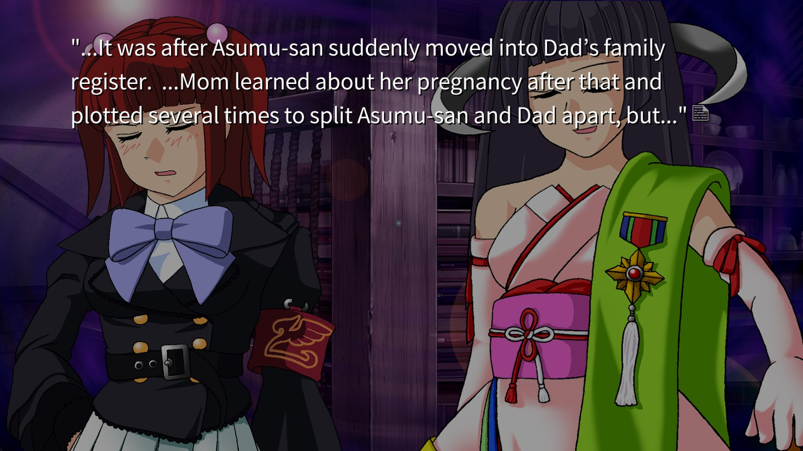

    > There's a big theme of babies from ~19 years ago dying. There's also a big theme of wanting to be acknowledged.

    1. Natsuhi killing that baby 19 years ago
    2. Kyrie's stillborn
    3. The Beatrice from 19 years ago dying
    4. Beato wanting Battler to acknowledge her
    5. Mammon wanting Ange to acknowledge her
    6. Maria and Beatrice promising to acknowledge each other in the Golden Land

    > Just to list off a few that I can remember.

-   _Ange_: Asumu-san gave birth to Onii-chan

    > That was proven false with the red in episode 4, wasn't it?

    > Ah... wait. That makes Shannon even more suspicious! Think about it. How could Beatrice even know that Battler wasn't Asumu's kid? Kyrie didn't even seem to know that.

    > However... Shannon mentioned knowing about Rudolf and how he always kept up with Battler even after he left the family. This isn't evidence per se, but I think this is still an important clue. Shannon is the only one foreshadowed to potentially know the truth about Battler's birth.

    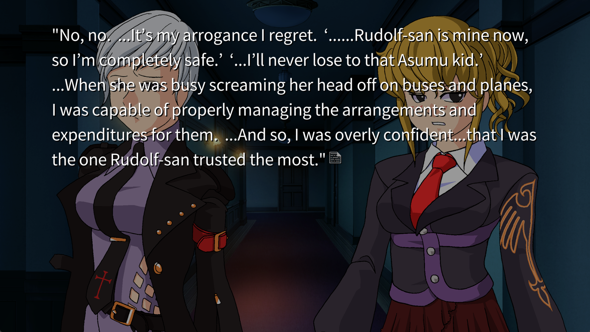

    > with dead angle playing in the background this is Beyond Kino

    > ...Did Battler really inherit his fear of vehicles from her?

-   Love needs to be "harvested", and it's not something you should procrastinate on
-   _Kyrie_: My hell ended after 18 years. That person is mine. I won't let him out of my sight. And I'm grateful to my master...
    > ...Who? Who is her master...
-   _Kyrie_: My 'certain willpower' in not giving up on that man no matter what... was answered with a 'miracle'

    > Really like the idea that miracles don't exist on their own, they're just the end result of belief

    > Because, y'know. Belief brings about certainty. And certainty brings about miracles. Or something. Shut up

    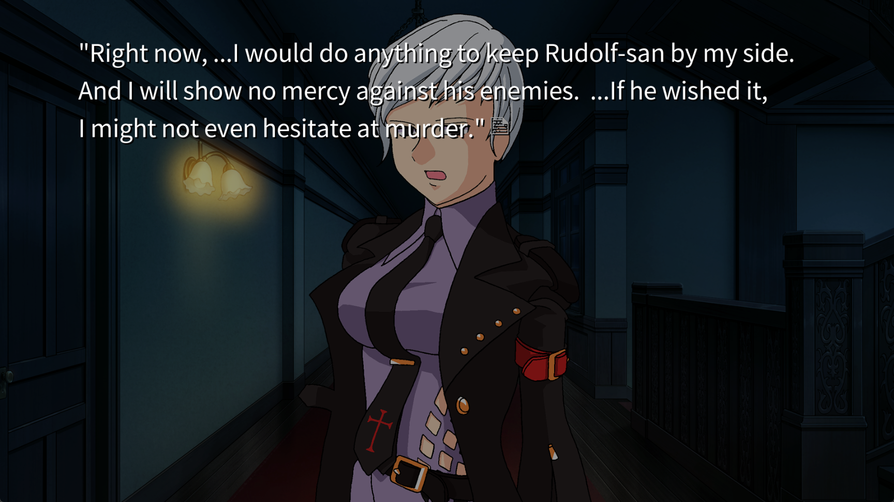

-   Asumu died shortly after Kyrie resolved to kill her. So her fate was sealed...
    > The vase from the beginning of chapter 3...
-   The miracle is that Kyrie didn't need to do it.

    > Like how the cat appeared and took the blame for the vase...

    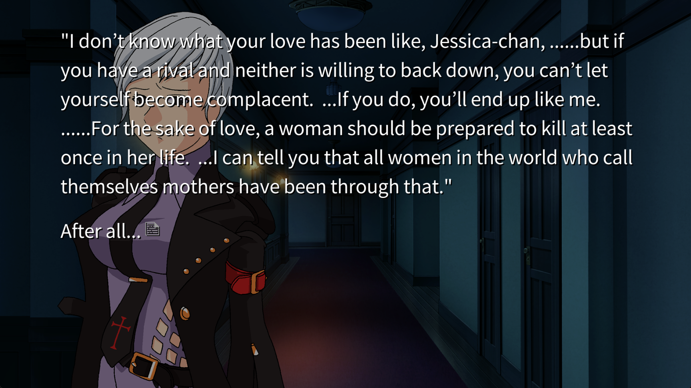

    > More Kanon = Shannon implications...

-   Leviathan suddenly appears and pierces Jessica

    > She appeared after both Jessica and Kyrie acknowledged this as a 'nightmare'

-   _Leviathan_: She's immortal, thanks to a contract with one of the great demons!

    > I'm too sleepy to interpret this

    > Wait no, I'm stupid. This is Zepar's barrier.

    > Interesting "unstoppable force vs immovable object" thing going on here. Well, those are the same aren't they?

-   Leviathan is the only one who can unlock the room(?)
    > ...Can the stakes be used as lockpicks? I doubt it.
-   More funny envy calculations from episode 3
    > These are so funny
-   _Kyrie_: You're lacking in both love and jealousy.
-   Kyrie says that the relatives will eventually realize she hasn't returned, then Jessica's magic will vanish once observed.
-   _Jessica_: It seems you were too proud after all, Aunt Kyrie.

    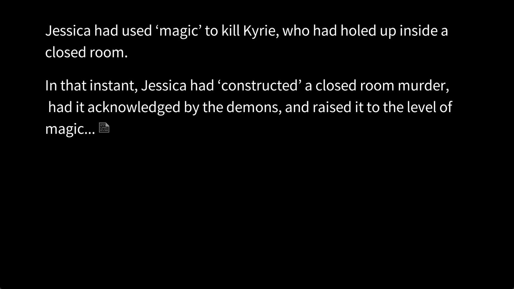

---

-   Rosa in the parlor thinking about how to navigate the family conference in the direction she wants
-   She needs ~100 million yen by March to help support 'that man's' business
    > Maria's father
-   Kanon has to kill her now
-   Kanon somehow knew that Rosa co-signed a loan with Maria's father
    > Krauss only knew about the loan. Not who she signed it with
-   Rosa viewed it as a trial of love (it's not)
    > Erika was right
-   _Rosa_: I've only waited as long as the first half of Kyrie's 18 years. If I gave up after just this, she would laugh at me.

    > Great logic Rosa. You must continue suffering simply because someone else suffered longer than you

    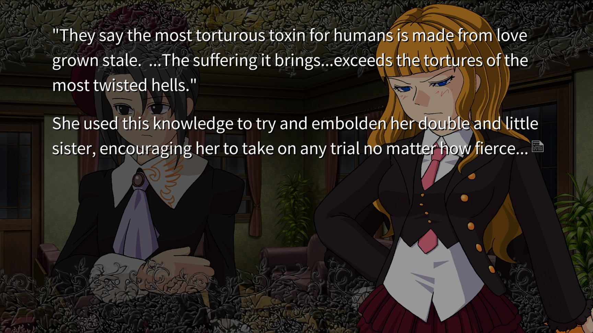

# [12-25-22]

> happy holidays to the the certainly gay readers. i know what you are. there's no way you're not. if you aren't we can work on that

-   Kanon quickly and painlessly kills Rosa
-   MARIA JUMPSCARE
-   Shannon has to kill Maria now
    > Funny how that worked out
-   Shannon uses her non-targeting barrier to crush Maria and Sakutaro
    > IT'S JUST LIKE YUGIOH
-   _Maria_: This might be just perfect for that wannabe detective trying to deny Beato's magic.

---

-   Now it's Beatrice's turn. And it looks like her target is Natsuhi.
-   Krauss told Natsuhi to go to bed

    > Oh, so the man on the phone was Krauss? I think I mentioned this possibility in the episode 5 notes

    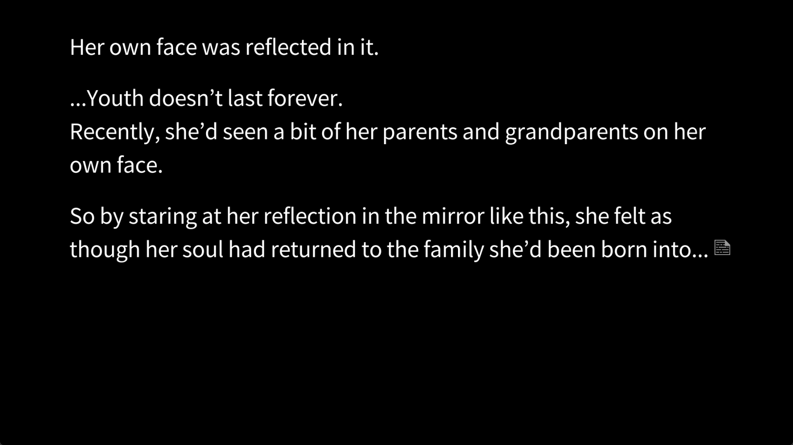

-   _Natsuhi_: Though I understand logically that staying here is the best way I can help, I still feel wretched for doing it.

    > This is another repeating theme. Understanding something logically yet still feeling awful for it.

    > ...I wonder if that's how Erika feels deep down. I don't think any human can have a totally clear conscious when making an emotionally unsatisfying decision like this. Erika is still a human after all.

-   There was a chance that Battler was the baby that Natsuhi pushed off a cliff 19 years ago.

    > What? How? He's still Rudolf's kid... how in the world would Rudolf's baby end up with Kinzo

    > I mean, Battler did try to use this as a blue in episode 5. But that was just demonstrative... it was another possible truth to deny the certainty of Erika's

-   Peering into the mirror knocked Beato over
-   Beato loves Battler and wants him to acknowledge her
    > little too STRAIGHT for me not going to lie/fib/deceive/gaslight/gatekeep/girlboss
-   _Beato_: I was born for Battler's sake!
-   A closed room is one of the concepts that allows a witch to be a witch. Just unlocking the door strengthened the anti-magic toxin a little.

# The power of the living to live is fundamentally stronger than the power of magic.

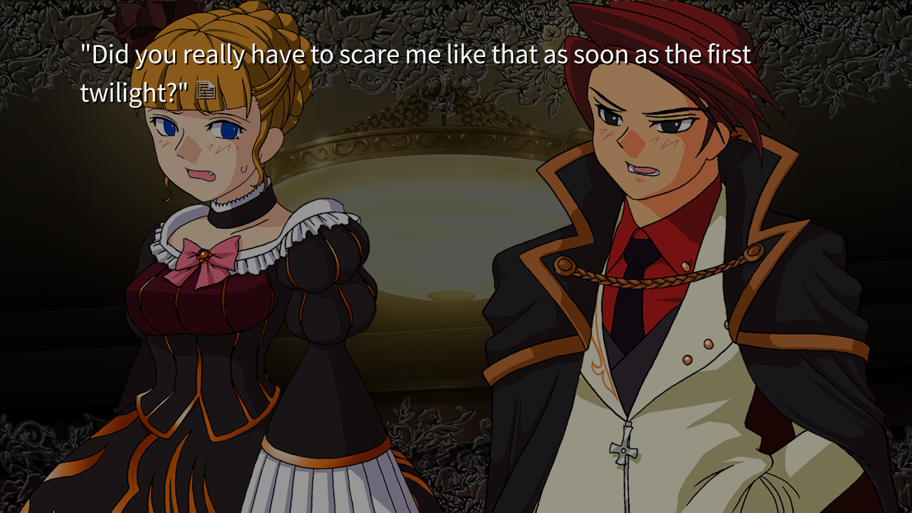

> I was thinking about this. These 5 deaths correspond to the first twilight, right? George killed Eva, Jessica killed Kyrie, Kanon killed Rosa, and Shannon killed Maria. Now, Beatrice (with Battler's help) killed Natsuhi.

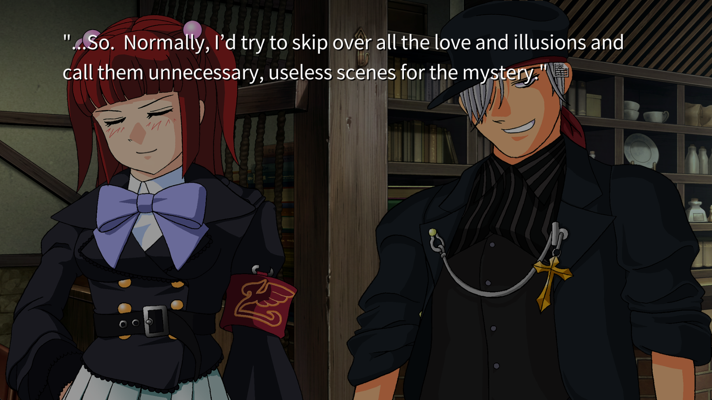

> Haha. I do that

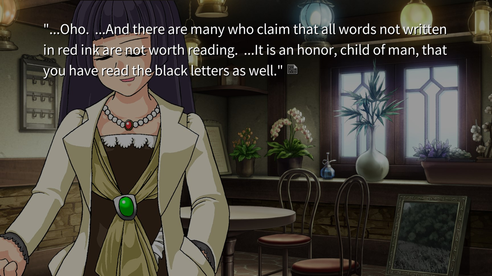

> What they're basically saying is that the truth cannot be reached unless you consider various different perspectives; the red is "truthful" in the strictest sense, but the normal text just requires some nuance

-   Ever since Beatrice first appeared, there have been many scenes centered around love
-   In the end, Battler had regained some memory, and his impression of Beato had gone a complete change
    > Hence... the new Beato.
-   Ange would have normally left by now, but she was certain that Hachijo genuinely knew the truth
-   Hachijo, and anyone who knows the truth, are Endless Witches

    > Hold on. Whoever solves the epitaph is given the title of Golden Witch. Does that mean that solving the epitaph is equivalent to knowing the truth?

    > ...How? I've already solved it, and it doesn't seem to say anything about Beatrice at all. It's not even _related_ to Beatrice.

    > Back in the episode 5 notes, we established that solving the epitaph _proves_ something to Beatrice. She has an answer to a question. What question could the epitaph answer possibly be in response to?

-   Bern and Erika want to play without the detective proclamation to completely "flip the score" and undo the loss from the last game
-   Battler just sees this as a convenient excuse if they lose
-   _Bern_: This bet is balanced. If the human side wins, the Illusion of the Witch cannot be recovered. If Erika loses, that detective trash will be sent into the depths of oblivion along with the worst possible Fragment.
    > ...Poor Erika? What the fuck
-   It's all or nothing, basically

    > Bern wants to end this game once and for all. Because winning with a normal human means absolute victory...

    > holy FUCK poor Erika

-   George and Jessica knocking at Erika's door at ~1:10 AM
-   They want to know if Battler and Maria had come to her room
-   Servant room and dining hall of the mansion didn't pick up
-   Erika tells them to stay in the cousin room and for the servants to not leave the building
-   No crime has occurred in the guesthouse.
-   The entrance hall lock was undone this time
-   Gohda was the first one to discover the crime (in the parlor room)

    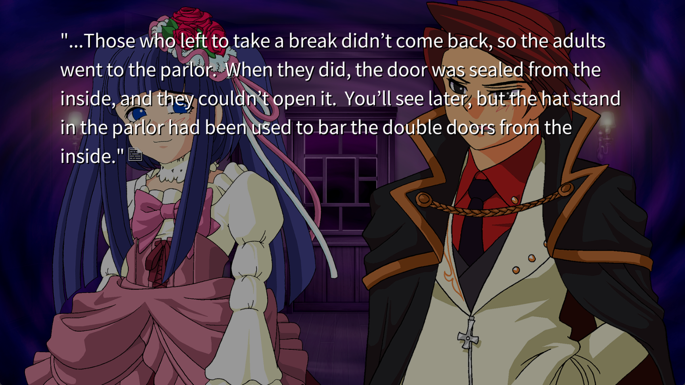

-   They broke into the room through the window and found Rosa and Maria's corpses
-   The entrance was unlocked because they went out through it to check the parlor from the outside
-   It was locked before that

    > Eva is the odd one out here. Rosa, Maria, Natsuhi, Kyrie, and... who was Battler's victim? They were all killed in the mansion (presumably). Eva was moved to the VIP room though.

    > Good question. Also, who used the hat rack to block the room in episode 1? I can't quite remember, but I want to believe that it's [insert single entity name for Kanon/Shannon]

-   Battler is found dead in a (first floor) guestroom
-   Another closed room no way really
-   The goal of the game is to explain, without magic, the strange crimes that are claimed to be caused with magic. If that couldn't be done, it wouldn't be a game.
-   The witch side is therefore responsible for creating a crime that could be reproduced with tricks and not magic
-   "Magic can only do what you can accomplish by your own hands"

    > It's an embellishment, as Virgilia put it.

    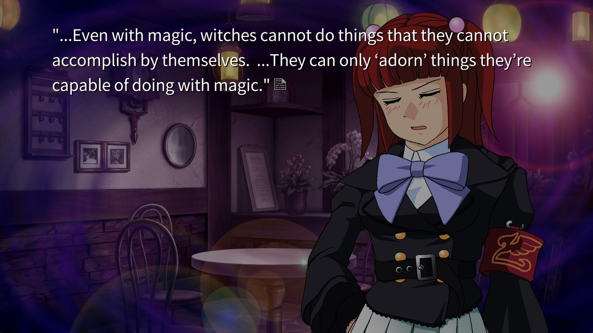

-   Hideyoshi's group went to the guesthouse, while Krauss and Rudolf's group was in the hall
-   Servant room contained a clear folder containing a sketch of the mansion's interior
-   Without the detective proclamation, Erika's photographic memory doesn't count as foolproof evidence
    > She has to fight in the same way the old Battler fought
-   The master keys had nothing to do with the trick. The closed rooms were all made without relying on the use of locks
    > Note that the rooms themselves were still locked
-   The doors were locked AND chained
-   Erika is indebted to Bern?
-   The door to the parlor was barred with a hat stand
-   The question now is, why choose a room without a chain lock?

    > Worth noting that Eva wasn't killed in the VIP room, she was killed outside.

    > Also, we should think about the "order" of these closed rooms. Beatrice's chain of rooms required a specific traversal. Is that the case here?

    > Well... not really. There's nothing preventing them from entering any specific one. Plus, the master keys don't help them enter.

-   There were no corpses that could have been confirmed dead with certainty by physical means
-   Cannot deny the possibility that one or more of the corpses might be a faked death

    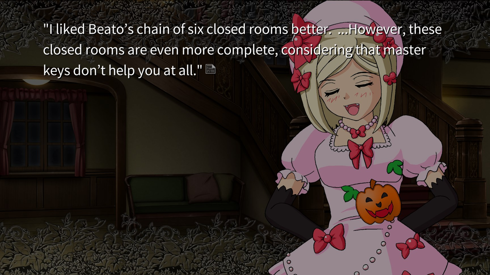

-   An illusion of a closed room, or an illusion of a crime
    > i.e. the room isn't actually closed, or nobody was actually killed
-   There are all sorts of other technicalities as well. Manipulating the chain lock, secret doors, killing at a distance, chances of suicide, or whether they are definitive "closed rooms" in the first place

    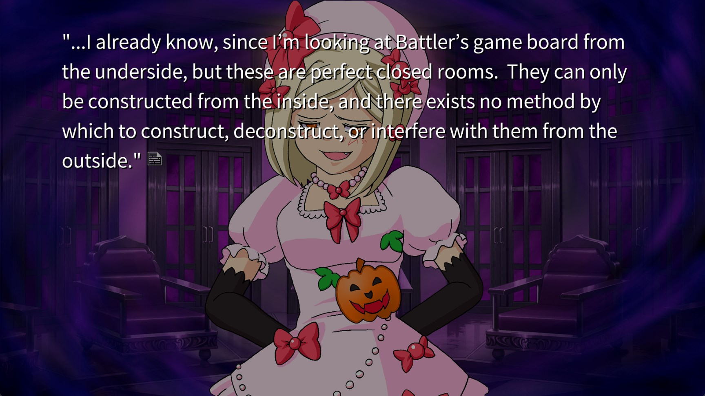

-   _Lambda_: I can't repeat that in red, because that would be too rude to Battler. If you do love me, you must see my words as red truth already, right...?

    > aw.

    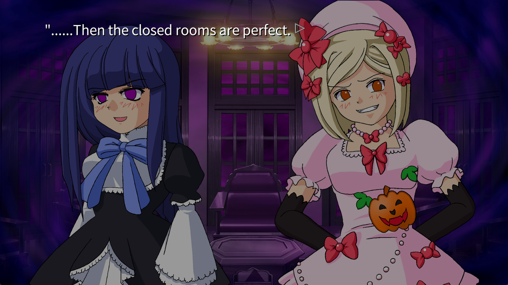

    > AWW.

    > they're so adorable.

-   If these closed rooms are perfect, then it seems as if these are all illusions of crimes. Did everyone get pissed at Erika and set up fake murders?
-   ...Nope. They're perfect murders too.
    > Neither of these were guaranteed were red... so something clearly has to be incorrect.

---

# The rooms with the six people in them are all closed rooms.

# Closed rooms cannot be constructed from the outside.

# All forms of interference that pass between the inside and outside of the room are prevented.

-   This excludes the kinds of interference that you'd expect from a normal room, like voices, knocks, and the extension line

# At the time of the deconstruction of the closed rooms, none existed within the rooms except the victims

> Natsuhi, Eva, Kyrie, Rosa, Maria, Battler

> So nobody was hiding in any of the rooms.

-   'No murder was committed after the deconstruction of the closed rooms'... is unverified.
    > I mean, more murders will occur after this. Battler can't really verify that claim.
-   Excepting the victims, those who entered the closed rooms were Krauss, Rudolf, Hideyoshi, and Gohda
-   This is based on spoken testimony. There is no proof that others did not enter

# Acknowledged. Krauss, Rudolf, Hideyoshi, and Gohda were the only ones who entered the rooms.

# Krauss, Rudolf, Hideyoshi, and Gohda were not involved in the murders of Natsuhi, Eva, Kyrie, Rosa, Maria, and Battler.

> Wow. That is a very, VERY generous red.

> But... that means it was impossible for anyone else as well. Closed rooms can only be constructed from the inside. It has been confirmed that nobody except the victims existed inside the rooms. The only people who entered were those 4, and they were confirmed innocent. That means none of the victims... are actually dead.

> Of course... my comments aren't red.

# The victims did not die by any method other than homicide.

> This doesn't prove that they're actually dead. If there are no victims whatsoever, then you can say they didn't die by any method other than homicide. That's equivalent to saying "Someone killed nobody"

-   Genji said that the mansion was locked after the kids left for the guesthouse
-   Battler and Maria were in the mansion though

    > Plus, George and Jessica entered, if we interpret the events of the demon game somewhat generously

    > So a servant was an accomplice (or a culprit). Kanon/Shannon blah blah

    > Though, I do wonder why Battler and Maria were even in the mansion.

    > Remember. They were playing cards in the room as well.

-   There's a chime in the servant room that goes off when the front door opens
    > Ah, well that changes things.
-   ...But there was nobody in the servant room
    > Oh.
-   Gohda was the only person on shift in the mansion

    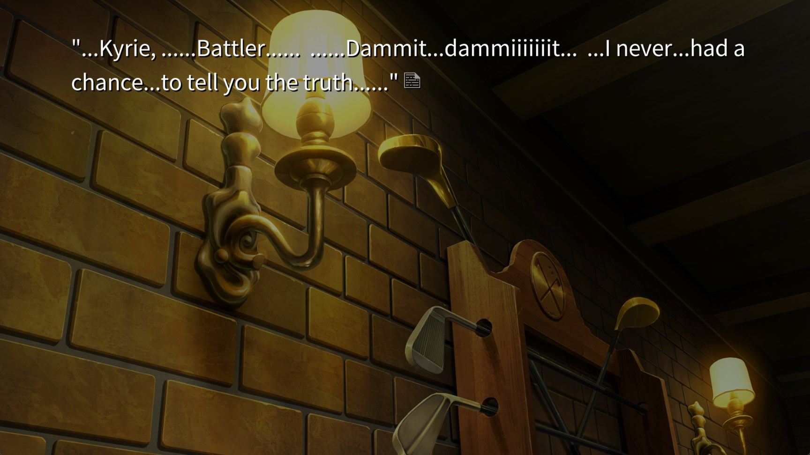

    > This shit has been on the backburner since **episode 1**

    > I don't feel like devoting any brain cells thinking about it again. Let's just continue

-   Erika has Krauss and the servants go to the cousin room
-   _Erika_: This crime happened during a short break in the family conference. In that small timespan, six people were killed. It was premeditated, and committed by someone who knew the layout of the mansion well.
-   At the time of the crime, the mansion was locked from the inside, and only those involved with the family conference existed there
-   Gohda probably didn't kill anyone, but it's possible he welcomed the murderer into the mansion
-   The victims are familiar with the servants, and there were no signs of a fight in any of the crime scenes. So the servants could have easily caught them by surprise
-   There must be more than one culprit
-   Also, it had to be someone who wouldn't rouse Rosa's suspicion until the last second (according to Rudolf)
-   The only ones with something to gain from setting the chain locks, are the servants
-   Erika suggests the possibility of the servants using a special tool to set the chains from the outside, even though the red makes this impossible
    > So she wants them to suspect the servants.

---

-   Battler says that the witch side doesn't have a huge advantege
-   Battler also notes that their (his and Beato's) roles have been flipped

    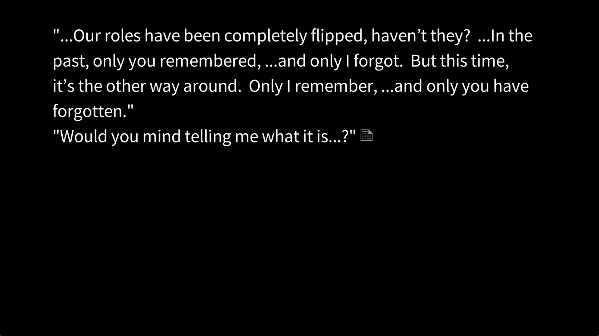

-   "Telling you would be easy. But I don't want to tell you. I just want to believe in a miracle for a bit myself."
    > god.
-   If Beato could remember a certain something without being told, that would prove that Beato had truly revived.

    > ...Does this work the other way as well? Did Beato want Battler to remember the truth without being told, so that he would revive?

    > ...This is probably what Kinzo was doing as well.

    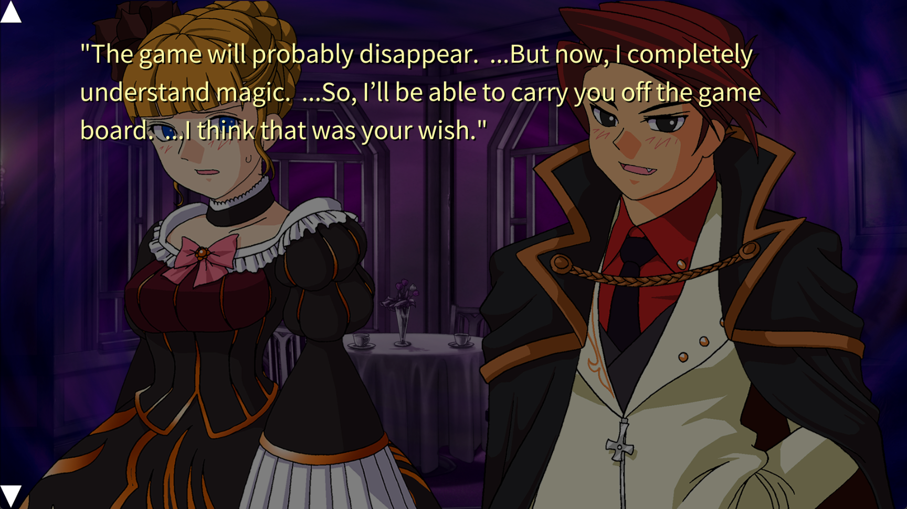

    > \*Thinking about when Battler promised Shannon he'd take her away on a white horse or whatever the fuck\*

# [12-27-22]

-   In all cases, the victims themselves constructed the closed rooms
-   The closed rooms were preserved
-   Erika says without the detective's authority, she can't be sure the corpses were dead
-   Without the proclamation, she can't be on the offense

    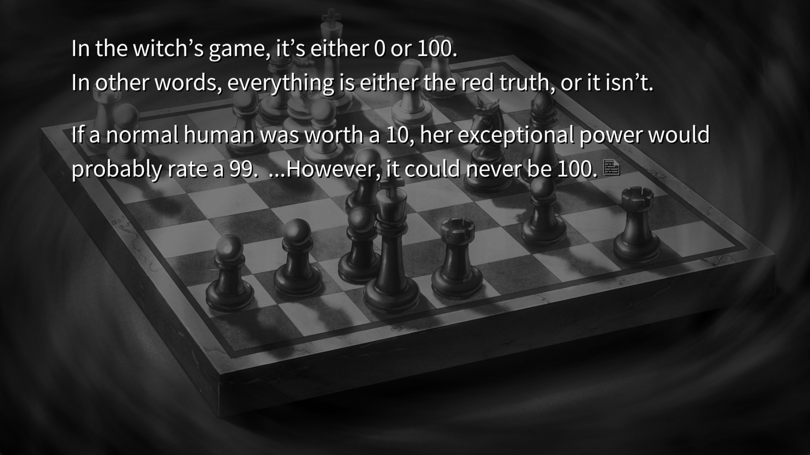

-   Nothing Erika does can compare to the red
-   She's only 99% certain of their deaths
-   Bern usually supplies her with that additional 1%
    > Miracles and small percentages appearing once again
-   Dlanor's red longsword also cannot be utilized without the detective's authority

    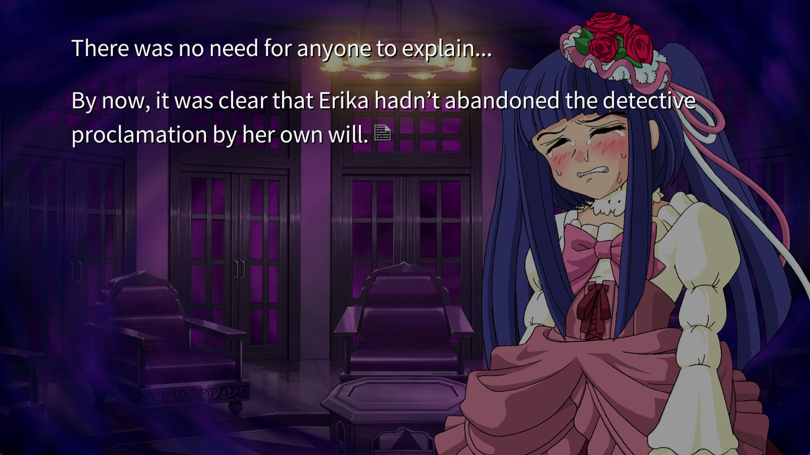

    > I feel so fucking bad for her

-   The game is already over. This is just a finale, not really a 6th game
-   Bern is unsatisfied because she wanted the board to be torn apart, and Beato's true, pathetic form exposed

    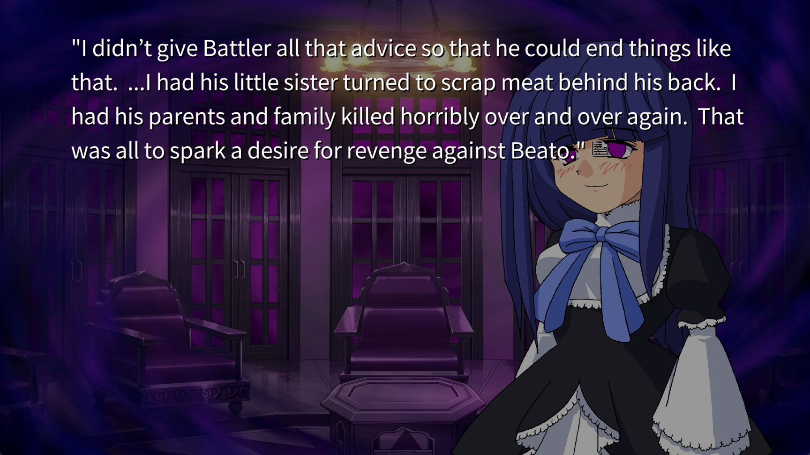

-   Bern and Lambda claim that Erika has basically no chance of winning, since she wasn't able to win with the detective's authority
-   _Bern_: If you manage to win in this even worse situation, that would be a miracle worthy of me.

    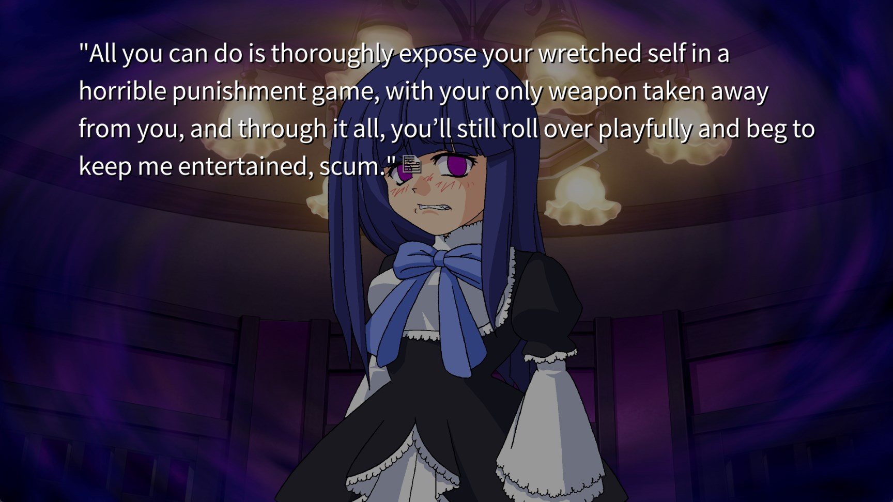

    > I have so many things to say but frankly I just want to cry

    > This question has been on my mind for a while, but why **is** Erika so subservient to Bern?

    > I _want_ to say it's because she rejects love, and subsequently her own humanity (as futile as that is). Bern's goal is to trample all over the concept of love in its sincerest form, and that naturally aligns with Erika's damage.

    > I worded that poorly... but I hope the idea got across

    > ...poor erika. Reading this genuinely makes my eyes water, because like... **[redacted]**

    > Let's not get into that here.

-   _Battler_: My role isn't to carry out serial murders. It's to use that process to show you closed rooms that are impossible without magic

    > Oh? Does that mean solving the epitaph indicates a belief in magic?

    > Well... that would line up with Evatrice's ascension. She solved the epitaph, then became a witch. She became the exact person that could make others believe

-   Battler wants to settle things with Erika after their draw last game

    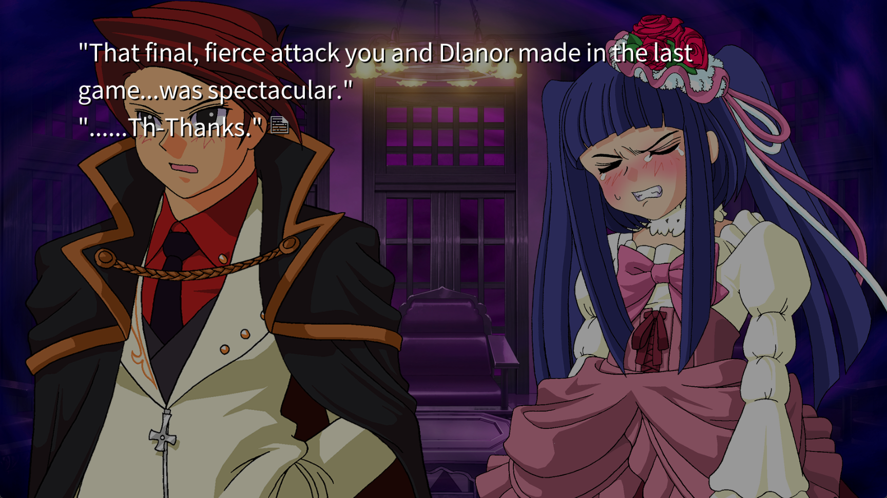

-   Battler quickly realizes that Bern made Erika avoid the proclamation, after noticing that Dlanor couldn't fight
-   _Battler_: This is between me and Erika. We're gonna fight with all we've got. That way, we'll be able to accept it whether we win or lose.
    > What an awesome mentality
-   Battler cannot kick Bern out of the game, because she'll take Erika with her, cancelling the game

    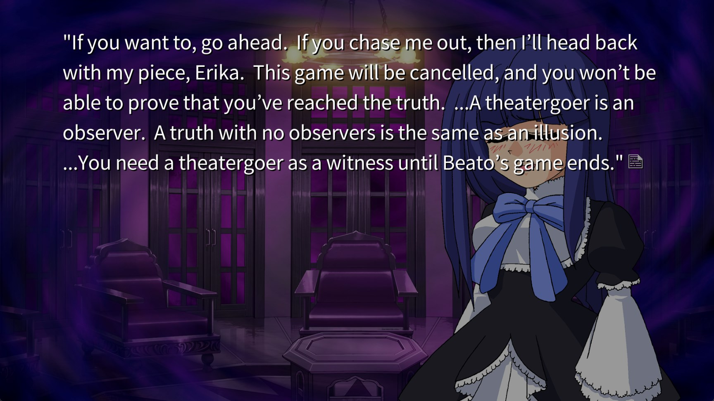

-   He still asserts that the truth only needs to pass between him and Beato, and Bern then threatens to leave and throw Erika into the worst possible fragment
    > i am going to sob she doesn't deserve this
-   Lambda reins in her gay wife and says Battler and Erika's desire to fight should be respected

    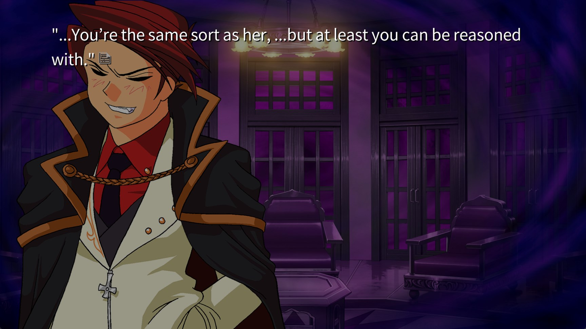

-   Erika is asked to make the proclamation, but she can't do that without Bern's permission. She's a piece after all
-   Dlanor needs permission to unsheath the red key, and the proclamation is just one form of that
-   Dlanor can use the sword when given a 'truth'. For example, Bern said that Erika's seals are equivalent in value to the red truth. So Dlanor can draw the red key for truths pertaining to them
-   _Battler_: Erika was proud to call herself a detective, wasn't she?

    

-   "In accordance with the rules, I must fight my rival ruthlessly. But I don't need to hate Erika as a person. I won't **misunderstand** Beato's game."
-   Battler lets Erika use three rooms' worth of packing tape seals
    > Three ROOMS' worth is a fuckton of tape. She needs to cover all the doors and windows
-   He also acknowledges that the seals have the same effect as the red truth
    > So now Dlanor can use her sword with respect to them
-   Battler rewrites the tale: the packing tape that Erika received was sticky, but there was only enough to use for three rooms
    > ...logic error window?
-   Human side wants to apply this retroactively, but that gives them a HUGE advantage

    > They can just tape the relevant rooms

    

    > smile

-   _Battler_: In the game, let's suspect each other over everything as enemies. But as fellow players, let's trust each other. That's how this game is meant to be played.

> NOOOOOOO I'VE BEEN FOOLED AGAIN

> erika's trick

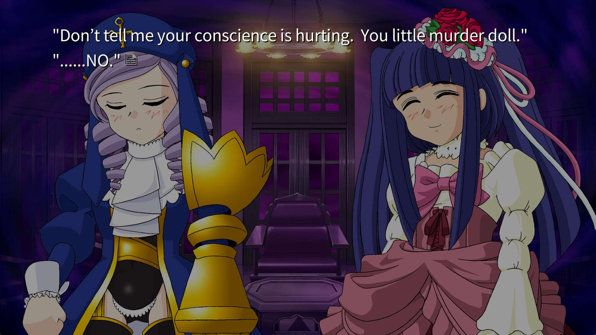

> So like. I feel like this is another important theme to touch on

> Is Battler a fool for being trustworthy? I don't want to assume that he's playing 5D chess and somehow didn't give himself a disadvantage here, and just assume he's a nice person. Trust is good.

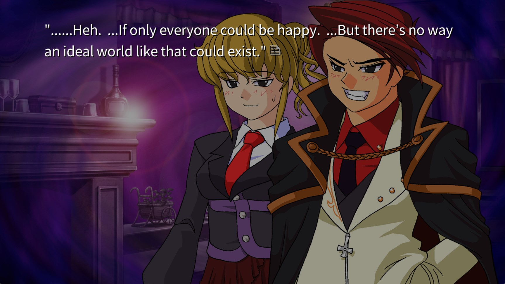

> IT CAN EXIST!!! COLLECTIVE DELUSION!!! MORE THAN ONE PERSON CAN BELIEVE!!!

-   It can exist in the Golden Land
-   That place doesn't exist in this world though

# [12-28-22]

-   George implies that the Golden Land is... in death?
    > I mean, that makes sense given the epitaph
-   The next trial is a battle on equal footing, someone needs to be killed
-   There's no real way to go about this without it being totally luck-based
    > I HATE GAME THEORY I HATE GAME THEORY I HATE GAME THEORY I HATE GAME THEORY I HATE GAME THEORY I HATE GAME THEORY I HATE GAME THEORY I HATE GAME THEORY I HATE GAME THEORY I HATE GAME THEORY I HATE GAME THEORY I HATE GAME THEORY I HATE GAME THEORY I HATE GAME THEORY I HATE GAME THEORY I HATE GAME THEORY I HATE GAME THEORY I HATE GAME THEORY I HATE GAME THEORY I HATE GAME THEORY
-   Erika, Rudolf, and Krauss decide to split people up into two rooms on the second floor of the guesthouse
-   They're suspicious of Gohda, Genji, and Kanon
-   Six in the cousin room (including those 3) (Krauss, Rudolf, Jessica, Genji, Kanon, Gohda)
-   Six in the other (Hideyoshi, George, Shannon, Kumasawa, Nanjo, Erika)
    > I imagine Jessica wanted to be moved because George and Shannon were in the other room

---

-   _Battler_: Magic is not something that is given to lazy or powerless humans. On the contrary, people who can hide their great efforts are the ones we call witches.
-   Erika split them into two rooms to somehow allow her to investigate the closed rooms more closely

# [12-29-22]

-   The dialogue here makes it seem as if George didn't kill Eva
    > Obviously we can't trust that
-   Erika says she'll visit the cousin room, but it's pretty obvious she just wants to revisit the crime scenes
-   She's clever. She's making sure Hideyoshi keeps everyone inside this room indefinitely

    > This isn't guaranteed, but Hideyoshi _was_ confirmed to have nothing to do with the first 6 murders. Ergo, he's probably not an accomplice. So this is like sealing the room...

    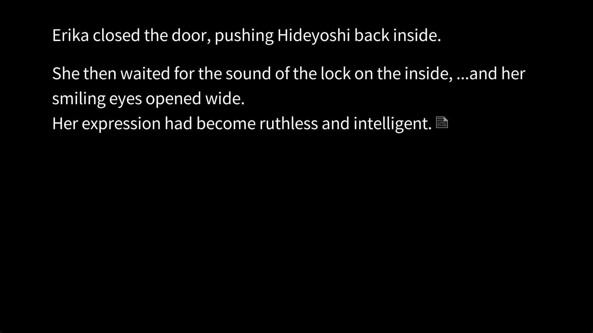

    > huge grin on my face

-   Erika asks Battler to confirm the locations of all characters present.

    > This is a good move. If Battler refuses, Erika can claim that someone sneaked out and committed the rest of the murders

    > For a crime to be impossible, he should reveal their locations...

# The six first twilight victims are located at the places where their bodies were discovered. Natsuhi is in her room, Eva is in the VIP room, Kyrie is in Krauss' study, Rosa and Maria are in the parlor, and you (Battler) are in the guest room

# Hideyoshi, George, Shannon, Kumasawa, and Nanjo are in the next room over

-   Erika wants Battler to say "everyone else is in the cousin room"

    > Weird. Why request it like this? Erika herself isn't in the cousin room, so it's not like Battler can say that.

    > Let's think carefully. Even if we exclude Erika and Kinzo, is there anyone unaccounted for?

    > ...No. Battler shouldn't have any issue saying this under that circumstance.

-   Back in episode 3, the 18 names given at the end didn't match with the 18 people who actually existed, leaving room to add in an unknown person
-   Erika is trying to avoid that.

    > Remember! Kanon's name was revealed to us in this chapter. It's Yoshiya. There could be some gimmicks involving it.

    > For example, I think it would be fair to confirm that Kanon is in the room while Yoshiya is not

    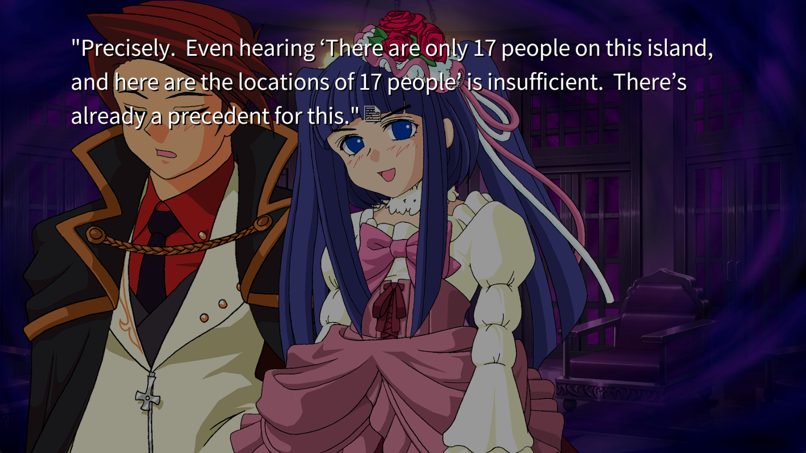

-   Battler has to remove any leeway for an additional person to exist

# I acknowledge that everyone else is in the cousin room.

> Wow, really?

> That confirms everyone's alibis for this point in time. There's still the whole Shannon/Sayo thing... but I doubt that'll be an issue

# The complete sealing of both the cousin room and the next room over has been guaranteed

-   Cornelia wonders why this move is being made. Wouldn't it be more advantageous to the Humans if there are more people with unspecified locations?

    > Maybe. But that's not really Erika's style right?

    > She wants to know the truth. So having exact locations and alibis means she can very meticulously work things out

-   Closed rooms are advantageous to wtiches, and disadvantageous to humans
    > Not necessarily... true closed rooms offer certainty!
-   Erika is denying the usage of the 11 people in the closed rooms
-   Holing up in a single room is a simple but effective tactic against a witch
-   Battler uses a knight/bishop analogy of cutting through enemy lines

    > is someone within the rooms going to die without breaking the seal? That would be really easy to investigate

    > Let's review. We believe that the six victims aren't actually dead. Their deaths were never confirmed in red, and since the closed rooms appeared to be perfect, that's our only option.

    > Now, the 11 remaining survivors are split between two rooms as described before. The locks on the first floor of the guesthouse are perfect, and the entrace has a chain lock.

-   Erika takes a flashlight and umbrella from the servant room
-   She unsets the chain and exits, only to find a letter.

    > AHAHAHAHAHAHA

    > wonderful

-   Letter wedged under the mat in front of the entrance

    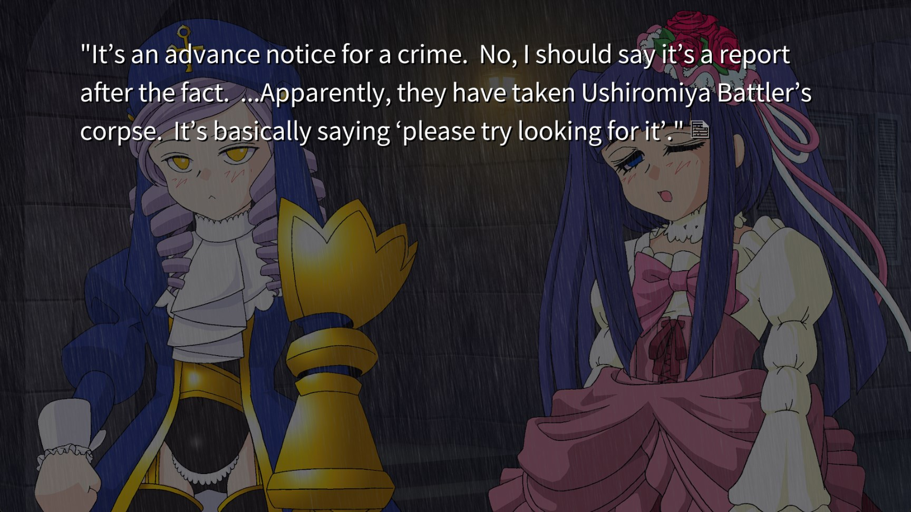

-   At the very end, after checking the locks and windows of the guesthouse, Erika confirmed that there was nothing at this spot
    > The six are alive...
-   Erika retroactively sealed a room
    > I knew that was way too big of an advantage...
-   Battler's guest room was sealed at the time of Erika's inspection of the corpses (earlier)

    > So that means the seal must now be broken...

    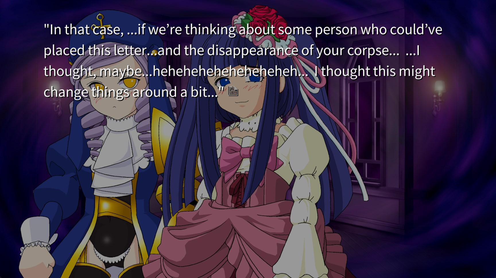

    > This seems a little unfair...

    > I mean, if Battler knew about the seal, he would have changed things up. What the hell

    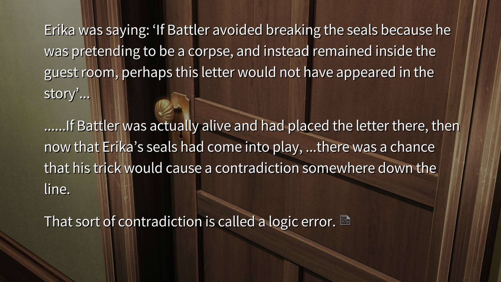

    > Disaster incoming...

-   _Ange_: A logic error would be 'a trick that has become impossible'
-   You can only have a magical result if it's something that could have been done without magic
    > So in the case of the cup, a logic error would be Maria staring at it, yet candy still appearing anyway
-   There are two types of magic: one where you just fucking Lie about something that wasn't observed, and one which is 'true magic', which is magic that matches some expected result.
-   This second kind is where the process is obfuscated
-   Only things that can be accomplished without magic can have a matching result
-   The witch side cannot deny their own trick with the red. It's not possible

    > Battler needs to immediately change his trick then?

    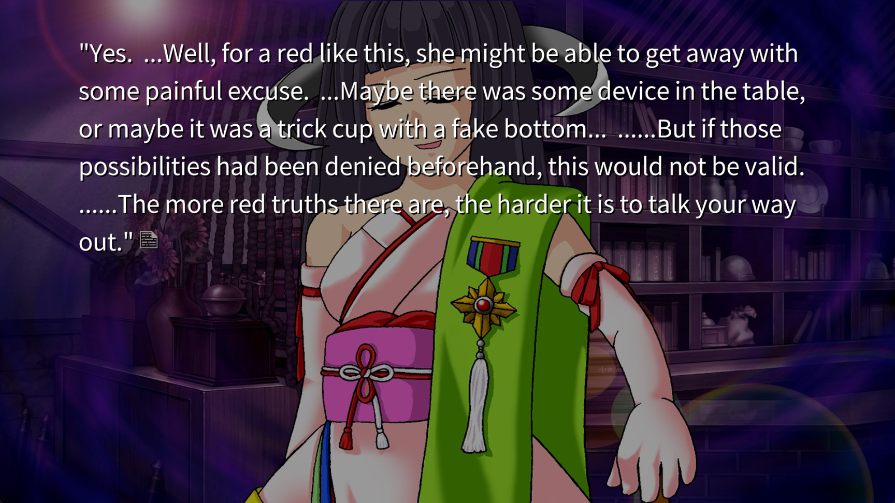

    > Might want to think about that terrifying room again. The red truth is making it exceedingly difficult for that person to escape, just like how it's harder for the witch to talk themself out

-   Switching truths is an act only available to the Game Master, not necessarily all witches

    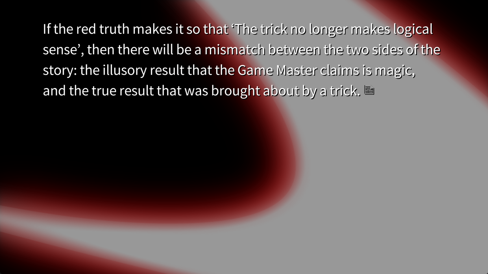

-   If the two sides cannot match because of the red, then we get a logic error, which destroys the game and results in the witch's defeat
-   There is a way around this. Battler can just swap someone else in as the living person and keep the seals intact
-   Of course, the seals need to break in order for his corpse to be moved...
-   He just needs to change his move so the placement of the letter and Erika's seals don't contradict each other

    > This could introduce other problems that fuck with the story...

    > Wait so, Battler only now knows that the seals were placed. Does that mean they aren't broken?

    > That's strange.

    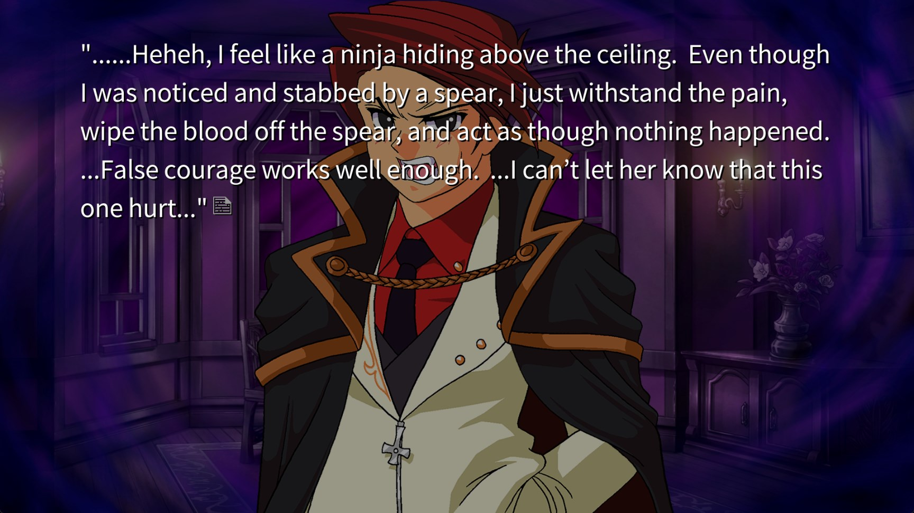

-   Erika now has a master key
-   The seals are still on the door...
    > BATTLER'S CORPSE WILL BE OBSERVED!!!!!!!!!

# We have confirmed that the seals to the guest room are undamaged. Since the time Erika confirmed Battler's presence, this closed room has been preserved.

> Battler is going to get out of this somehow...?

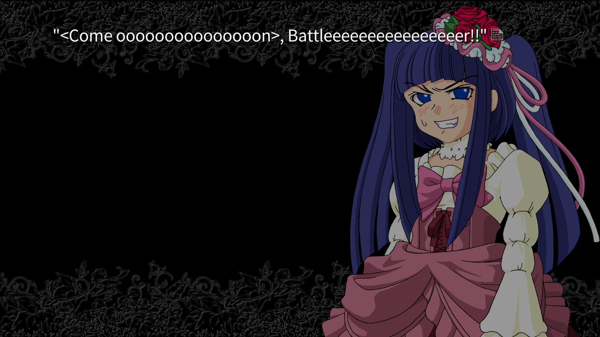

-   Battler is going to make a move that cannot be taken back
-   Erika... isn't looking for the culprit? Her enemy is Battler himself?
    > She... wants to find a logic error?
-   They have to make Erika think Battler vanished

# I swear that I am impartial in my judgments.

> thank u lambda <3

-   Erika is looking for a logic error, since there seems to be absolutely no way for Battler to escape the room
    > How the FUCK is he getting out of this
-   Battler's going to make a bluff?

    > Hehe... he's just like Kinzo

    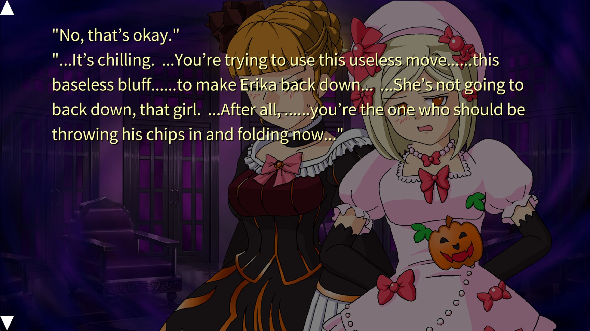

-   Battler has no trick in mind... he's so fucked
-   His body needs to be on the bed!
-   Time will be frozen and they're going to fight

---

-   Start by checking if Battler's on the bed

# Ushiromiya Battler is not on the bed

# Knox's 3rd. It is forbidden for hidden passages to exist.

# No hidden places that are impossible for Erika to find exist in the guest room.

-   Erika searched the bedroom except for one place (deliberately)

# Except for one location, there is no one to be seen in the bedroom

-   Sound of water from bathroom, and a slight heat
-   The shower was running, and Erika felt a resistance when opening it
-   She gets owned by hot water
-   The shower was cranked up and pointed at the door

    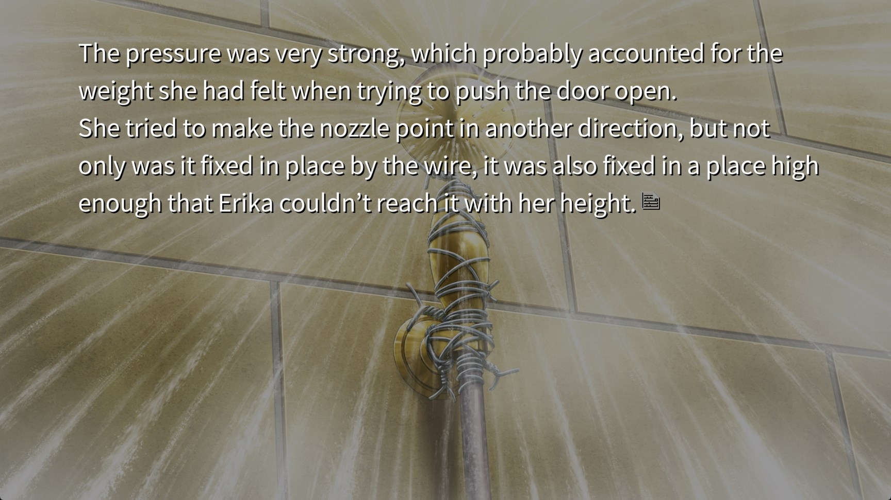

    > Considering how tall Battler is, it seems safe to assume this is his doing

-   She needs a tool to cut the wires holding everything in place
-   Notices a bundle of wires and some nippers used to cut them at the bottom

    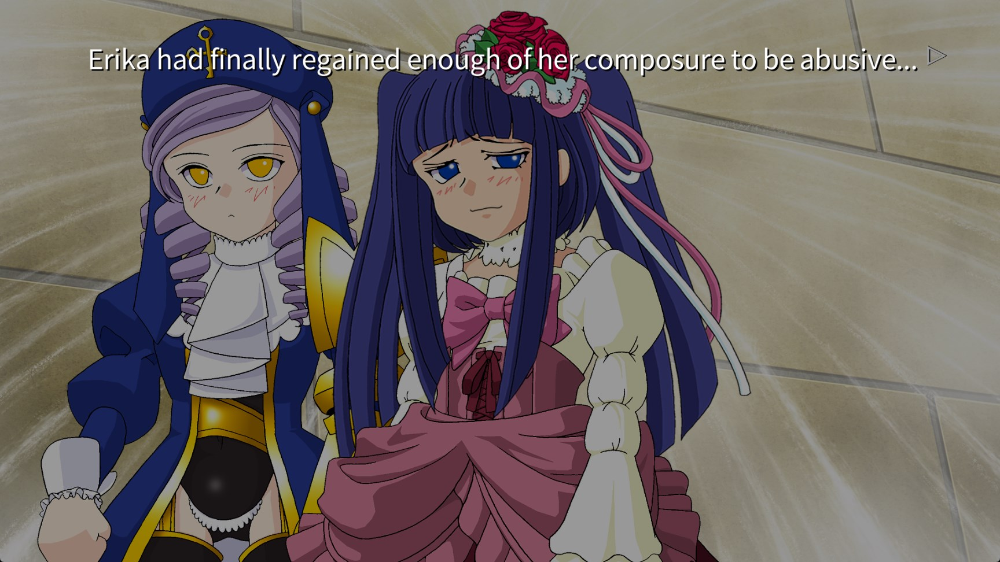

    > no way battler is going to be like "HAha I escaped from da room while u werebusy with SHower Gag"

# No one was seen in the BATHROOM

# except for one location, Battler does not exist anywhere inside the guest room

-   That one location was the closet, just like Natsuhi
-   They both claim they'll checkmate each other in two moves

# Ushiromiya Battler does not exist within the guest room. There are no exceptions, including the closet.

> Erika must have a counter to this. But I don't know what. OH NO

# At this time, I immediately closed the door, reset the chain, and sealed this room

> YOU CAN DO THAT?

# Erika repaired the chain lock

> ?????????

# Erika used the packing tape to join the two cut ends of the chain together, 'sealing' them. In other words, the chain was repaired by the packing tape, and this room once again became a closed room locked from the inside

> FUCK

# The use of the packing tape wasn't limited by the number of strips. It was the number of rooms. She's free to use as much as she needs.

-   Erika can use Battler's escape to solve most of the following crimes...
-   If Battler can't find some logic that lets him escape the room, this will be a logic error

    > He has no options right??? There's nothing to do here except leave

    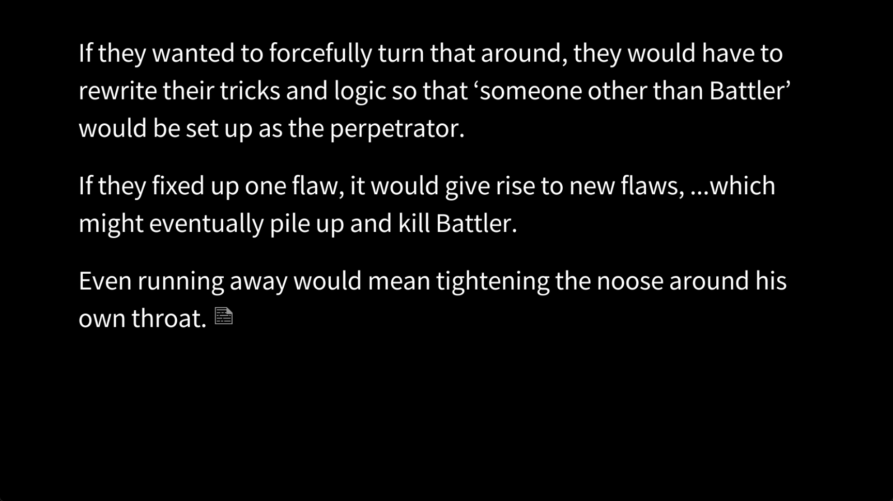

-   _Lambda_: Sometimes, madmen leap into the path of death... and so miracles occur.

# The lock caused by the chain is intact

-   A logic error only occurs when the witch admits to it. If they can keep thinking of new logic, they cannot die
-   **However, that would be like living in an endless living hell of the mind**

    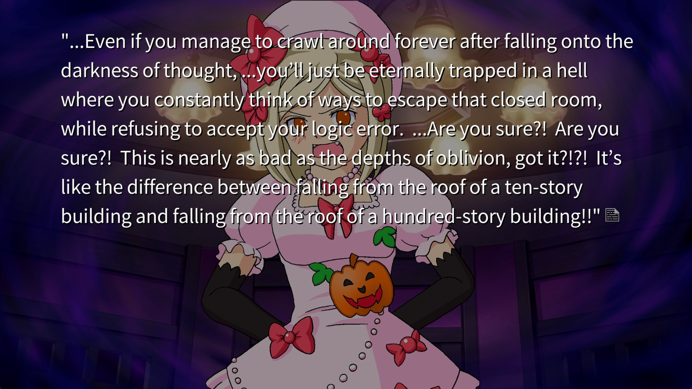

    > holy FUCKING shit

-   In the final game, the true victor was Beato

    > Huh???

    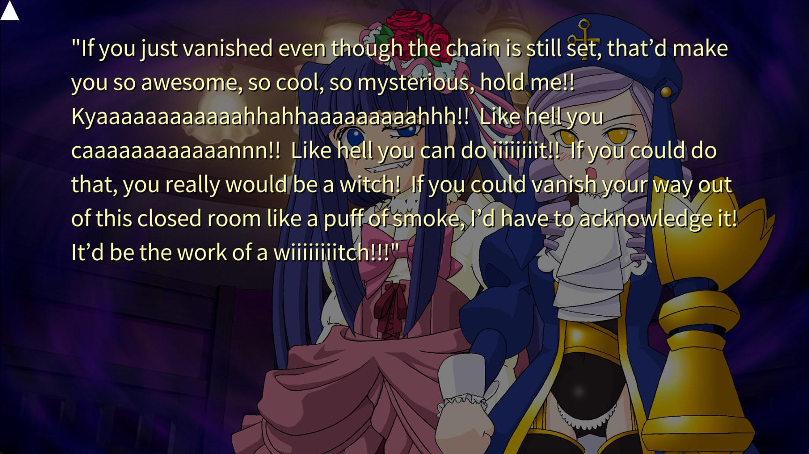

    > WHAT IS HE GOING TO DO

    

    > ** WHAT DID HE DO??? ** WHAT DID HE DO!!!!!!!!!!!!

    > GOLDEN TRUTH????

-   _Battler_: In your game, if you believe, a miracle will always occur.

    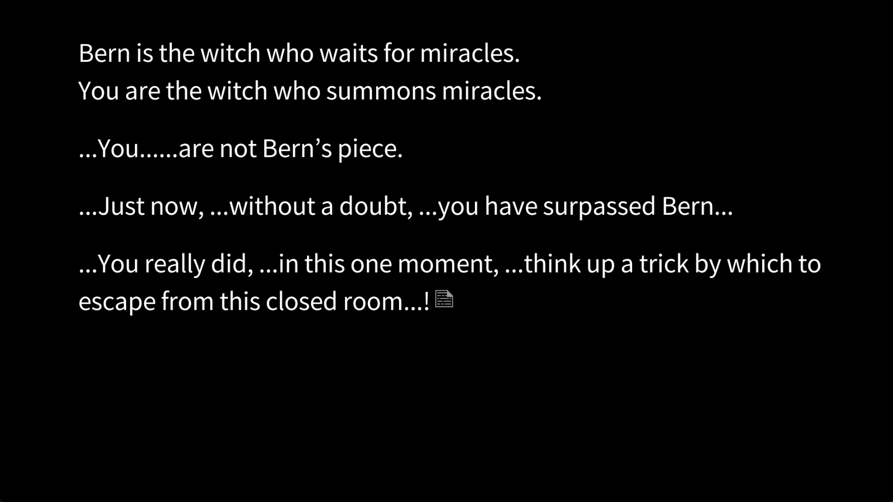

    > i'm going to sob

-   Battler "didn't let his thinking get trapped inside this closed room"
-   HE SWAPPED PLACES WITH ONE OF THE OTHER VICTIMS???

# USHIROMIYA KYRIE CANNOT SAVE BATTLER

> H-huh???

# Ushiromiya Natsuhi cannot save Battler.

# Neither can Eva.

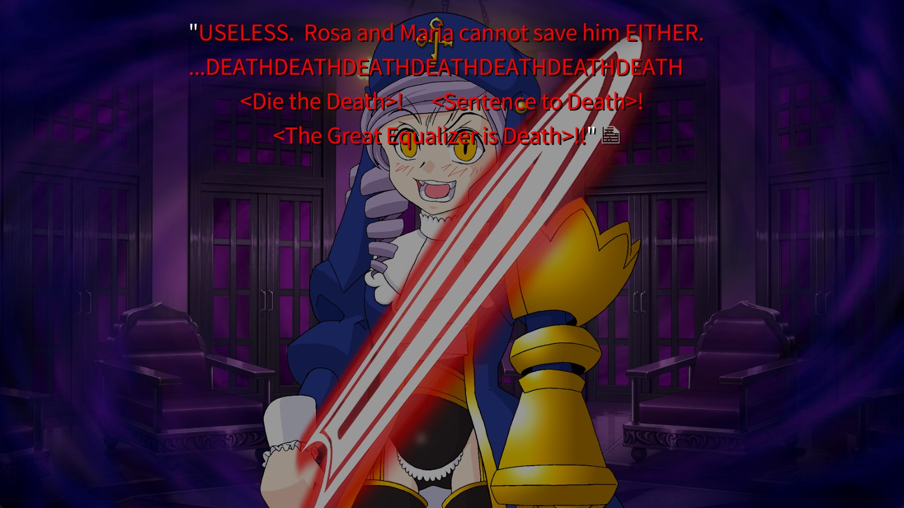

> How is she doing this???

-   _Dlanor_: There is a certain action permissible only to humans without the detective's authority, and it becomes a truth of such overwhelming credibility that witches can raise it to the level of red truth.
-   Erika... killed them herself????

# Erika re-killed all of them

# She severed their heads

# All 5 WERE ALIVE UNTIL SHE KILLED THEM

# nobody can save battler

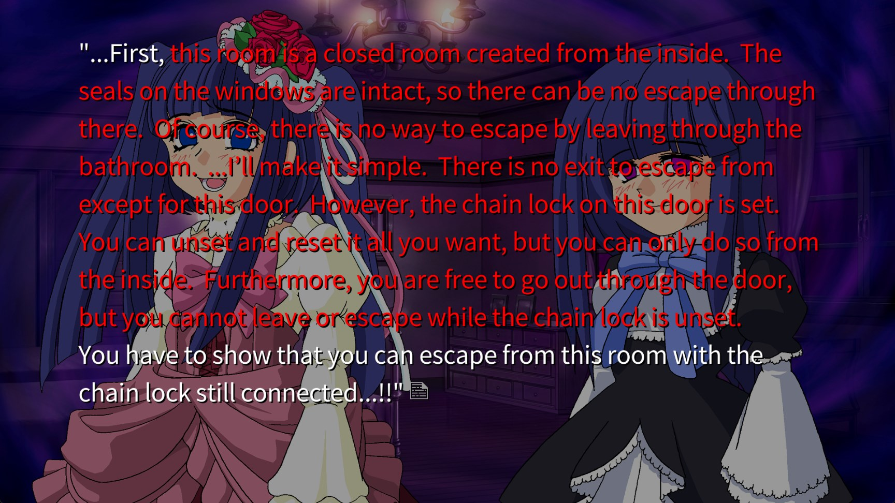

-   Lambda was once in that hell

-   Battler... is stuck inside his own head

    > ...the cathedral from the beginning of the episode.

    > ...

    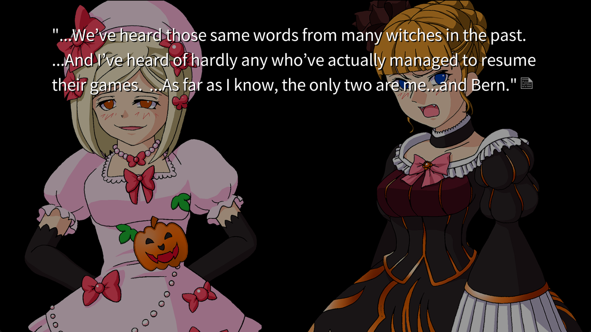

    > i can't do this anymore

-   _Lambda_: When we're bored, we remember. If we don't keep throwing people into that hell... then the fear of that hell will overwhelm us...

    > ...metaphor for the cycle of abuse? not even a fucking metaphor I CANT DO THIS

-   _Lambda_: As long as you hold on to your 'certainty', your wishes will definitely come true

    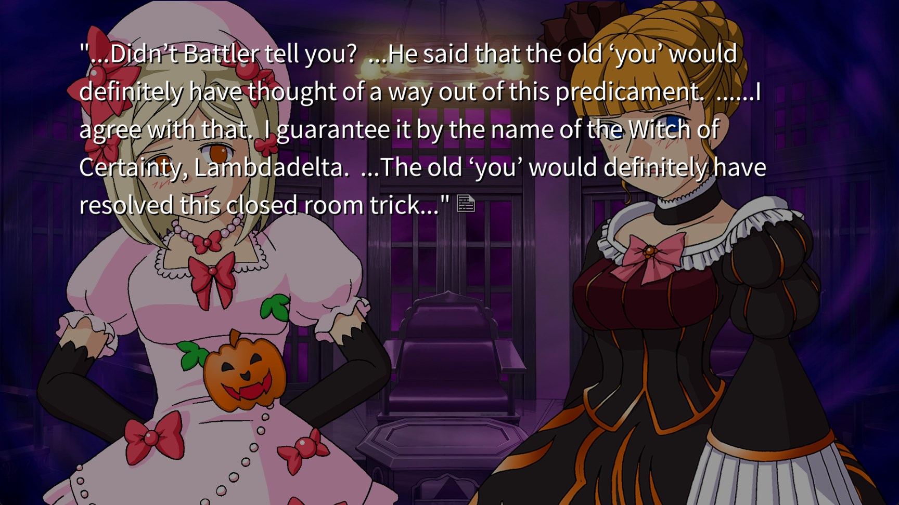

    > So... she has to become her old self?

---

-   Why is a demon's game like this necessary? Why does love need to be tested?
-   Again... the old Beatrice could have figured this out
-   _Zepar_: They can figure it out if they have the miracle of love!

    > Yeah yeah... without love it cannot be seen

    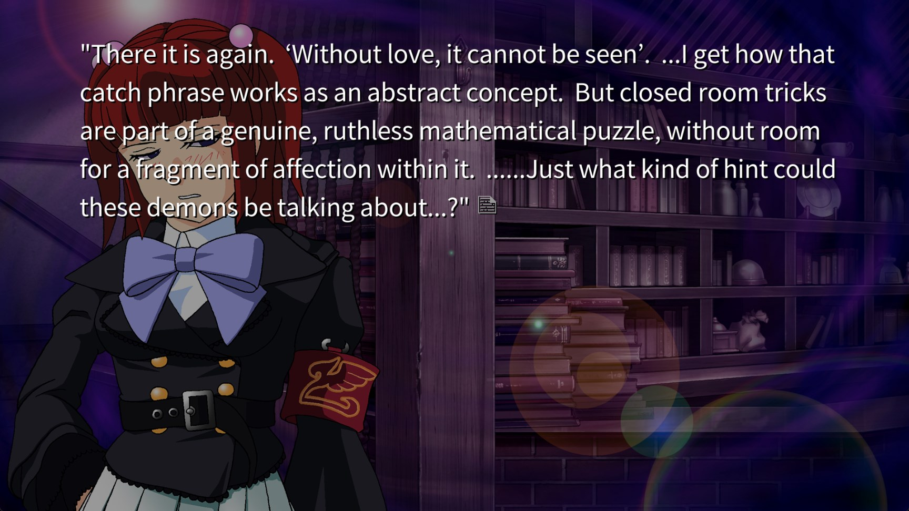

    > I'm on the same page. What does love have to do with any of this? Just having it doesn't really help...

-   _Featherine_: Unless you think, the tale will not continue

    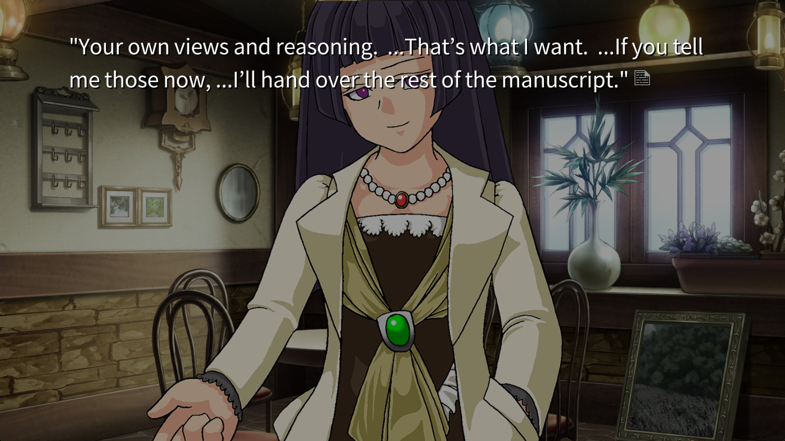

    > She doesn't want a correct answer per se, just... an answer.

    > But... how? How can Battler escape that closed room? And what does it have to do with love?

---

-   Both Lambda and Bern were in logic error hell before
-   In Bern's case, she wasn't even the game master. She was basically a monkey in the infinite monkey theorem
-   _Lambda_: There are about 100 keys on a typewriter. What are the odds of typing away randomly and ending up with Hamlet?
-   That hell was so long and harsh that her mind was completely broken. That's why she's so heartless

    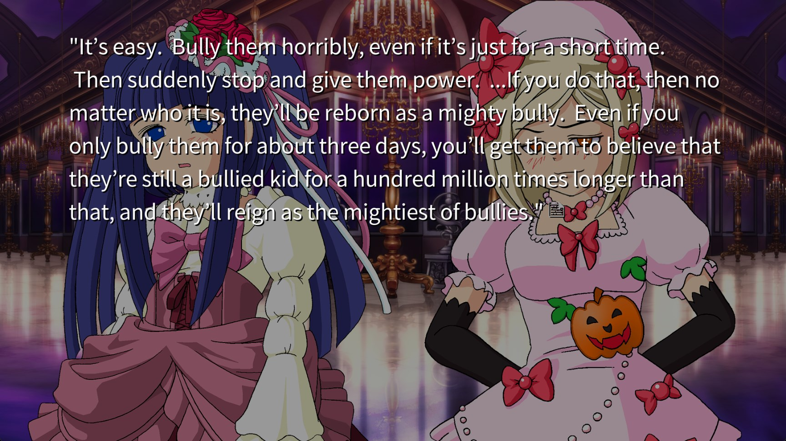

    > so like, this is one of the biggest themes right? She's describing another cycle of abuse.

    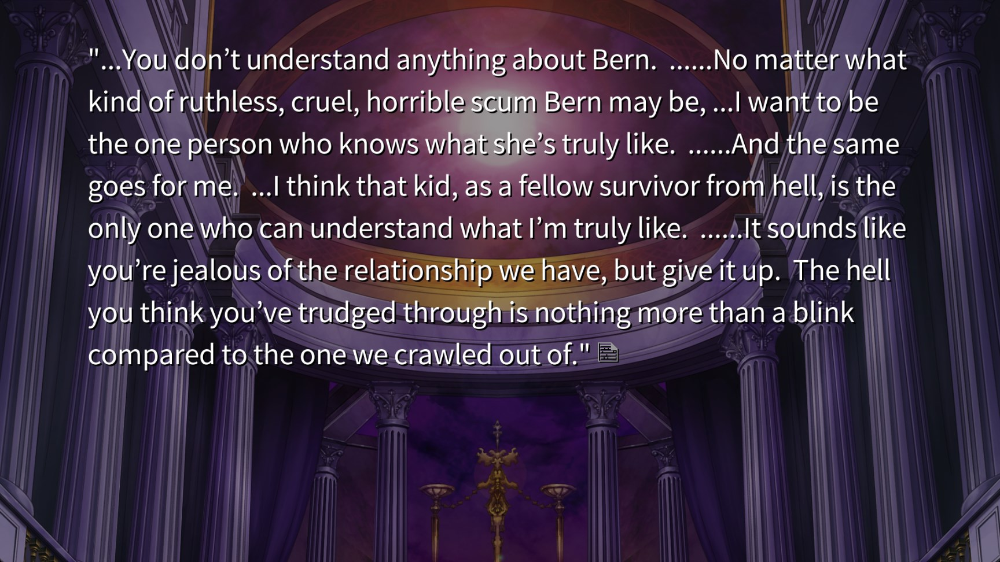

    > this... yeah. I sort of guessed as much back in episode 4, but... yeah.

    > This also confirms some thoughts I had about how like... a witch's potential is proportional to their suffering

-   Bern's hell could be escaped with a miracle
-   Lambda's hell could be escaped with certain willpower
    > How can Battler escape his hell?
-   Erika... compares her own suffering to theirs. She implies that her hell required her to withstand the truth, which they couldn't do
    > I think you're just miserable... whatever truth you faced was probably self-inflicted
-   Bern **never** wants to be reminded of her past

    > This alone is probably evidence that Erika--

    > Oh.

    > She lacks love. Or more specifically, empathy. Someone who has suffered comparably would probably immediately understand how fucking Stupid it would be to say that to Bern

    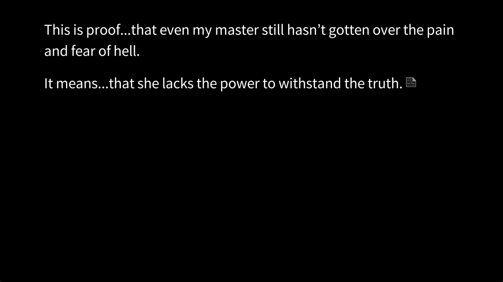

    > Erika I love you but PLEASE kill yourself Please Please PLEEASSEEEE kill yourself

-   Bern wants to give the territory to Erika, but she needs to marry Battler for that

    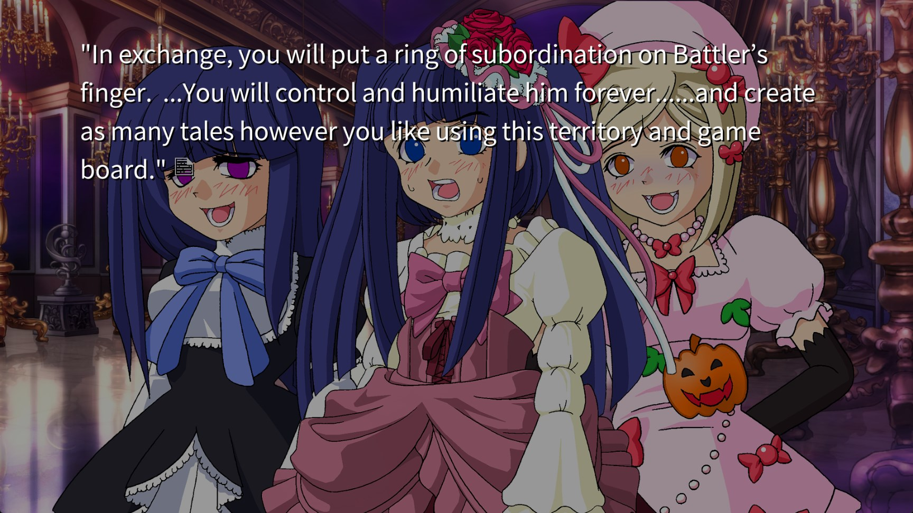

-   Erika is reveling in being the homewrecker this time

    > You have issues

    > Strangely... the game is saying that his **heart** is trapped in the closed room he created.

    > Is it not his mind? What interesting wording.

-   _Zepar and Furfur_: You can't see the answer... because you don't have enough love!

    > OH COME ON

    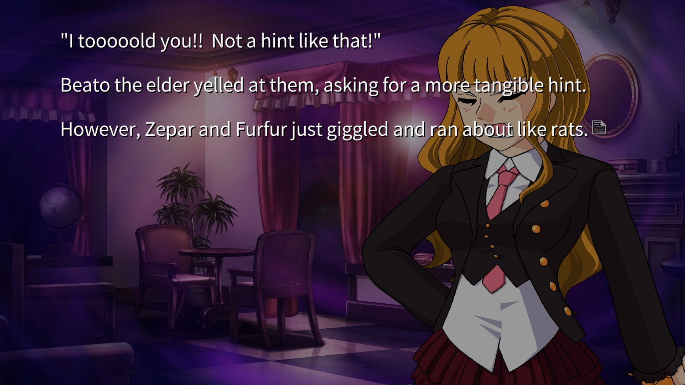

-   Shannon and Kanon are going to duel
-   Apparently... this wasn't unexpected. This day could have been avoided though?
-   They are given a pair of dueling pistols with one magical bullet each
-   _Beatrice (old)_: A duel over love is usually a fight between two people both in love with the same single person. However, here we have a pair of lovers fighting another pair of lovers. This is odd.
    > I think the inversion makes more sense if we um. Consider them to be the same person. Y'know
-   The minimum number of people needed to create a universe is two.

    > Ah... that's why Erika needed to marry Battler...

    > ...is that part of the closed room solution? Battler isn't alone. It takes at least two people to make a hellish universe like that

-   That number is 19!
-   The number of the witch
-   The number of years needed to create this tale
-   The number of years it took to reach this unavoidable day
-   And it was... the age of the true territory lord of this world.

    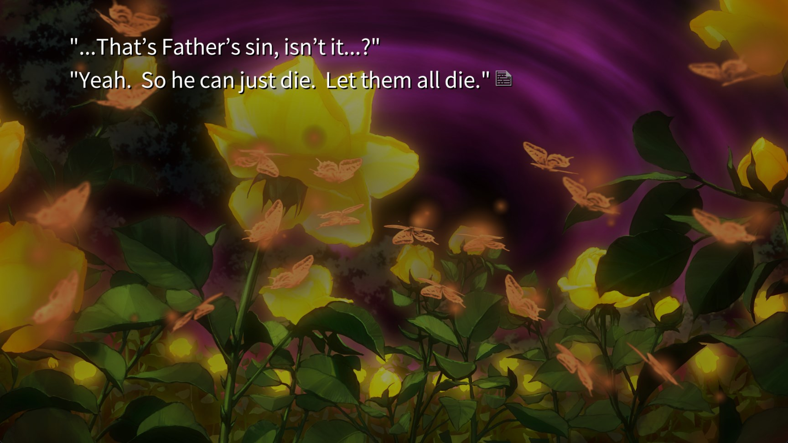

    > what... do they mean?

    > oh. They're the culprits?

-   It's today. October 5th, 1986. The fated day. The day that one of us will die.

-   To me, you are...

    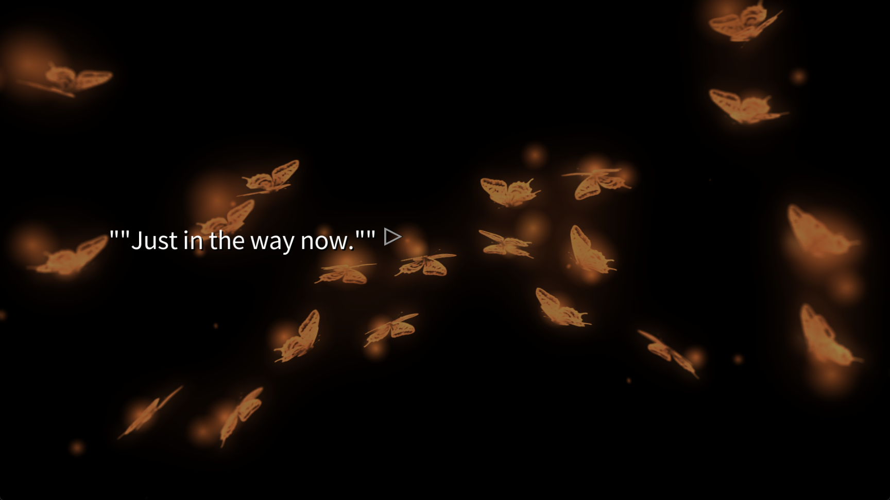

-   The intent to kill flashed through the eyes of both
-   Why does this need to happen? It was a mystery. As great a mystery as the question of how this could be the key towards unlocking Battler's closed room

---

-   _Gaap_: I can say for certain that it's impossible to escape from the inside on one's own.
-   Gaap says we need to break open the closed rooms of the guesthouse
-   Closed rooms formed by packing tape are not impossible to break
-   _Gaap_: Seals = closed room is wrong
-   Erika only verified the status of the seals on the doors

    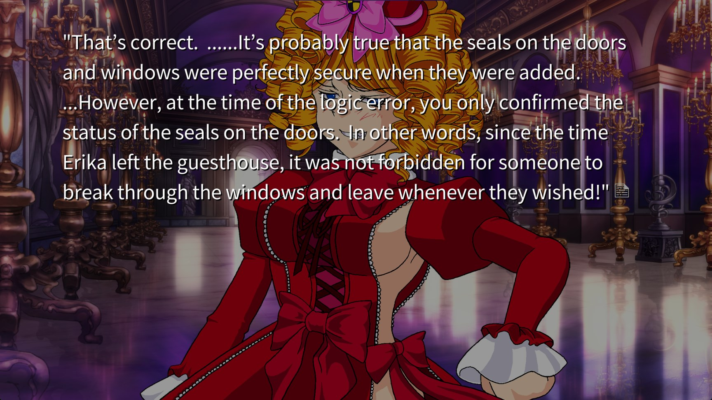

    > That seems too easy. Dlanor also left with a grin...

# The window seals were also intact. Of course this is at the time of the logic error.

> She didn't specify if the seals on the other room were also intact...

# It is forbidden for blue truth to be used if based on the argument that the window seals of the next room over were torn at the time of the logic error

# The opposing side is under no obligation to respond to the aforementioned blue truth

> Shannon killed Kanon and they became one? Then they took their new name and left the room before it was sealed? Idk

-   _Featherine_: One move exists. However, that move is one that can never be used again. And, it is also part of Beato's heart.

    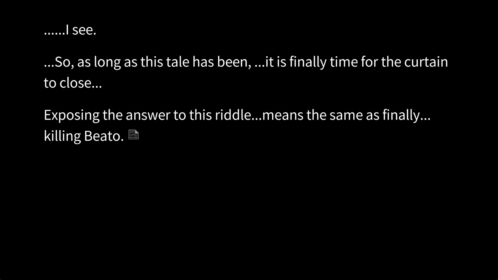

-   ...There does exist a trick that can save Battler. But it's tough. And if it's used, part of Beato's heart will be exposed.
-   Bern doesn't think Battler will figure it out because of that
-   Huh... Beato was clutching the ring at the end of episode 5

    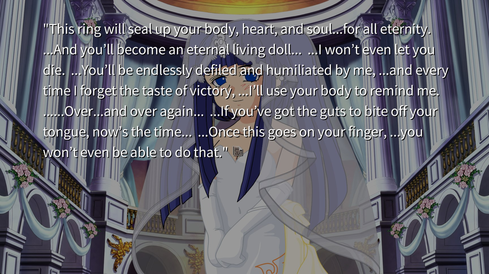

    > hm. Much to think about

-   What follows is very unpleasant and uncomfortable

---

-   Beato still didn't understand the duel
-   The love between George and Shannon wasn't standing in the way of the love between Jessica and Kanon
    > this music is murdering me again
-   Furniture and a human do not add up to two people

    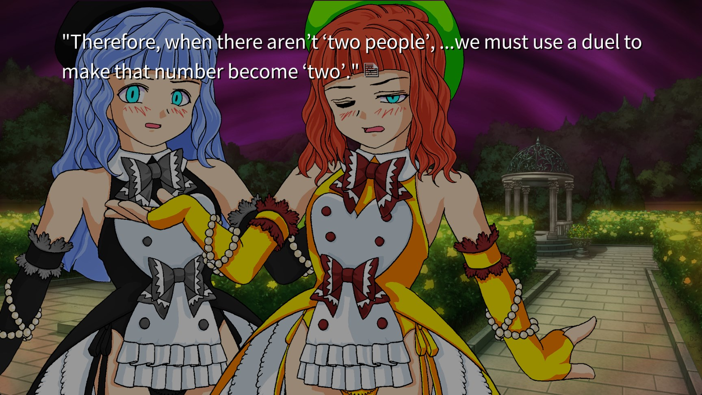

-   To be qualified to love a human, you need only one thing. The possession of a single person's soul.
    > They're the same person aren't they?
-   Let the sinful souls regain a complete soul and become capable of true love
    > ...Yeah.
-   This marks... the birth of a Human who can truly love another.
-   Their days as furniture will end
    > They're analogous to the Beatos as well...
-   Shannon **fell to the ground** before Kanon fired, dodging his shot

    > Hehehe...

    > Ahahaha... it's just like the times she faked her own death! It's just like the first twilight of episode 3! And the first twilight of episode 1!

-   It's all coming down to luck...
-   _Shannon_: Our reunion could have been avoided entirely...

    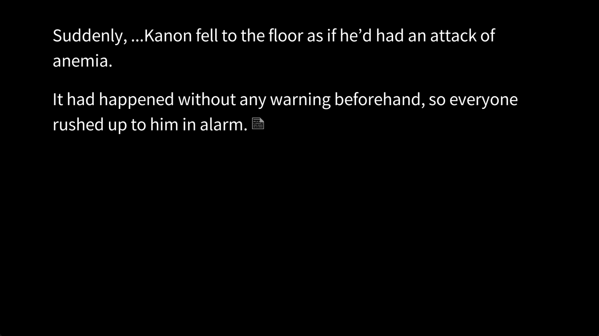

-   Gather, incomplete souls! Become one and know love!
-   Beato and Kanon begin to disappear

    

-   Beato was born for the purpose of loving Battler... but she can no longer do that
-   _Beato_: I don't know why. I don't know why I started to love him
-   _Beato (old)_: People don't need a reason to love each other!!
-   _Beato_: Why is it that I love Battler...? ...'Mother'?

    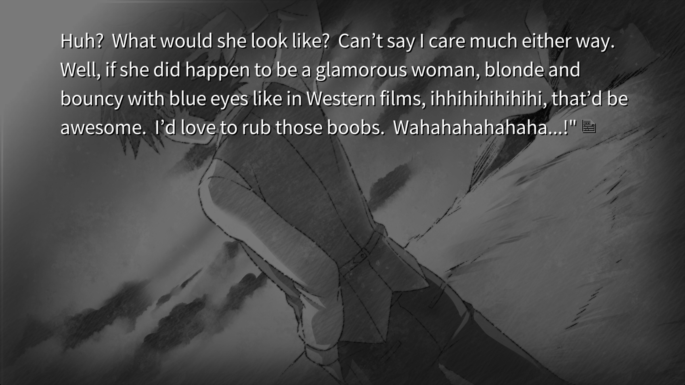

# Beatrice. Listen. I am giving you my love for Ushiromiya Battler. Become the kind of woman Battler wants.

# Take the golden hair he likes. Take the blue hair he likes. Take this personality that matches his. And then... you must love him in my place. And then, if possible, you must be loved by him.

# I... can no longer love him. Please, take my feelings that went unfulfilled, my feelings that I couldn't hold back, and make my wish come true.

# From this day forward, you are no longer the Rokkenjima ghost that lives only to play pranks. From this day forward, you will become the master of this island and wait for the day that he comes to fulfill his promise.

# From this day forward, you will no longer be me. Please forgive me for pushing all of my worries onto you, while I alone try to find happiness.

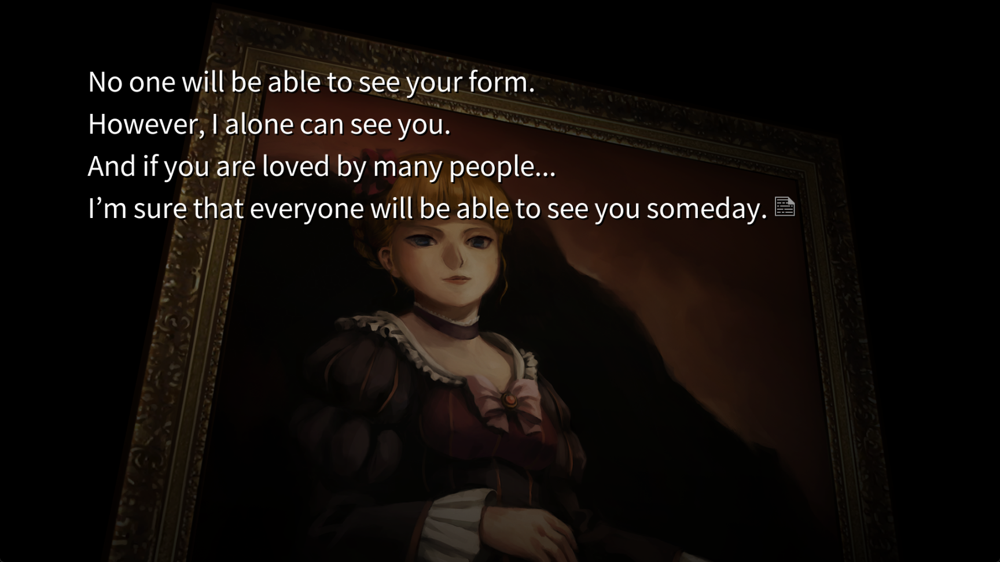

# A witch is... not the one who solves puzzles

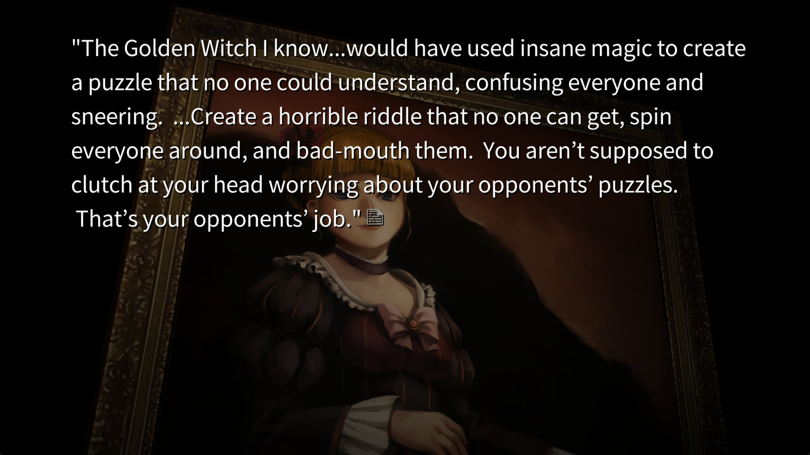

-   Don't worry about how Battler got out of the closed room. You need to create a much more spectacular, ultimate closed room, and make it so that they're the ones worrying

    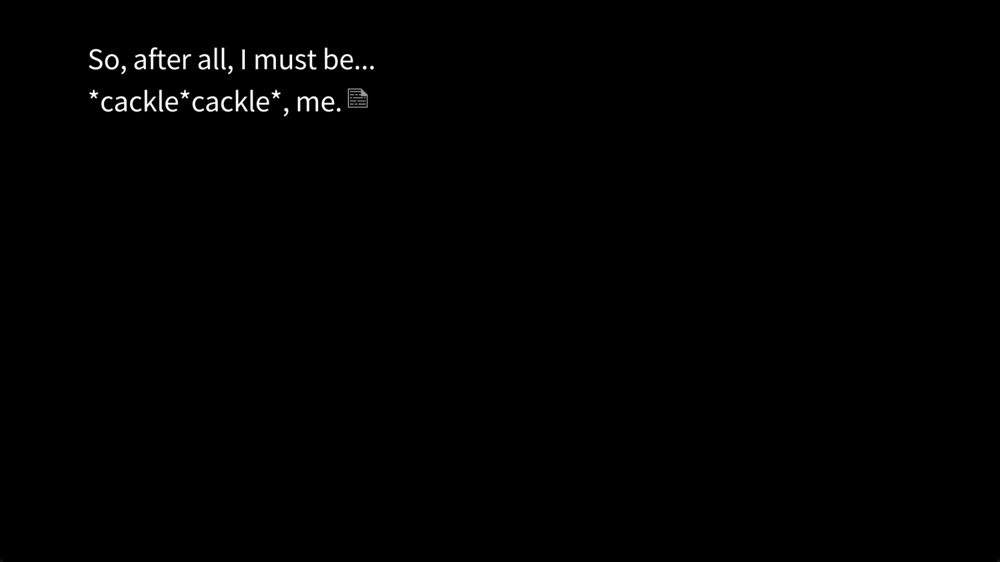

    > Are they... going to use Kanon's disappearance to continue the game?

    > Battler can escape and let that be the ultimate riddle...

# IM GOING TO SOB

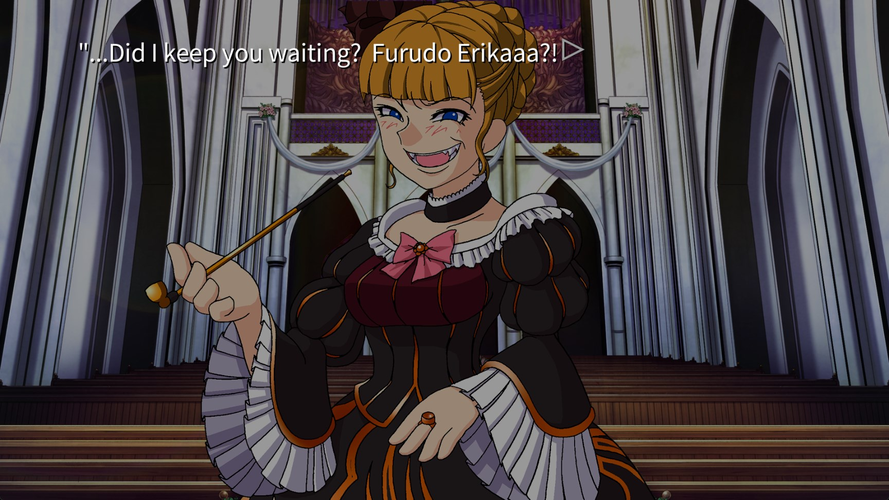

# She knows what it means to be the main character.

-   Kanon dashes into the mansion, remembering the good sides of everyone
-   It would have been fine to find reasons for our love later
-   _Kanon_: Battler, it's okay. I'm going to save you now.

    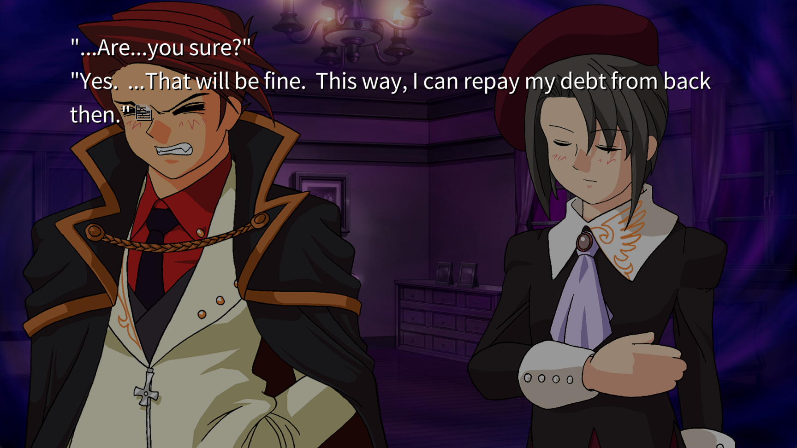

# The one who rescued Battler was, without a doubt, Kanon.

# Battler and Kanon are different people.

# The cousin room is guaranteed to be a perfect closed room until the end

# At the time the next room over was sealed, Hideyoshi, George, Kumasawa, Shannon, and Nanjo were in it. And the number of people in the next room over was five. No one else existed there. All people can only go by their own names.

> Is she going to seal Erika inside the closed room?

> It requires one sacrifice

# At the time Battler was rescued, only Kanon entered the guest room

# Kanon does not exist in the guest room. Of course, this includes all parts of the closet, the bedroom, and the bathroom

-   _Erika_: Now... at the end... I'd like to finally... introduce myself...

    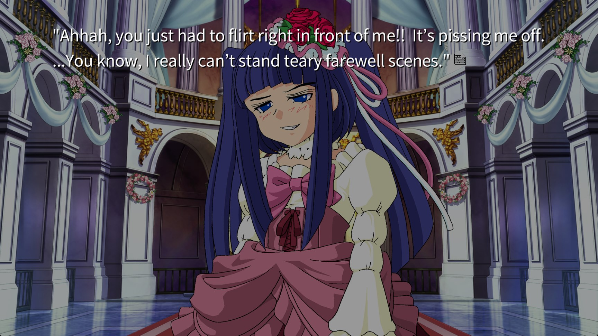

# I'm Furudo Erika, the detective! I may be an uninvited guest, but please, welcome me!

# I'm the visitor, the 18th human on Rokkenjima!

# Sorry, but... even if you do join us-

# That makes 17 humans.

> THERE IT IS!!! I WAS RIGHT!!!
