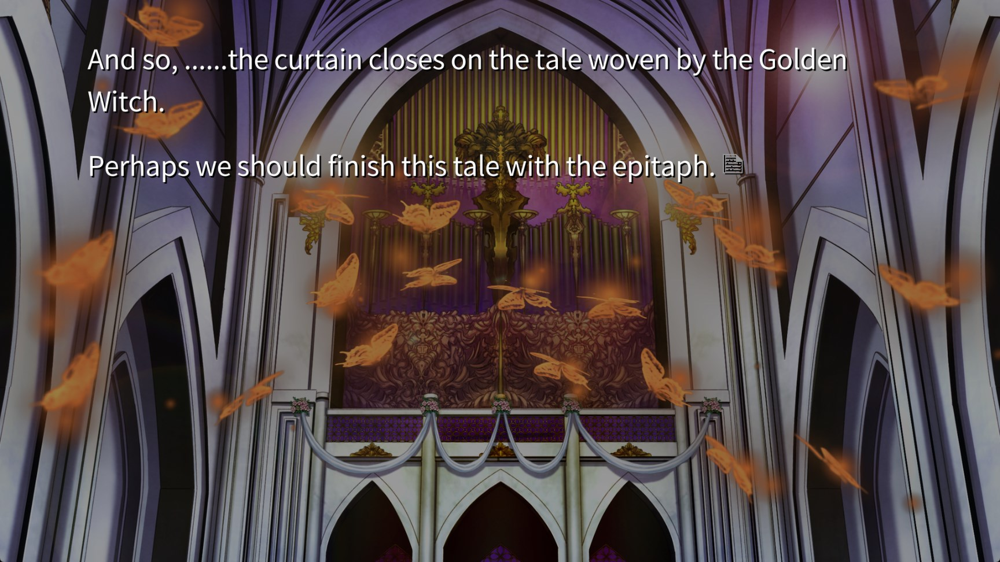
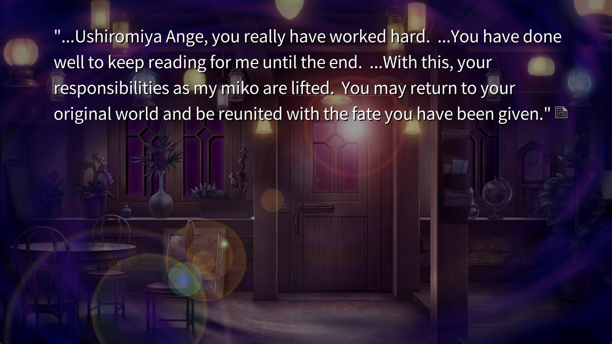
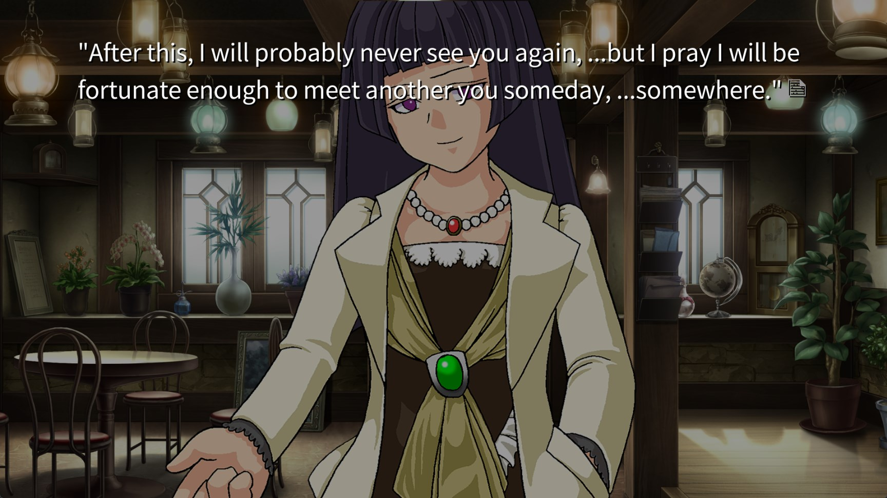
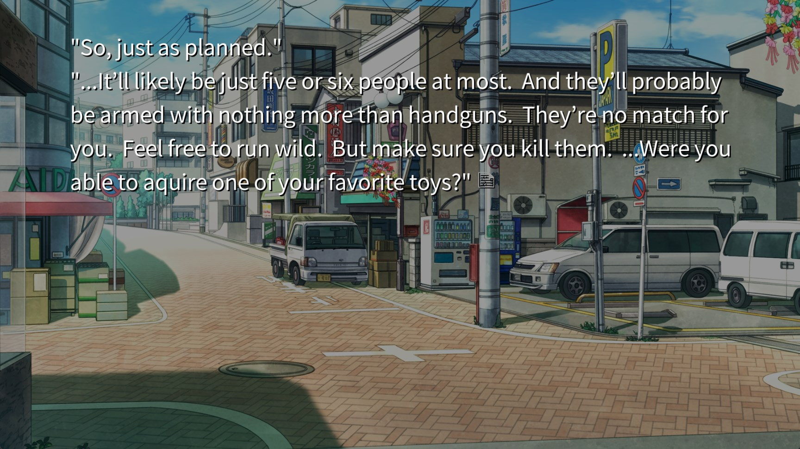
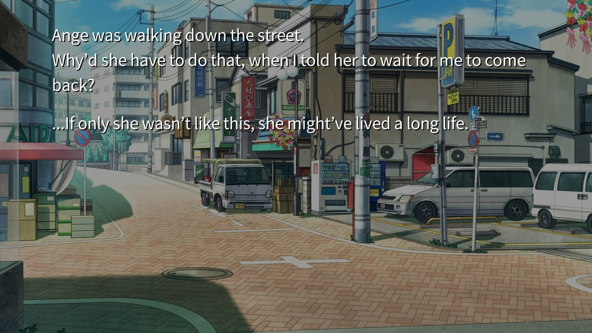
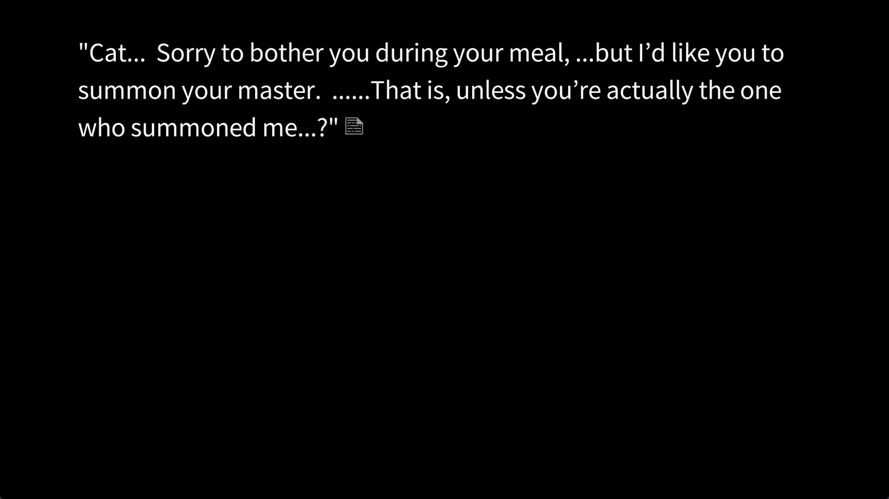
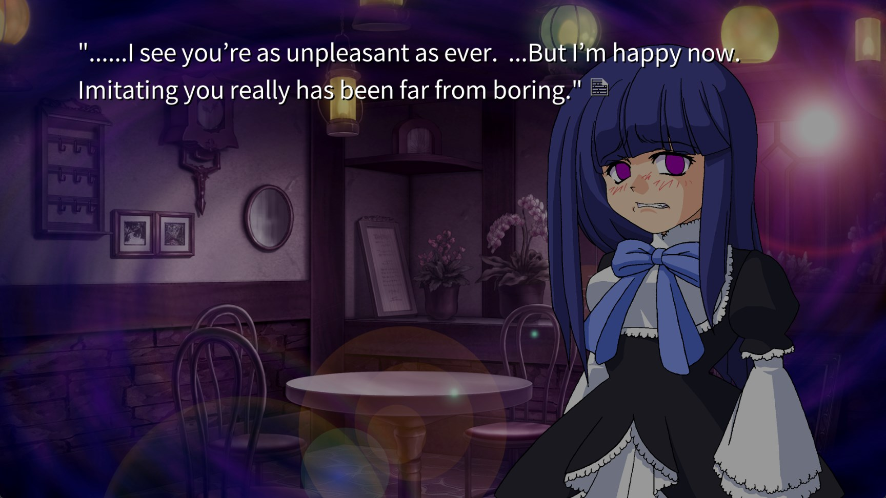
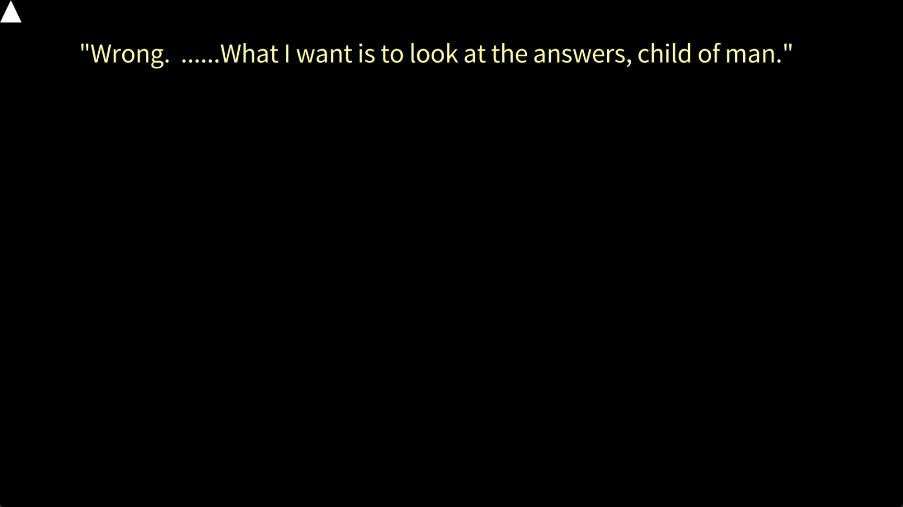
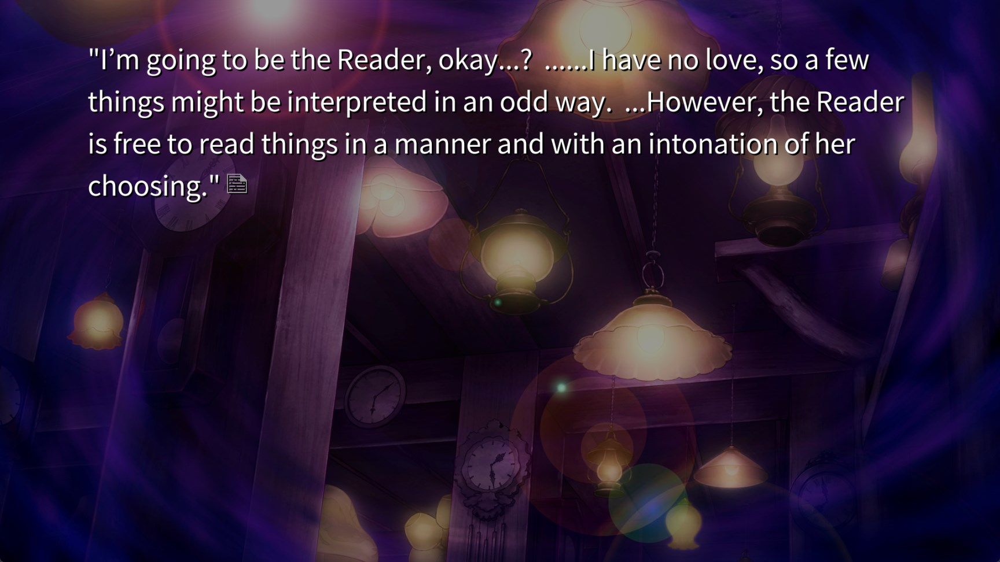

# [12-30-22]

> I have so many feelings and emotions and thoughts and

# QUESTIONS

> Before we begin, I think we should start by listing off all the major questions we still have!

1. What are the circumstances surrounding Battler's birth? Specifically, who is his real mother, and is he the baby from 19 years ago? Is he somehow related to that baby?
2. Was Beatrice born out of Shannon's love for Battler?
3. It's been established that something will be proven to Beatrice in one of two ways: the epitaph being solved, or everyone being murdered. What exactly is being proven?
4. Furthermore, Featherine said that anyone who knows the truth becomes an endless witch themself. Solving the epitaph also causes one to become an endless witch, which means it somehow means you've learned the truth. How is the epitaph related to the truth?
5. Why did Kanon and Shannon split from their original "true" self or whatever?
6. What **is** the Golden Land exactly?
7. What happened to the mansion and the guesthouse?
8. What was Battler's sin?
9. (Most likely linked to #3) What's the motive behind the murders?

---

-   Battler is still the territory lord, so he keeps the ring
-   _Beato_: I created this tale because I wished to be with you. That means the purpose of this world has been fulfilled. So from now on, I want you to write it. The continuing tale, of you and me.
-   A few guests are being recognized
-   Kanon is dead, but all are revived in the Golden Land
-   Kanon will be revived, as a human
-   Shannon and George are married

    > AND EVERYONE CLAPPED

    > Ok how is this going to go to absolute shit

    

-   Beatrice and Battler recite the last few lines of the epitaph, and the book is done
-   Battler and everyone else never came back. They reached the Golden Land and that was that
-   ...but in reality, they all died in the massacre

    

-   What is Featherine's reward?
-   Ange came to her own conclusion regarding the story, but continue to debate Featherine for a while
-   The sofa in her house felt familiar
-   _Featherine_: If I let you keep that money, will you come again, read my next manuscript, and tell me your opinions?
-   Featherine offers to write her tale one day
-   One that Ange will consider a miracle

    > So... is this plotline going to merge back into the one from episode 4?

    > ...Ange is going to die isn't she?

    

-   _Ange_: This may be a strange question... but are you Featherine? Or is Featherine you?
    > Is a witch the person? Or is a person the witch?
-   The day of which I had no **memories** ended, and on the following day, I would take a boat to Niijima
-   Okonogi and Amakusa foresaw Kasumi's arrival on Rokkenjima

    > Lemme guess... they're planning on killing Kasumi, her men, and Ange all in one neat little remote island

    

-   _Okonogi_: Don't forget to buy your cup ramen by the box in Narita before your flight out
-   Ange is a liability

    

    > ...She's definitely going to die on Rokkenjima

-   _Ange_: Let's leave it all to luck

    > How should we interpret this missing "day" that got added? I think we have to view it as multiple tellings of the same story. In other words, in episode 4 Ange never did this, but another endless witch wrote a segment where she _did_. That would explain why she couldn't remember it before.

---

# [???]

-   Bern was annoyed by the completely predictable ending and decided to leave the cathedral
-   _Bern_: It's true that I tried to find somewhere desolate so I wouldn't have to look at people, but this is a bit ridiculous. Am I lost?
-   Miracles do not exist. If something seems like a miracle, it's by design
-   Bern is following a cat leaving red footprints
-   The cat enters a room through a crack in a door

    

    > NOOOOO YOU WHORE WHY WOULD YOU KICK A CAT LIKE THAT

-   FEATHERINE!?
-   _Featherine_: It seems you have taken the name Bernkastel, and have been playing a far from praiseworthy Fragment game
-   Bern is her longest-serving miko

    > So Bern has been reading to her?

    

-   _Featherine_: It seems Beatrice's game ended with Battler's victory. I liked it.
-   _Featherine_: I have observed all 6 games so far. I believe I have found an answer for all of the riddles in my own way. The culprit, motive, tricks. I'm not yet clear about the very last part of the epitaph riddle, but I have enough of a theory that if I actually went to Rokkenjima and investigated, I should be able to resolve that part as well.

    > This is a hint. The meaning of the last part of the epitaph can be confirmed by visiting Rokkenjima

    

-   _Featherine_: After watching a play, reading the pamphlet and learning what goes on behind the scenes is similar to, as you would say it, enjoying some black tea after a meal
-   Think of it as a burial for Beato's corpse
-   _Bern_: I see... so you were short a player and a commentator.

    

    > I wonder if this is a slight nod towards interpreting things without love. It's hard to see hard truths wtih it, I guess

-   Looks like Bern is going to be the Game Master...
-   _Featherine_: You can create whatever sort of tale you like to satisfy your grudge. Just answer all of my questions.
-   Black tea is best enjoyed... with your fellow monsters.
-   _Bern_: BEATRICE on d8.

    > ...She's keeping the witch back. Black begins at rank 8.

    > Hehe.
