# [12-31-22]

> Let's copy over the questions we had from the tea party:

# QUESTIONS

1. What are the circumstances surrounding Battler's birth? Specifically, who is his real mother, and is he the baby from 19 years ago? Is he somehow related to that baby?
2. Was Beatrice born out of Shannon's love for Battler?
3. It's been established that something will be proven to Beatrice in one of two ways: the epitaph being solved, or everyone being murdered. What exactly is being proven?
4. Furthermore, Featherine said that anyone who knows the truth becomes an endless witch themself. Solving the epitaph also causes one to become an endless witch, which means it somehow means you've learned the truth. How is the epitaph related to the truth?
5. Why did Kanon and Shannon split from their original "true" self or whatever?
6. What **is** the Golden Land exactly?
7. What happened to the mansion and the guesthouse?
8. What was Battler's sin?
9. (Most likely linked to #3) What's the motive behind the murders?
10. Who **is** Beatrice? **What** is Beatrice?

---

> Now we can begin.

-   _Virgilia_: A dream is something drawn in the sand between the coming and receding waves.
-   No wave will ever come again to wipe away the dream she drew.

    > Is the background here... the chapel?

    > It is. Wonder what that implies

-   Suddenly in a room with several Inquisitors of Heresy... but from a different department. Also there are suspects present.

    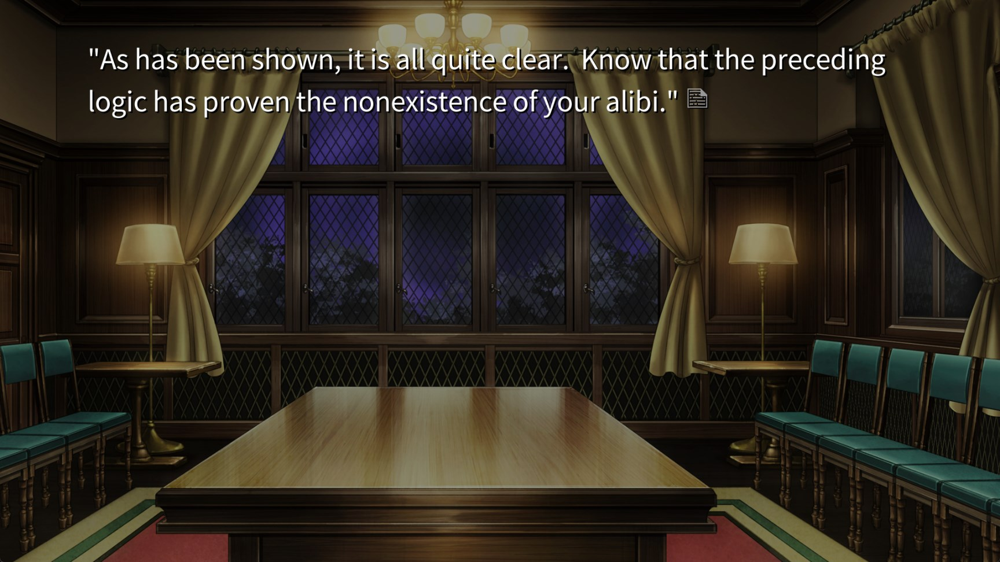

    > She's talking to... Shannon? No, she's probably talking to whoever Kanon and Shannon "came from". The original person

-   The maid she's pointing at has no alibi-- and her proposed one contradicted the facts
    > Ah... was Kinzo murdered? It mentions a study...
-   Know that your position as the culprit is an unshakable fact.
-   Motives are unnecessary in mysteries.
    > BUT THAT'S LIKE. ONE OF THE MAIN QUESTIONS (#9)

---

-   Battler and Virgilia are in front of (Beatrice's) coffin
-   Written in the book was a dream that would be more enjoyable for her than any other
-   The tale will be shut up with you in your coffin, for all eternity. So no one will be able to read it except for you.

    > A truth that only needs to pass between them.

    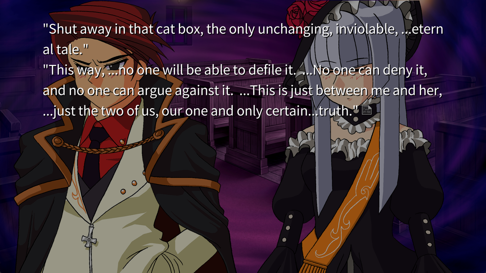

-   Man sprinting through a twilight street
    > Willard? The guy from that other department mentioned in the decalogue tip?
-   Had several experiments to do, things to check

    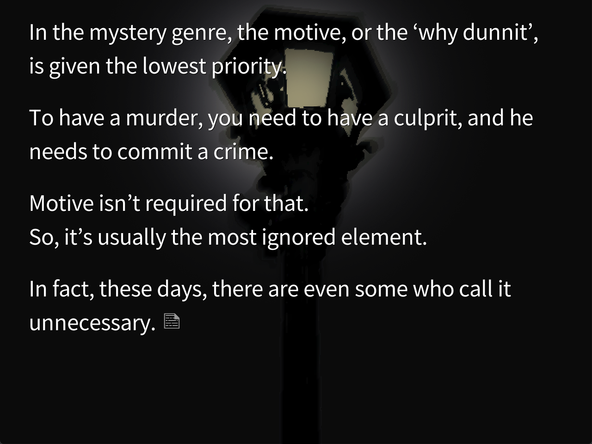

    > We're using original backgrounds in 4:3 now btw. I like them more

-   You cannot neglect the motive
-   _Virgilia_: It is time for us to leave. If we're too noisy, we'll wake her from her dream

    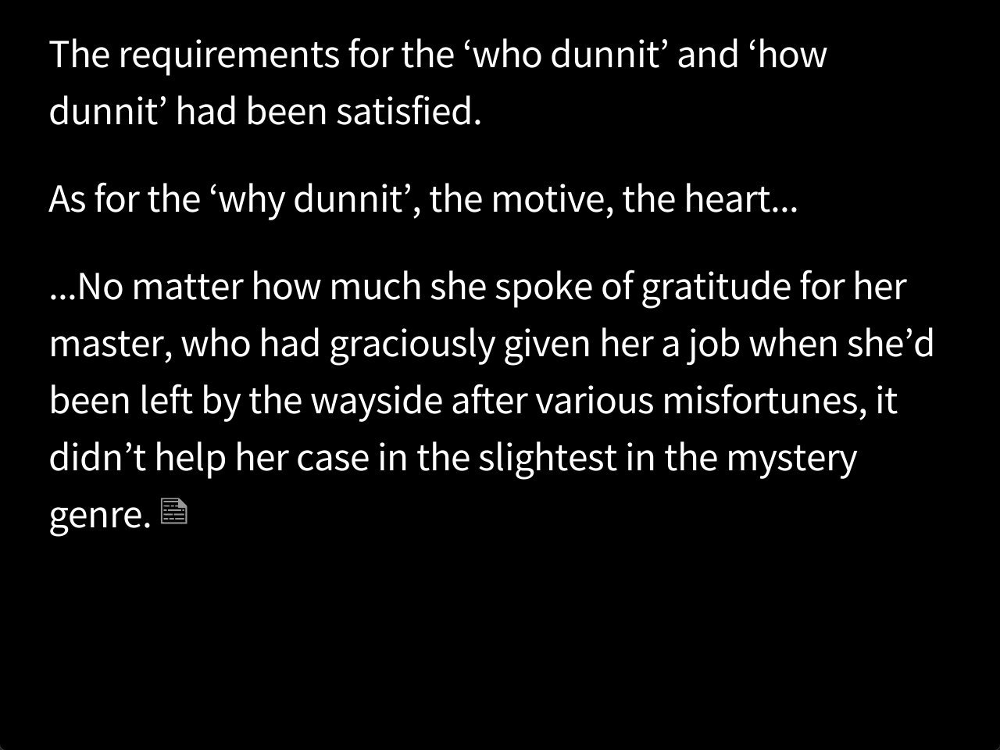

-   The motive can be **squeezed out** of the culprit afterwards
-   Know that we of the SSVD possess methods of forcing unrepentant criminals to reveal the truth
    > Lot like Erika.
-   willard BURSTS into the room and says they've got the wrong culprit

    

    > So fucking based... kino... swag...

-   Lack of an alibi $\neq$ culprit
-   The other alibis weren't perfect. Look for a motive!

    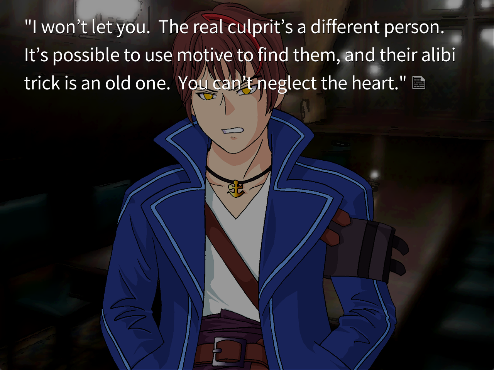

# It is forbidden for a servant to be the culprit

> **WHAT??!!?!?!??!?!?**

> HOW

# Van Dine's Twenty Rules, Rule #11.

> Servants--such as butlers, footmen, valets, game-keepers, cooks, and the like--must not be chosen by the author as the culprit.

> WHAT THE FUCK

-   Double check the alibis for the second wife and her lover
    > Eva and Hideyoshi? I mean, Eva was definitely one of the culprits in game 3
-   "All the suspicious must be interrogated! That is how we conduct our witch trials!"

    > Ok Erika

    > Once again, unfalsifiable does not mean true

    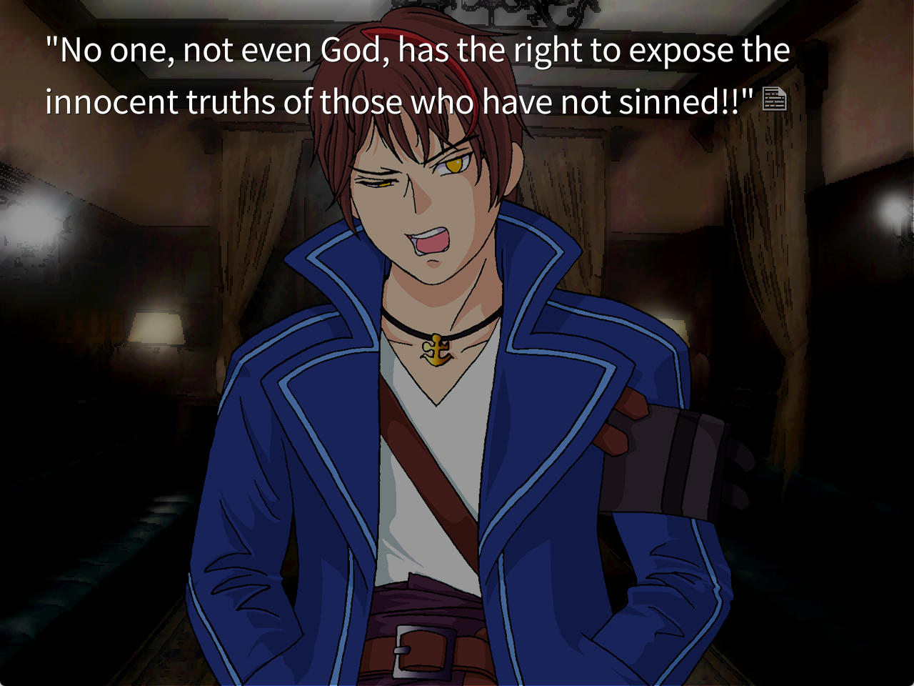

    > Really dunking on Erika here

-   _Willard_: Your boyfriend said that he'd be willing to give up everything to prove your alibi
    > George?
-   _Willard_: Meeting together in secret while on the job is hardly praiseworthy.

    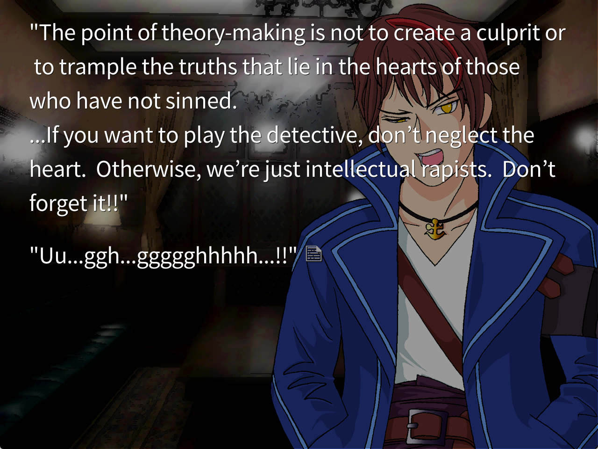

    > Erika is no detective according to this guy

-   Willard has already filed his resignation...

---

-   Will enters the chapel, and it's oddly similar to the cathedral from the game board

    > Reception desk and all

    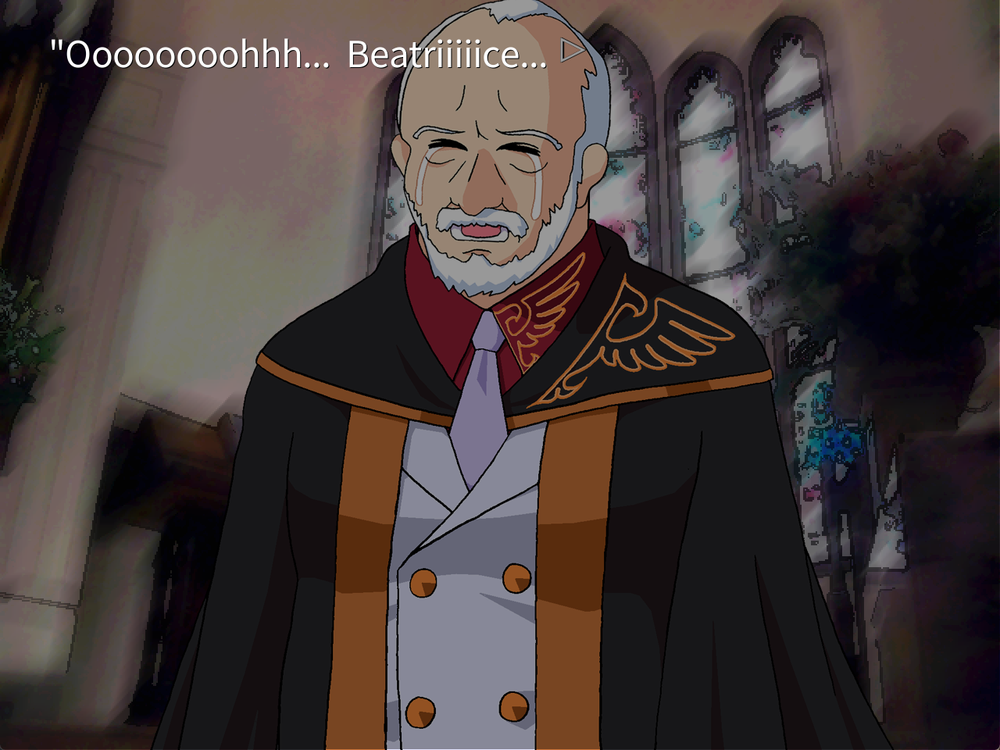

    > OOOOOOOOOOHHHHHHHHHHHHHHHHHHHHHHHHHHHHHHHH

    > BEEAAATORIIICHEEEEEEEEEEE

-   Everyone is remembering the dead in their own way
-   Notably, Rosa is saying she killed her
    > 19 years ago
-   There is no corpse. Just the book that Battler left

    > Huh...

    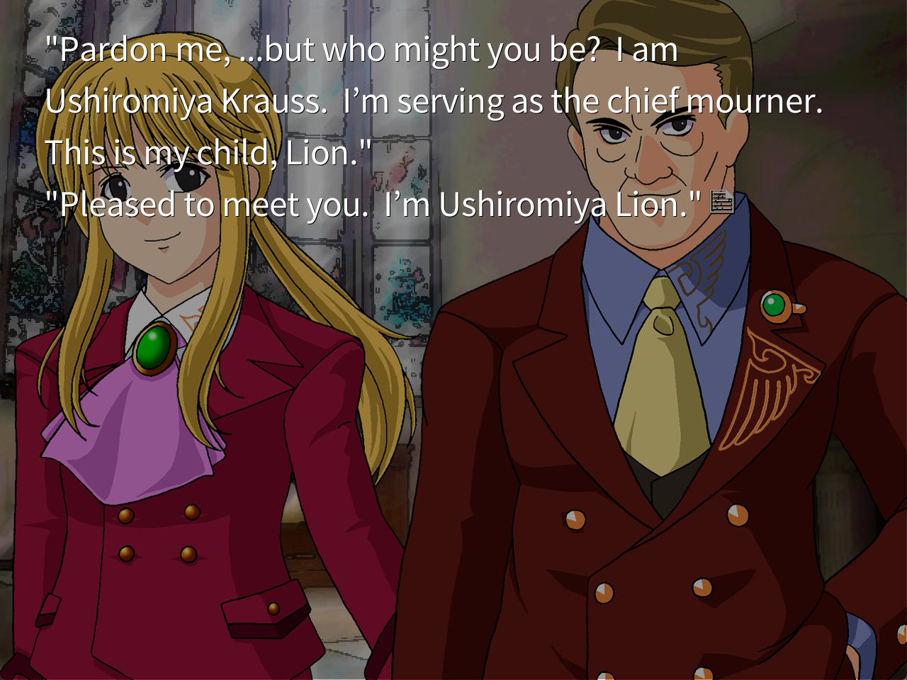

    > Are they... the baby from 19 years ago?

    > They can't be, right? Timeline shenanigans are allowed though, I think.

-   Even Will doesn't know who the fuck she is
-   _Will_: Krauss's child is supposed to be Jessica
-   _Lion_: Jessica is my little sister. Do you need me to call for her?
-   Bern makes her appearance after Will calls out to her
-   Apparently, some game has already started
-   _Bern_: I've just moved from Beato's cat box into a larger one. Lion is one of the pieces who has a possibility of appearing inside it
    > ...Maybe they really are the baby.
-   Lion is a piece Bern placed

    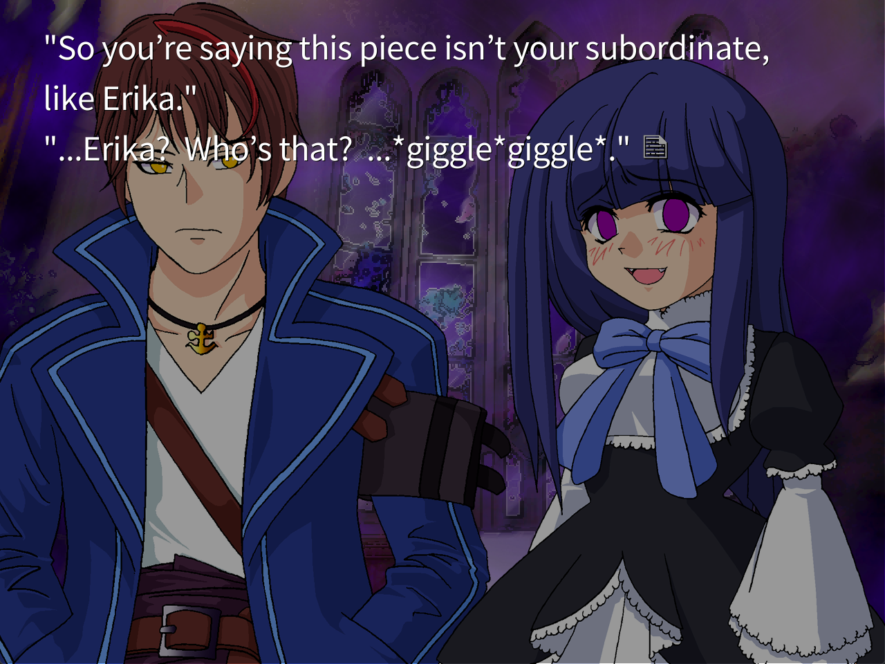

    > Ominous...

-   Lion will succeed the headship when she turns 20... not Krauss
-   Silver ring for the successor
    > That's new.
-   _Bern_: Wright, try and beat this game.
-   Wright refuses
    > Why did he even come here then?
-   He's incapable of refusing an invitation from Bern
-   _Bern_: 'Who killed Beatrice?' That's my game.
    > Huh. That wasn't even one of my nine questions
-   Lion will be Will's ally

# Van Dine's Twenty Rules, Rule #7. It is forbidden to have a crime without a corpse.

-   The corpse could still exist. It's just not in the casket

# Rule #1. It is forbidden to have a crime without all clues presented.

# Don't worry. Everything is gathered here.

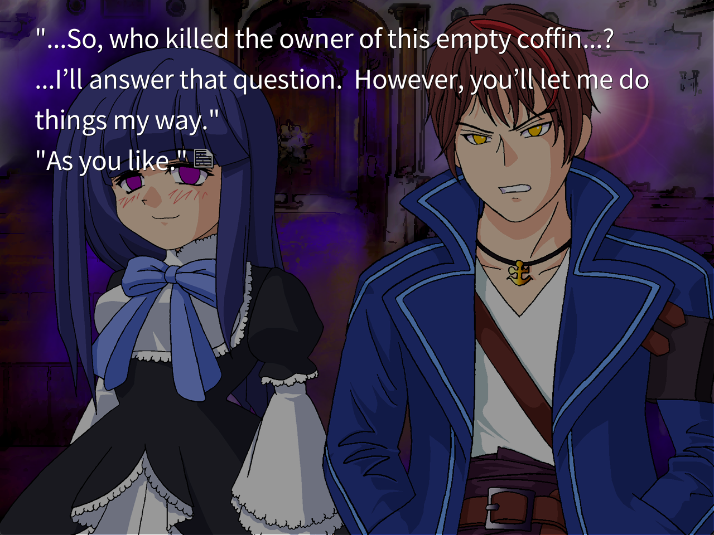

-   Will now has to explain the current situation to Lion

    > Honestly, me as well. I get that this 7th game is intended to explain everything that's happened so far. All the tricks, the culprit, and the motive.

    > But since when was this about who killed Beatrice?

    > I thought this was about the murder of the entire family...

    > It's past October 5th as well! And where the fuck is Battler?

-   Will throws a rose and it freezes in midair, turning into a black husk
-   _Will_: This chapel has been cut off from the Fragment. We're currently locked in a concentrated loop of time
-   The only way to escape is to play along with Bern's game

    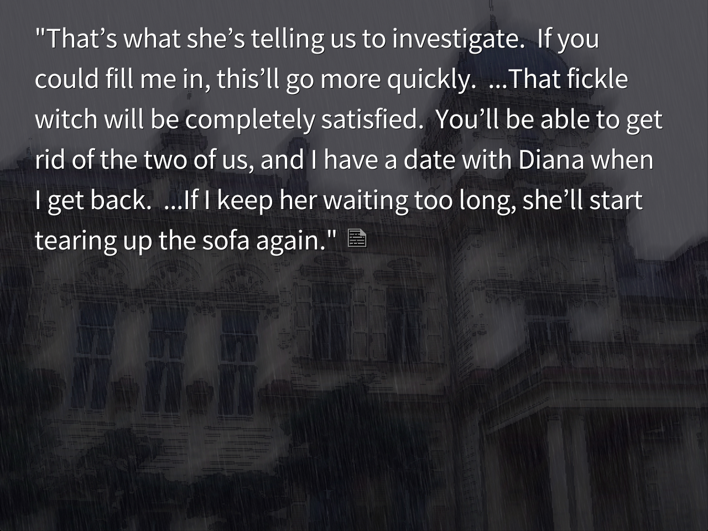

-   Beatrice _is_ the mistress of Kinzo, the family Head

    > Speaking of, remember earlier in the episode where the maid was accused of killing the master in his study?

    > Kinzo was murdered...

-   Will knows so much because he read the past games. He exists on a different plane from the family

    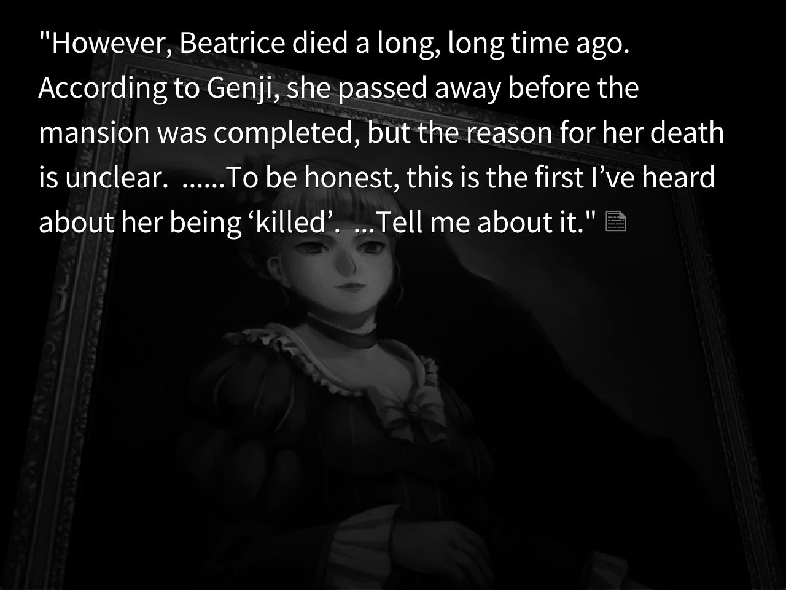

    > Okay, we're on the same page. The original "Beatrice" (well, maybe not original, but the oldest one we know of) died a long time ago, before the mansion was completed.

    > There was another one that died 19 years ago.

    > The Beatrice that gave Shannon the brooch and the Beatrice that played the first four games with Battler are different.

    > Again, since when was this about her murder?

-   Lion doesn't know SHIT
-   The portrait was first displayed in April of 1984
-   Everyone knows Beatrice. And yet, no one knows her. Kinzo's the only one who's ever met her
-   They have to figure out who killed Beatrice to break the barrier
-   For Lion, who was used to Kinzo's rantings, this was more than enough to understand
    > Hm...

---

> Time to question the family!

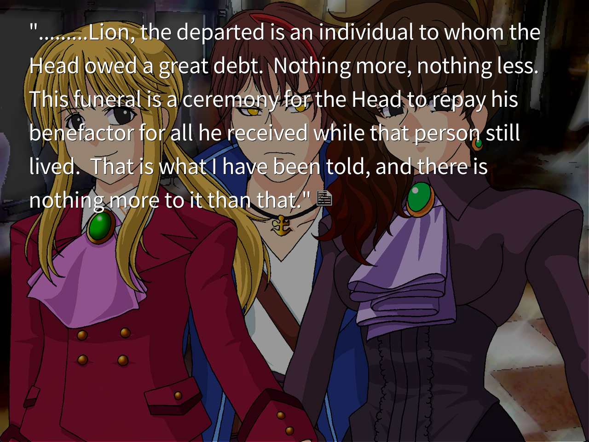

> Fair enough. We do know Beatrice was the 'owner' of the gold, but there's probably a lot more to it than that.

-   Oh, Diana is a cat
-   "Even this outrageous arrogance is nothing compared to Kinzo"

    > Y'know, isn't it weird how nobody is questioning how Will fucking ARRIVED HERE

    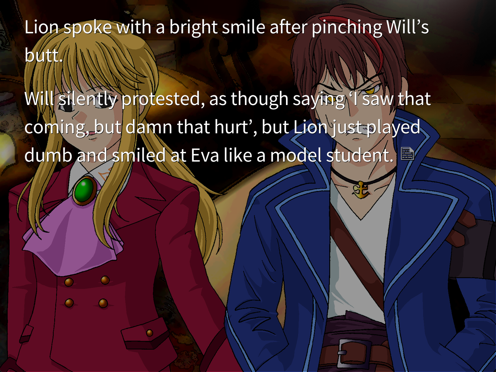

    > no way? no way? no way? no way? no way? no way? no way? no way? no way? no way? no way? no way? no way? no way? no way? no way? no way? no way? no way? no way? no way? no way?

-   Eva, Hideyoshi, Rudolf, and Kyrie corroborate the theory that Beatrice was Kinzo's mistress
-   Rosa seems to be the only one who "met" her

    > Or rather... the second version of her. Her daughter?

    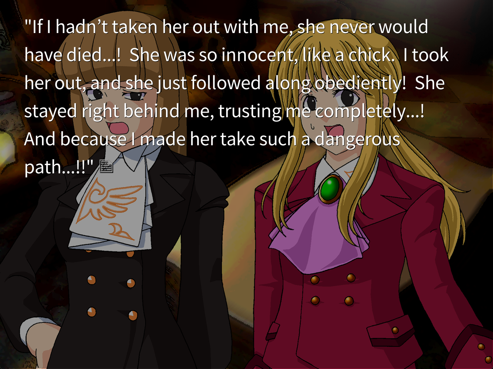

    > I do like that she used the descriptor "chick" here. It really emphasizes the parallels between Battler and Kinzo.

-   _Will_: If I were Beatrice, I'd thank you for making that dream come true for a short while. If she knew that you've been suffering all this time for it, she'd probably feel sorry for you.
    > kinda true, even though rosa deserves death
-   "You're the one who taught her that the sea is blue"

    > FUCK

    > Just like Shannon teaching Kanon...

    > I don't have a very good interpretation for this right now

-   Rosa can finally face that "innocently smiling Beatrice"
-   The two of them can finally speak together

    > Hm... another Battler parallel?

    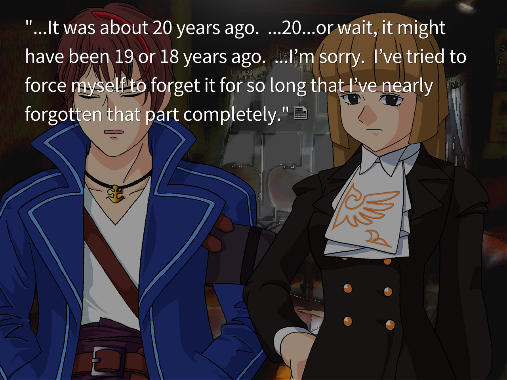

-   Ronove guaranteed that it was 1967
-   Rosa's tutor told her mother something that was supposed to be a secret
    > I forgot what that was
-   This Beatrice must have been different from the one Kinzo knew
    > I feel like there's something disgusting going on here
-   This Beatrice was around ~19 or so
-   Will doesn't seem to agree with the daughter theory
    > What's wrong with it?
-   That Beatrice definitely died
-   Rosa sprinted in a random direction and found a lion statue behind the chapel
    > This is probably related to the epitaph, right?
-   Rosa told Genji what happened later that night

    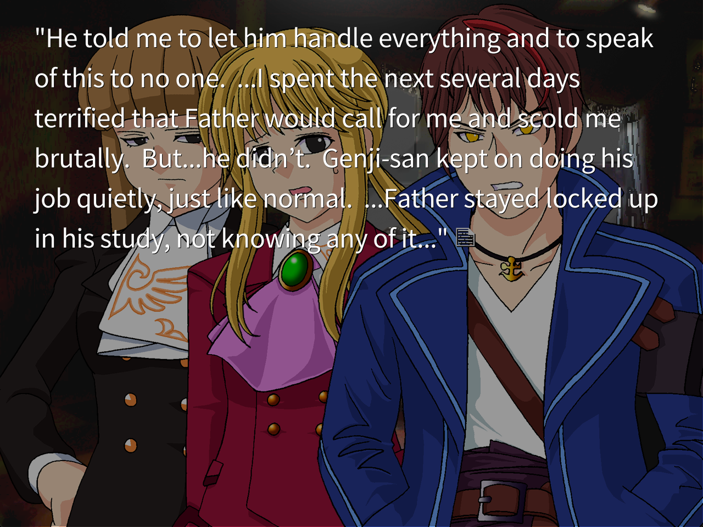

-   Kinzo couldn't have a funeral for her at the time

    > Ah, right. Why is the funeral being held **now** of all times?

    > And again, where the fuck is Battler?

-   Time to talk to Kinzo himself

    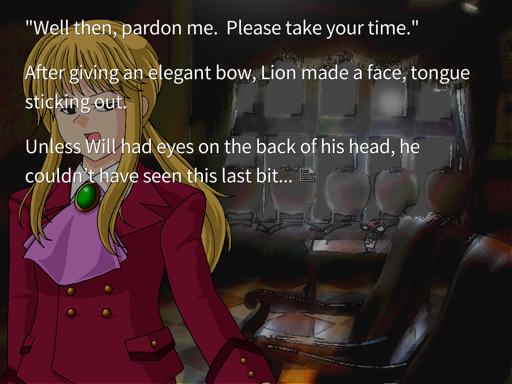

    > (anime girl voice w/tongue sticking out) bweeehhhhhh

-   _Will_: Don't tell me that arguing with Kinzo and persuading him to spill the beans is supposed to be part of this game.
-   _Bern_: That'd be boring.
-   Bern will give Will the power to get the truth from Kinzo

    > The detective's authority?

    > Nope

-   Theatergoing authority...
-   Shannon appears in front of the door leading outside
    > So she hasn't merged back with Kanon yet...
-   She's been taking turns with Kanon running the reception desk

    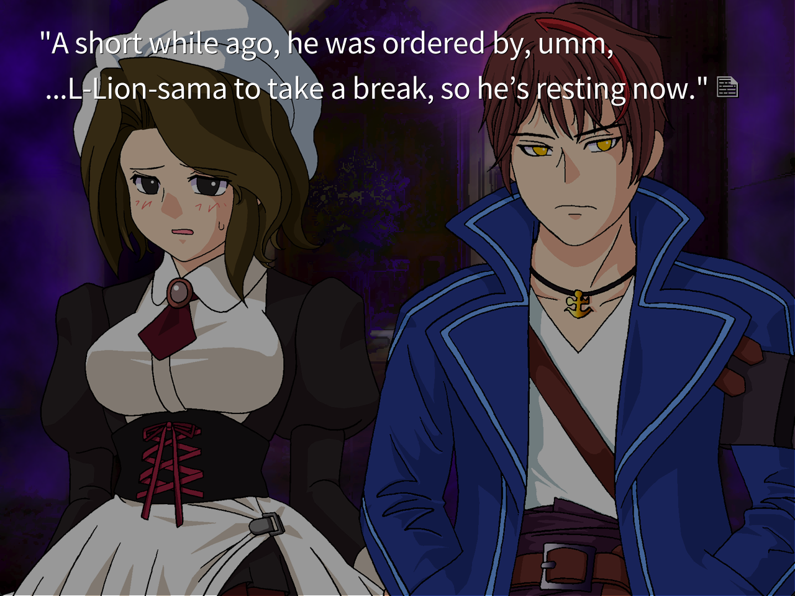

    > Yeah ok Lol

    > Lion didn't know Kanon's name. Shannon stumbled over Lion's name.

    > That first fact is plausible. That second one is strange. Why would she stumble over Lion's name?

-   _Will_: Don't worry. I don't recognize Lion either.

    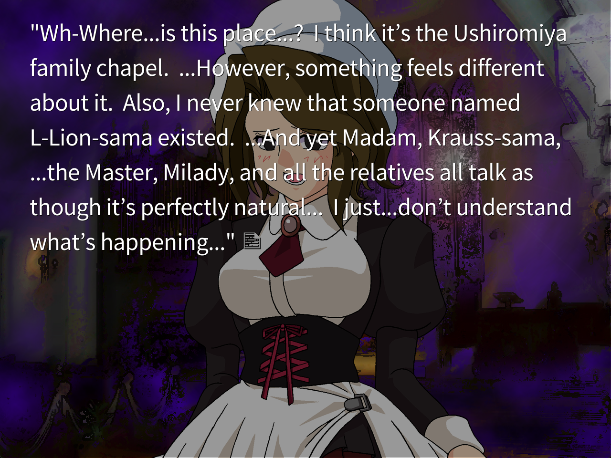

    > I think this makes sense. The person Beatrice split from was the combined Kanon/Shannon self. Maybe they're both confused because Lion is a piece that Bern placed, one that they're not equipped to anticipate?

-   In order for that piece to be placed, she needed a larger cat box
-   This world is several fragments sewn together
-   This world is a special stage. Kinzo still exists

    > That wording is interesting. Kinzo should be "dead", not fail to exist, right?

-   All of the information needed for reasoning is already here
-   The name of the ghost wandering the mansion at night is also Beatrice
-   That makes 3 Beatrices

    > There should be another one, right? The one created by the Kanon/Shannon self

    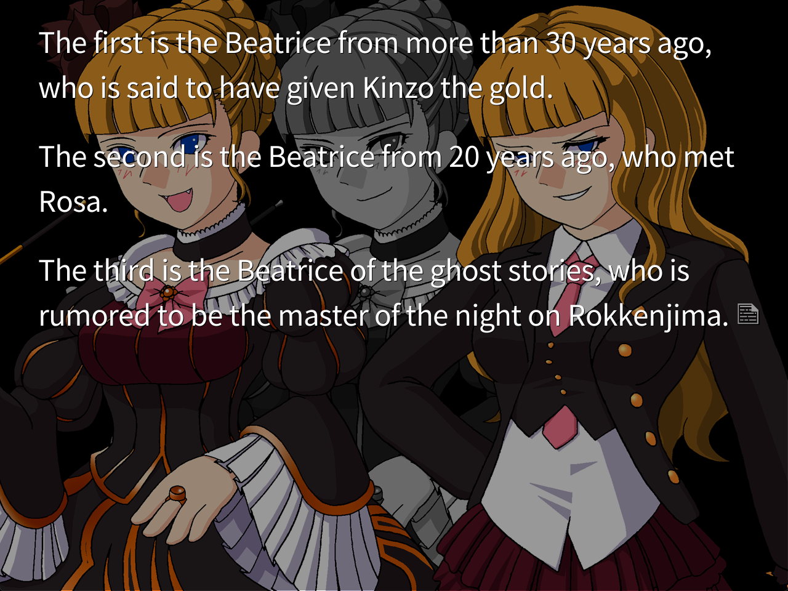

-   Erika's reasoning was probably correct. It started off as a legend of evil spirits, then various elements got mixed in to create the legend
-   _Will_: Call Kanon here.
    > Shannon: ohno.jpeg
-   Shannon makes a shitty excuse about not leaving the desk unmanned
-   _Shannon_: We're low on helpers, so we can't have two people there either.
    > oh COME ON
-   _Shannon_: It was the one who orders me. I cannot disobey orDERS.

    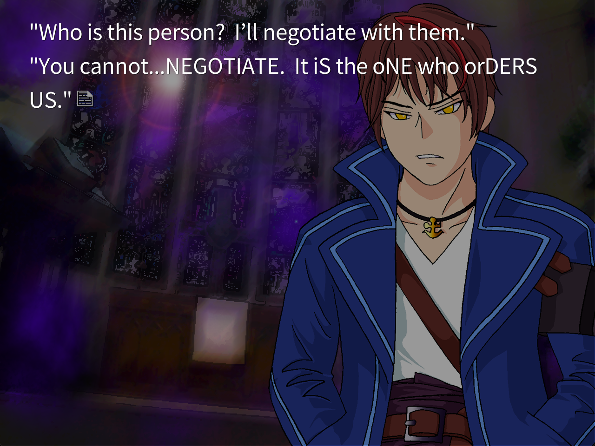

    > weird... it's the combined self right?

-   _Will_: I hate theatergoing as much as torture. If you don't call him, I'm going to use my authority.

    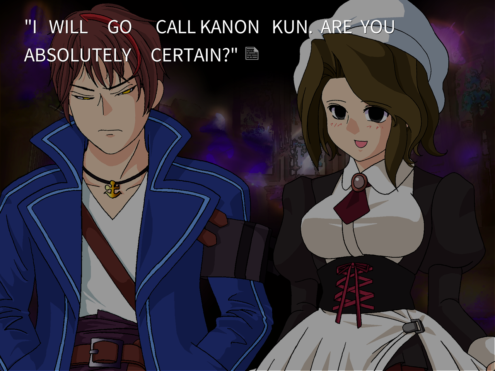

-   This is similar to putting your own king in check, apparently.

    > So... this is somehow a loss condition for Will? How does he even lose this game? Make it impossible to figure out who killed Beatrice?

    > Therefore... learning that Kanon and Shannon are the same person somehow makes it impossible to find Beatrice's killer. That means some information is lost if they are merged back together.

    > ...But what?

-   Lion doesn't remember Shannon's name either
    > Begs the question... does Lion remember the merged self?

---

> Time to talk to Kinzo

-   _Kinzo_: You're no one, aren't you? Why do you want to know about Beatrice?

    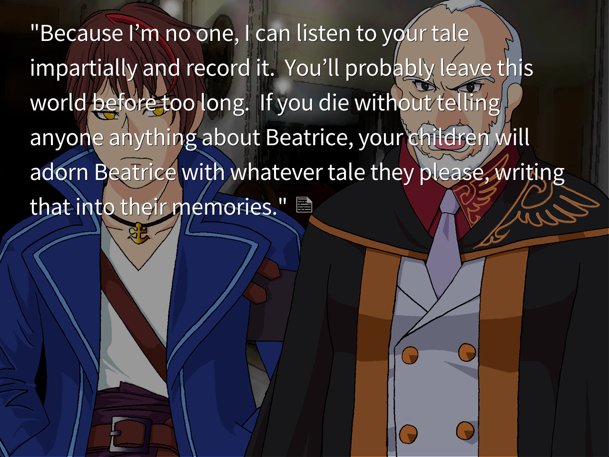

    > This is awfully on-the-nose.

-   _Kinzo_: No matter what other people say, no one can defile our tale. What they say is of no consequence!

    > Oh Battler...

-   Kinzo does not like wills. He won't abandon a task to be performed after his death

    > Ah... the beginning of the game

    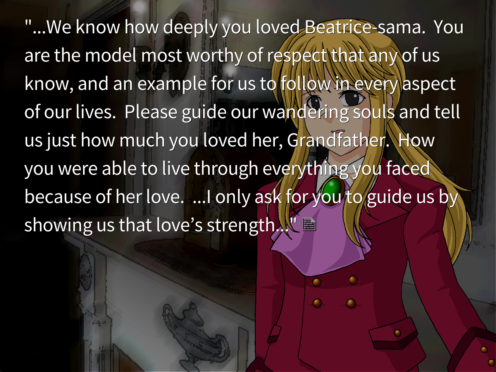

-   The Beatrice of interest existed before the mansion, and she probably had a daughter who grew up in Kuwadorian.
    > Of course, Will doesn't seem to like that last part.
-   Kinzo is surprised he knows the name of Kuwadorian
-   The Beatrice there thought of Kinzo as a father, but PROBABLY wasn't permitted to call Kinzo "father".
    > Battler..............................
-   Will claims he saw her as a new Beatrice
-   Genji once said there was no child between Kinzo and Beatrice
-   Notably, Genji has no memory of this.
    > Also notably, Shannon and Kanon do not remember Lion. But everyone else does. This further cements the idea that Kanon/Shannon's shared self is probably Beatrice's own piece. They were shown to be aware of previous games before, and yet they're not totally familiar with this game's environment
-   She **wasn't a daughter**, but Beatrice reborn. A model answer from Genji

    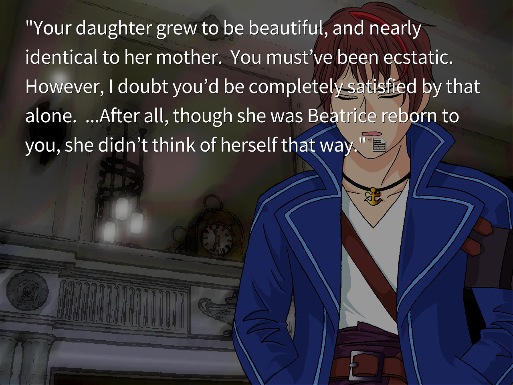

    > Things were obviously different in Battler's case. That was the world of the game board. ...This isn't. Kinzo is kinda disgusting for this

-   "Who am I? Everyone calls me Beatrice..."

    > FUCK... the end of episode 4...

    > I mean, in that Beatrice's case, she was the merged Kanon/Shannon self right?

    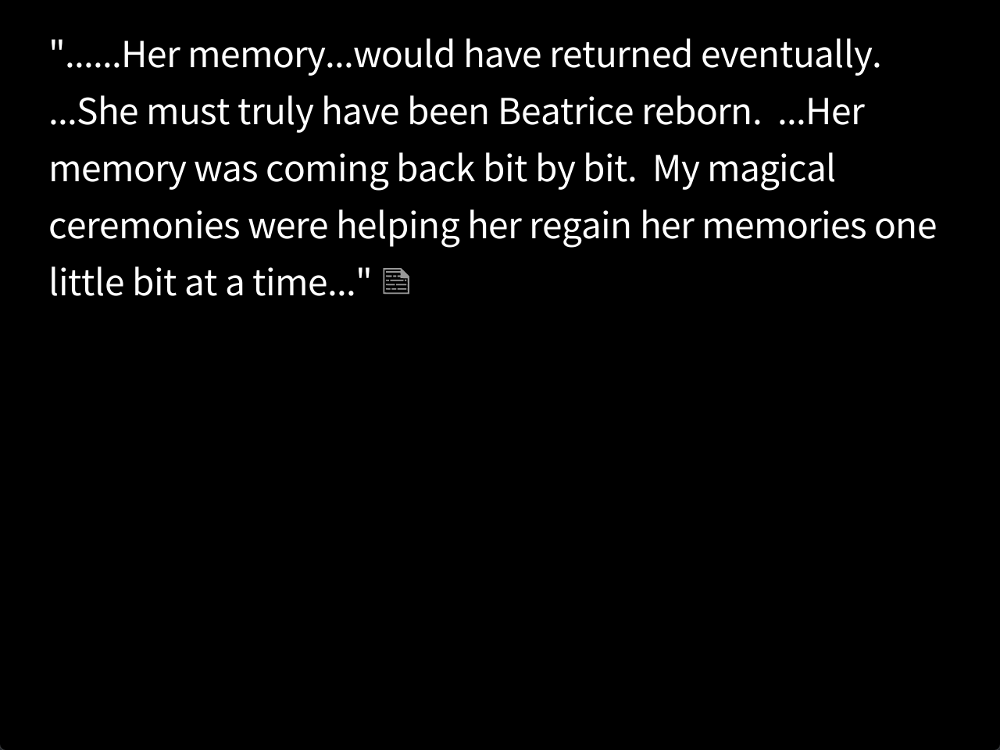

    > NOT THIS FUCKING MUSIC AGAIN

    > AAAAAAAAAAAAAAAAAAAAUUUUGGHHHH

    > So... is that it? This is someone who simply couldn't deal with the loss of a loved one?

    > SO HE FUCKING RUINS THE LIFE OF A CHILD???

    > Kinzo kill yourself challenge

-   The high level Beatrice said Kinzo refused to let the witch's soul escape even after death. She also said that her power and memory had been sealed

    > So basically, Kinzo couldn't accept that she was dead and gone. This was Beato's "magical" interpretation

    > Shoving her soul into a cage of flesh...

    > Of course, back then, she said her soul was freed upon death... but still tied to the island.

    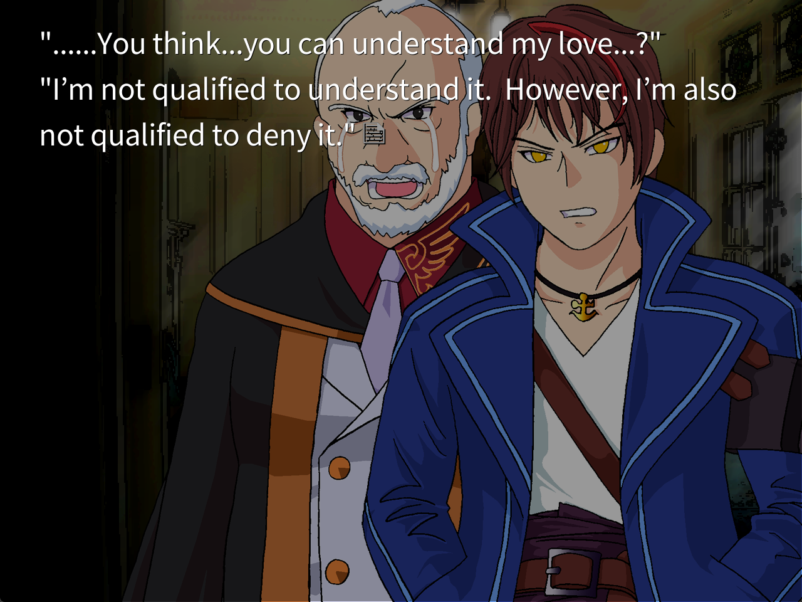

-   Because of love, he believed she was Beatrice reborn, and raised her that way. Somewhere in his heart, he knew what he was doing though
-   She couldn't believe she was the Beatrice he desired, and wanted to escape. She then fell off a cliff and died
    > omori
-   Genji then handled that death very quietly

    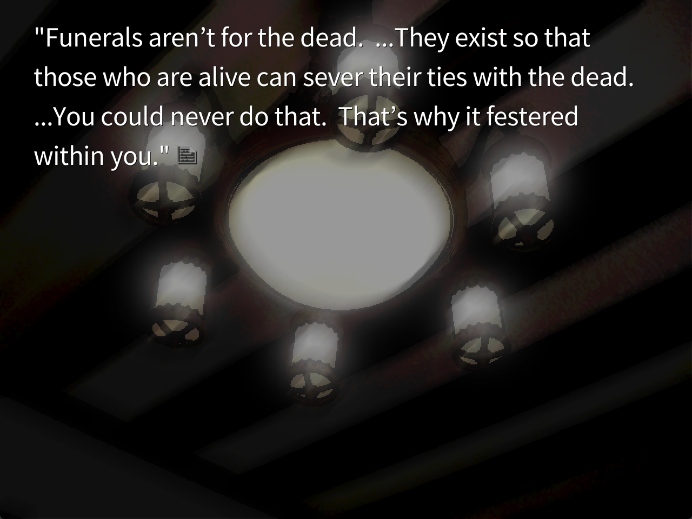

-   Losing Beatrice twice drove Kinzo to madness, which spawned his interest in the occult for the rest of his life
-   _Kinzo_: Why did you die in my arms not once, but twice!?

    > Wait what?

    > What do you mean "in your arms" Kinzo?

-   _Kumasawa_: If they already know that much, perhaps we can tell them the rest?
-   In the fourth game, we have testimony from the ferryboat captain saying that Kumasawa went in and out of Kuwadorian

    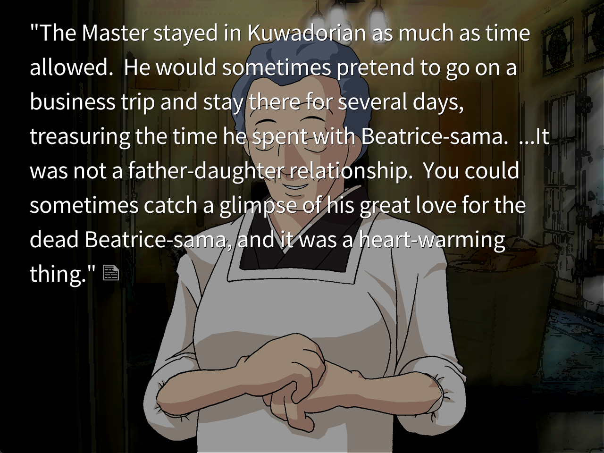

    > Ew? Ew? Ew? What the fuck

    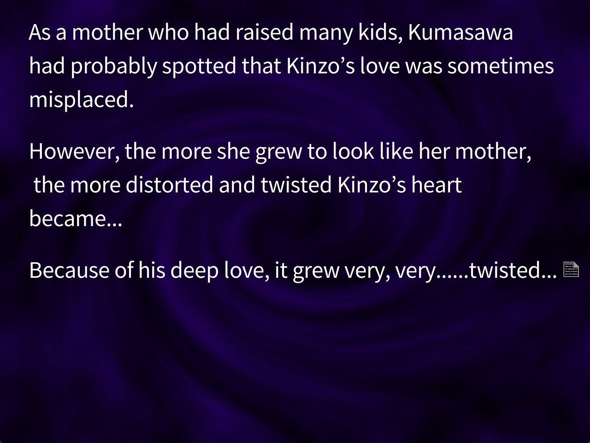

# AUUUUUUUUUUUGGGGGGGGHHHHHHHHHHH

-   Time for Kinzo to speak of the truth
-   The bright from Bern's power grew brighter, but only Will could see it
-   _Kinzo_: I met Beatrice Castiglioni just before the end of the war. She came from across the sea...
    > From Italy? How does Taiwan play into this...

---

-   Battler looked like Kinzo in his youth
-   Even the voice resembled Battler's...
    > Hmm... the Kinzo/Battler parallels are very deliberate, but I'm not sure what message they're trying to communicate. The cyclical nature of what happened?
-   Kinzo didn't want to succeed the headship
